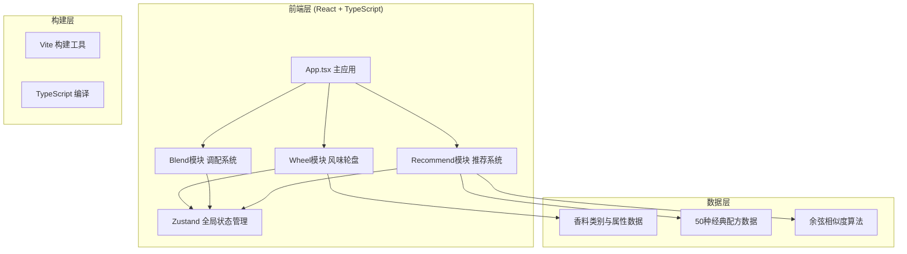

## 1. 架构设计



## 2. 技术描述
- **前端框架**：React@18 + TypeScript
- **构建工具**：Vite@5 + @vitejs/plugin-react
- **状态管理**：zustand
- **工具库**：uuid
- **初始化方式**：Vite项目脚手架（react-ts模板）
- **后端**：无（纯前端应用，数据内置为Mock）

## 3. 项目结构
```
├── package.json              # 依赖配置与脚本
├── vite.config.js            # Vite构建配置
├── tsconfig.json             # TypeScript严格模式配置
├── index.html                # 入口页面（暖色渐变背景）
└── src/
    ├── app.tsx               # 主应用组件，组装模块，管理布局
    ├── wheel/                # 风味轮盘模块
    │   ├── wheel.tsx         # 轮盘渲染 + 旋转交互 + SVG绘制
    │   └── data.ts           # 香料类别/具体香料/风味属性数据
    ├── blend/                # 调配模块
    │   ├── blend.tsx         # 调配碗 + 槽位 + 拖拽排序
    │   └── radar.tsx         # 风味雷达图SVG绘制
    └── recommend/            # 推荐模块
        └── recommend.tsx     # 推荐面板UI + 余弦相似度算法
```

## 4. 数据模型

### 4.1 香料类别 (SpiceCategory)
```typescript
interface SpiceCategory {
  id: string;
  name: string;        // 辛香、甜香、花香...
  hue: number;         // 0-315 均匀分布
  saturation: number;  // 70
  lightness: number;   // 80
  description: string; // 类别简短描述
  spices: Spice[];
}
```

### 4.2 具体香料 (Spice)
```typescript
interface Spice {
  id: string;
  name: string;
  categoryId: string;
  flavor: FlavorProfile; // 5维风味评分
  angle: number;         // 在轮盘中的角度位置
}
```

### 4.3 风味特征 (FlavorProfile)
```typescript
interface FlavorProfile {
  spicy: number;    // 辛辣度 0-100
  sweet: number;    // 甜度 0-100
  fresh: number;    // 清新度 0-100
  warm: number;     // 温暖度 0-100
  woody: number;    // 木质度 0-100
}
```

### 4.4 经典配方 (Recipe)
```typescript
interface Recipe {
  id: string;
  name: string;
  description: string;
  spices: string[]; // spice id 列表
  flavor: FlavorProfile;
  primaryHue: number; // 主色调
}
```

### 4.5 全局状态 (AppState)
```typescript
interface AppState {
  selectedSpices: Spice[];  // 最多6个
  wheelRotation: number;    // 轮盘当前旋转角度
  hoveredCategory: string | null;
  addSpice: (spice: Spice) => void;
  removeSpice: (spiceId: string) => void;
  reorderSpices: (from: number, to: number) => void;
  setWheelRotation: (deg: number) => void;
  setHoveredCategory: (id: string | null) => void;
}
```

## 5. 核心算法

### 5.1 余弦相似度计算
```
cos(A,B) = (A·B) / (||A|| * ||B||)
向量维度：[spicy, sweet, fresh, warm, woody]
将当前配方风味向量与50种经典配方逐一计算，取Top5
```

### 5.2 风味雷达图混合计算
```
混合风味 = Σ(单个香料风味 × 权重) / 香料数量
权重默认均匀，槽位顺序影响视觉但不影响数值计算
```

### 5.3 轮盘物理引擎
- 拖拽旋转：rotation = deltaX × 0.5（灵敏度）
- 惯性滚动：velocity × 0.92 每帧衰减
- 悬停检测：基于极坐标角度计算所在扇区

## 6. 性能优化策略
1. **SVG分层渲染**：轮盘使用 <g> 分组，仅重绘旋转transform
2. **requestAnimationFrame**：所有动画统一调度，避免掉帧
3. **useMemo缓存**：雷达图路径、推荐计算结果使用Memo缓存
4. **debounce**：推荐计算防抖，避免频繁重算（16ms）
5. **CSS transform优先**：位移、缩放使用GPU加速属性
