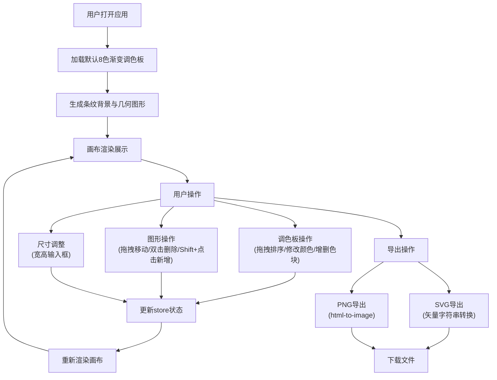

## 1. 产品概述

情绪调色板与几何海报生成器是一款面向独立平面设计师的在线创意工具，帮助用户通过浏览器快速生成具有特定情绪色彩的条纹与几何图形组合海报草稿，并支持导出为SVG或PNG格式。

- 核心价值：将色彩情绪与几何图形结合，快速生成视觉灵感草稿
- 目标用户：独立平面设计师、创意工作者、艺术爱好者
- 产品定位：轻量级、高效率的海报创意生成工具

## 2. 核心功能

### 2.1 功能模块
1. **调色板面板**：8色渐变色板、拖拽排序、颜色修改、增删色块
2. **画布区域**：水平条纹背景、随机几何图形、交互式操作
3. **导出功能**：SVG矢量导出、PNG位图导出
4. **画布控制**：尺寸调整、内容重生成

### 2.2 页面详情
| 页面名称 | 模块名称 | 功能描述 |
|---------|---------|---------|
| 主页面 | 调色板面板 | 8个可拖拽色块、颜色选择器、增删按钮、垂直排列 |
| 主页面 | 画布区域 | 条纹背景渲染、几何图形绘制、拖拽交互、尺寸控制 |
| 主页面 | 导出工具栏 | SVG导出按钮、PNG导出按钮、顶部布局 |
| 主页面 | 尺寸控制区 | 宽度/高度输入框、底部布局、范围限制 |

## 3. 核心流程

### 3.1 主要用户流程
用户打开应用 → 查看默认调色板与海报 → 调整调色板颜色/排序 → 调整画布尺寸 → 拖拽/增删几何图形 → 导出SVG或PNG

### 3.2 流程图

## 4. 用户界面设计

### 4.1 设计风格
- **设计主题**：深色科技感 + 创意艺术感
- **主色调**：蓝绿色 #4ECDC4（强调色/按钮色）
- **背景色**：主背景 #1a1a2e，次级背景 #16213e
- **文字色**：白色 #FFFFFF，次要文字 #e0e0e0
- **整体风格**：深色主题、简洁现代、创意工具感

### 4.2 视觉元素
- **按钮风格**：蓝绿色背景、白色文字、圆角6px、悬停提亮、点击缩放
- **色块样式**：60×60px、圆角8px、间距8px、拖拽半透明+阴影
- **画布边框**：2px白色边框、四周20px深色边距
- **几何图形**：透明度0.85、轮廓线1.5px、拖拽时虚线边框

### 4.3 布局结构
- **左侧面板**：300px宽，垂直排列调色板
- **右侧主区**：占据剩余空间，画布居中
- **顶部工具**：导出按钮组
- **底部控制**：尺寸输入框

### 4.4 页面设计概述
| 页面名称 | 模块名称 | UI元素 |
|---------|---------|--------|
| 主页面 | 调色板面板 | 8色色块垂直排列、删除按钮、添加按钮、拖拽排序 |
| 主页面 | 画布区域 | 条纹背景、几何图形、白色边框、边距 |
| 主页面 | 导出工具栏 | SVG按钮、PNG按钮、蓝绿色主题 |
| 主页面 | 尺寸控制区 | 宽度输入框、高度输入框、标签 |

### 4.5 响应式与触控
- **桌面优先**：以桌面端体验为主
- **移动端适配**：画布下方自动缩放适应屏幕宽度
- **触控支持**：touchstart/touchmove/touchend事件支持拖拽和点击
- **操作方式**：支持鼠标与触控双模式交互
