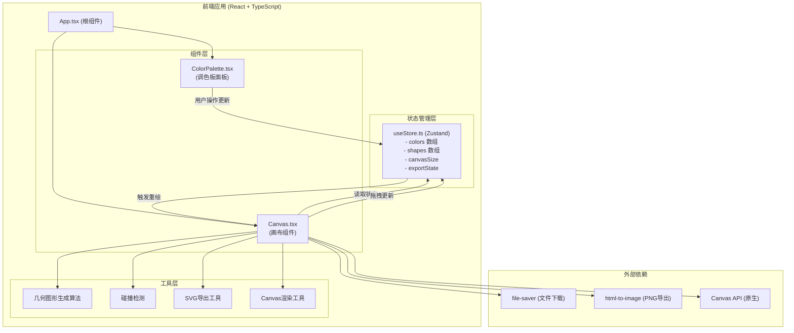

## 1. 架构设计

### 1.1 整体架构图


## 2. 技术描述

### 2.1 前端技术栈
- **框架**: React 18 + TypeScript
- **构建工具**: Vite 5
- **状态管理**: Zustand (轻量级、高性能)
- **样式方案**: CSS-in-JS / 内联样式 (组件级)
- **文件导出**: file-saver, html-to-image
- **渲染技术**: 原生 Canvas API

### 2.2 项目初始化
- 使用 Vite 官方模板初始化 React + TypeScript 项目
- 安装指定依赖包
- 配置 TypeScript 严格模式 (target ES2020)

### 2.3 核心技术选型理由
- **Zustand**: 轻量级状态管理，API简洁，性能优秀，适合中小型应用
- **原生Canvas**: 图形绘制性能最佳，支持像素级控制
- **html-to-image**: 成熟的Canvas转图片方案，支持PNG导出
- **file-saver**: 通用的浏览器文件下载方案

## 3. 文件结构与调用关系

### 3.1 目录结构
```
auto111/
├── package.json
├── vite.config.js
├── tsconfig.json
├── index.html
├── src/
│   ├── App.tsx          (根组件)
│   ├── main.tsx         (入口文件)
│   ├── index.css        (全局样式)
│   ├── components/
│   │   ├── ColorPalette.tsx   (调色板组件)
│   │   └── Canvas.tsx         (画布组件)
│   ├── store/
│   │   └── useStore.ts        (Zustand状态管理)
│   └── utils/
│       ├── shapeGenerator.ts  (几何图形生成)
│       ├── collision.ts       (碰撞检测)
│       └── svgExporter.ts     (SVG导出工具)
```

### 3.2 数据流向
1. **初始化**: App.tsx → useStore → 加载默认colors → Canvas.tsx 渲染
2. **调色板操作**: ColorPalette.tsx → 拖拽/修改/增删 → 更新 useStore.colors → Canvas.tsx 重绘
3. **画布交互**: Canvas.tsx → 鼠标/触控事件 → 更新 useStore.shapes → Canvas.tsx 重绘
4. **尺寸调整**: 输入框事件 → 更新 useStore.canvasSize → Canvas.tsx 重新生成图形并渲染
5. **导出操作**: Canvas.tsx → 调用导出工具 → file-saver 触发下载

## 4. 状态管理设计

### 4.1 Store 数据结构
```typescript
// 颜色项
interface ColorItem {
  id: string;
  color: string;
}

// 几何图形类型
type ShapeType = 'circle' | 'triangle' | 'diamond';

// 几何图形
interface Shape {
  id: string;
  type: ShapeType;
  x: number;
  y: number;
  size: number;       // 边长或直径
  colorIndex: number; // 对应调色板颜色索引
  isDragging?: boolean;
}

// 画布尺寸
interface CanvasSize {
  width: number;
  height: number;
}

// Store 状态
interface PosterState {
  colors: ColorItem[];
  shapes: Shape[];
  canvasSize: CanvasSize;
  
  // Actions
  setColors: (colors: ColorItem[]) => void;
  updateColor: (id: string, color: string) => void;
  addColor: () => void;
  removeColor: (id: string) => void;
  reorderColors: (fromIndex: number, toIndex: number) => void;
  
  setShapes: (shapes: Shape[]) => void;
  updateShapePosition: (id: string, x: number, y: number) => void;
  addShape: (x: number, y: number) => void;
  removeShape: (id: string) => void;
  regenerateShapes: () => void;
  
  setCanvasSize: (width: number, height: number) => void;
}
```

## 5. 核心算法

### 5.1 条纹背景生成
- 条纹数量 = colors 数组长度
- 条纹高度 = 画布高度 / 颜色数量
- 颜色顺序：与调色板顺序一一对应
- 渲染方式：Canvas fillRect 逐行填充

### 5.2 几何图形生成
- 数量范围：8-15个随机
- 类型分布：圆形、等边三角形、菱形各占约三分之一
- 大小范围：40-120px
- 颜色：从调色板随机选取
- 透明度：固定0.85

### 5.3 碰撞检测
- 使用圆形碰撞检测（所有图形以边界圆计算）
- 间距要求：至少10px
- 算法：生成时逐个检测，避开已有图形

### 5.4 拖拽交互
- 鼠标/触控按下：检测命中图形，设置拖拽状态
- 移动：实时更新图形位置，重绘画布
- 释放：更新最终位置到store
- 性能：使用 requestAnimationFrame 确保60FPS

### 5.5 SVG导出
- 遍历所有图形，转换为SVG元素
- 条纹背景转换为 SVG rect
- 圆形：`<circle>`
- 三角形：`<polygon>`
- 菱形：`<polygon>`
- 使用 Blob + file-saver 触发下载

## 6. 性能优化

### 6.1 渲染性能
- 使用原生Canvas API，保证绘制效率
- 拖拽时仅重绘变化的图形（局部重绘）
- 最大尺寸初始渲染 ≤ 300ms
- 后续重绘 ≤ 100ms
- 拖拽帧率 ≥ 50FPS

### 6.2 状态管理
- Zustand 轻量级，无额外重渲染开销
- 组件按需订阅状态，避免不必要重渲染

### 6.3 图形生成
- 碰撞检测优化：空间分区或简单遍历（数量少）
- 预计算：图形边界框缓存

## 7. 响应式与触控

### 7.1 移动端适配
- 画布区域自动缩放适应屏幕宽度
- 使用 transform: scale() 或 max-width: 100%
- 保持画布宽高比

### 7.2 触控支持
- 监听 touchstart / touchmove / touchend 事件
- 坐标转换：使用 changedTouches 计算位置
- 双击删除：支持双击触控
- 长按+拖拽：与鼠标拖拽体验一致

## 8. 质量保障

### 8.1 边界条件
- 色块数量限制：最少4个，最多12个
- 画布尺寸限制：宽度400-1920px，高度300-1080px
- 图形不超出画布边界
- 颜色值合法性校验

### 8.2 交互反馈
- 按钮悬停/点击状态
- 拖拽时视觉反馈（半透明、阴影、虚线边框）
- 操作成功提示
