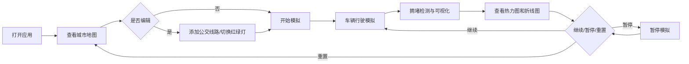

## 1. 产品概述

生态城市交通流量模拟与分析平台，帮助城市规划教学人员和爱好者直观理解不同道路规划方案对交通流的影响。
- 核心价值：通过可视化交互模拟，降低城市交通规划学习门槛，提升教学体验
- 目标用户：城市规划专业学生、教师、交通爱好者

## 2. 核心功能

### 2.1 功能模块
1. **城市地图模块**：网格化城市地图Canvas绘制，包含主干道、路口、住宅区、商业区、行道树
2. **交互编辑模块**：添加公交线路、切换路口红绿灯模式
3. **交通模拟模块**：车辆生成、路径规划、红绿灯控制、拥堵检测
4. **数据分析模块**：拥堵热力图、拥堵指数折线图
5. **控制面板模块**：开始/暂停、重置、速度调节

### 2.2 页面详情
| 页面名称 | 模块名称 | 功能描述 |
|-----------|-------------|---------------------|
| 主页面 | 城市地图 | Canvas绘制5×5网格道路系统，25个路口，住宅区/商业区分布，行道树装饰 |
| 主页面 | 公交线路编辑 | 点击两个路口之间添加橙红色虚线公交线路 |
| 主页面 | 红绿灯控制 | 点击路口切换四相位/两相位红绿灯模式 |
| 主页面 | 车辆模拟 | 彩色三角形车辆从住宅区驶向商业区，遵守红绿灯规则 |
| 主页面 | 拥堵检测 | 路口车辆累积超15辆触发拥堵，颜色渐变+感叹号脉冲动画 |
| 主页面 | 拥堵热力图 | 每5秒生成绿到红渐变热区，透明度40%覆盖地图 |
| 主页面 | 控制面板 | 开始/暂停按钮、重置按钮、速度滑块(0.5x-4x)、拥堵指数折线图 |

## 3. 核心流程

用户打开应用 → 查看默认城市地图 → 可添加公交线路/切换红绿灯模式 → 点击开始模拟 → 观察车辆行驶和路口拥堵 → 通过控制面板调节速度或暂停 → 查看拥堵热力图和指数变化趋势 → 可重置重新开始

## 4. 用户界面设计

### 4.1 设计风格
- **主题色**：深蓝灰(#2C3E50)到深铁灰(#1A1A2E)暗色渐变背景
- **强调色**：发光蓝(#00B4D8)边框、翠绿(#2ECC71)开始按钮、红色(#E74C3C)重置按钮、橙红(#FF6B35)公交线路
- **按钮样式**：圆角矩形(圆角半径8px)，轻微投影(模糊6px，透明度0.3)
- **交互动画**：悬停缩放1.05倍，0.2秒ease-out过渡
- **布局**：桌面端地图占80%宽度，右侧控制面板；移动端垂直排列

### 4.2 页面设计概览
| 页面名称 | 模块名称 | UI元素 |
|-----------|-------------|-------------|
| 主页面 | 城市地图 | Canvas绘制网格道路、深灰色(#555)道路、浅灰色路口圆点、浅绿色住宅区、浅蓝色商业区、深绿色行道树 |
| 主页面 | 车辆模拟 | 彩色三角形车辆(#FFD93D到#6BCB77随机)、等待时半透明 |
| 主页面 | 拥堵提示 | 路口颜色从浅灰渐变深红、黄色感叹号脉冲动画(1.2秒周期) |
| 主页面 | 控制面板 | 方形开始/暂停按钮(48px)、红色重置按钮、速度滑块(蓝色#3498DB滑块20px)、Canvas折线图 |
| 主页面 | 热力图 | 绿到红渐变热区覆盖层，透明度40% |

### 4.3 响应式设计
- 桌面端(≥768px)：地图占80%宽度，右侧控制面板
- 移动端(<768px)：地图缩放到70%并增加滚动条，控件垂直排列
- 所有交互元素支持触摸操作
