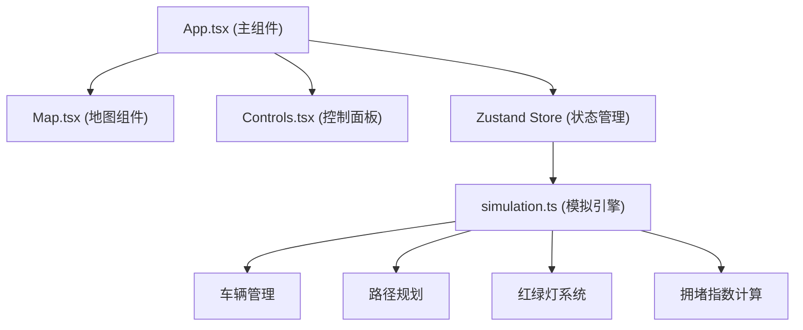

## 1. 架构设计



## 2. 技术描述

- **前端框架**：React 18 + TypeScript
- **构建工具**：Vite
- **状态管理**：Zustand
- **绘图技术**：HTML5 Canvas
- **无后端**：纯前端应用，所有计算在浏览器端完成

## 3. 文件组织

| 文件路径 | 功能描述 |
|---------|---------|
| package.json | 项目依赖与脚本配置 |
| vite.config.js | Vite构建配置 |
| tsconfig.json | TypeScript严格模式配置 |
| index.html | 入口HTML页面 |
| src/App.tsx | 主组件，组合地图和控制面板，管理全局状态 |
| src/Map.tsx | 城市地图Canvas组件，绘制网格、道路、车辆、热力图 |
| src/Controls.tsx | 控制面板组件，按钮和速度滑块 |
| src/simulation.ts | 交通模拟引擎，车辆生成、路径规划、红绿灯、拥堵计算 |
| src/store.ts | Zustand全局状态管理 |

## 4. 核心数据模型

### 4.1 类型定义

```typescript
// 路口类型
interface Intersection {
  id: string;
  x: number;
  y: number;
  gridX: number;
  gridY: number;
  trafficLightMode: 'four-phase' | 'two-phase';
  currentPhase: number;
  phaseTimer: number;
  waitingVehicles: number;
}

// 车辆类型
interface Vehicle {
  id: string;
  x: number;
  y: number;
  color: string;
  path: { x: number; y: number }[];
  pathIndex: number;
  speed: number;
  isWaiting: boolean;
  destination: { gridX: number; gridY: number };
}

// 公交线路类型
interface BusRoute {
  id: string;
  startIntersection: string;
  endIntersection: string;
}

// 区域类型
interface Zone {
  x: number;
  y: number;
  width: number;
  height: number;
  type: 'residential' | 'commercial';
}

// 拥堵数据点
interface CongestionDataPoint {
  time: number;
  avgCongestionIndex: number;
}
```

## 5. 性能优化策略

1. **Canvas分层渲染**：静态地图元素预渲染到离屏Canvas
2. **requestAnimationFrame**：使用系统帧率同步，保持30fps以上
3. **对象池模式**：车辆对象复用，避免频繁GC
4. **增量更新**：热力图每5秒更新一次，而非每帧
5. **空间分区**：路口车辆检测使用网格空间索引
6. **Web Worker**：拥堵计算可移至Worker线程(如需要)
