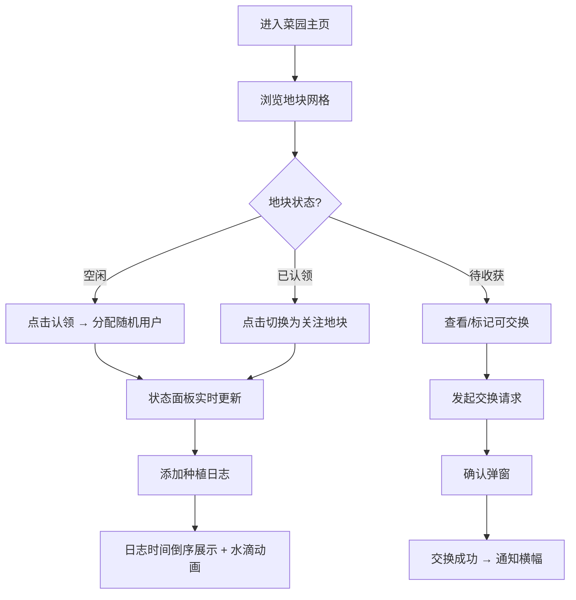

## 1. 产品概述

社区共享菜园与实时生长状态可视化平台，为菜园参与者提供线上认领地块、记录种植日志、交换收获、查看菜园实时状态的一体化服务。旨在降低社区菜园管理成本，提升参与者互动体验，让城市居民便捷地参与种植活动。

- 主要用户：社区菜园参与者（认领人、管理员）
- 核心价值：可视化菜园状态、简化认领流程、促进社区互助与收获交换

## 2. 核心功能

### 2.1 用户角色
| 角色 | 注册方式 | 核心权限 |
|------|----------|----------|
| 参与者 | 系统随机分配用户名 | 认领地块、记录日志、交换收获、查看状态 |

### 2.2 功能模块
1. **首页（菜园主界面）**：地块网格展示、状态面板、认领列表、交换通知
2. **地块详情**：地块状态切换、种植日志记录、标记收获/可交换
3. **数据可视化**：菜园状态占比环图、生长时间轴折线图

### 2.3 页面详情
| 页面名称 | 模块名称 | 功能描述 |
|----------|----------|----------|
| 菜园主页 | 地块网格 | 6x6 地块展示，点击认领/切换，不同状态颜色图标区分 |
| 菜园主页 | 状态面板 | 显示选中地块详情、种植日志列表、统计图表、生长曲线图 |
| 菜园主页 | 认领列表 | 侧边展示所有已认领地块的用户清单 |
| 菜园主页 | 交换通知 | 侧边展示可交换地块、交换确认弹窗、全局通知横幅 |

## 3. 核心流程

**主用户流程：** 用户进入菜园主页 → 浏览 6x6 地块网格 → 点击空闲地块自动认领（分配随机用户名）→ 在状态面板添加种植日志（作物名、日期、浇水备注）→ 作物成熟后标记为待收获/可交换 → 其他用户点击可交换地块发起交换 → 双方确认后状态互换并弹出通知。

## 4. 用户界面设计

### 4.1 设计风格
- **主色系**：淡米色背景 #FAF0E6，地块浅木色边框 #DEB887
- **状态色**：空闲 #D2B48C（浅褐+小草）、已种植 #8FBC8F（绿+叶芽）、待收获 #F0E68C（金黄+果实）、交换高亮 #FFA500
- **点缀色**：植物绿 #4CAF50（折线图）、蓝色 #2196F3（水滴动画）
- **按钮**：圆角 8px，悬停放大阴影
- **字体**：无衬线字体，深棕色 #3E2723
- **图标**：lucide-react（Leaf、Sprout、Apple、Droplets 等）
- **纹理**：地块格子用 repeating-linear-gradient 水彩浅色条纹

### 4.2 页面设计概述
| 页面名称 | 模块名称 | UI 元素 |
|----------|----------|---------|
| 菜园主页 | 地块网格 | 居中 75% 宽度，圆角矩形地块，hover 放大 1.05 倍 + 阴影，0.2s 过渡 |
| 菜园主页 | 状态面板 | 右侧固定面板，详情卡片 + Canvas 环图 + Canvas 折线图 + 日志列表 |
| 菜园主页 | 认领列表 | 左侧面板，头像 + 用户名 + 地块编号列表 |
| 菜园主页 | 交换通知 | 横幅从顶部滑入 0.4s 淡入，5s 自动消失 |
| 菜园主页 | 弹窗 | 居中模态框，圆角 12px，半透明遮罩 |

### 4.3 响应式
- **桌面端（≥768px）**：三栏布局（左认领列表 12.5% + 中地块网格 75% + 右状态面板 12.5%）
- **移动端（<768px）**：地块网格 4 列，认领列表与状态面板移至底部横向滚动区
- **触摸优化**：触控区域 ≥ 44px，点击缩放反馈

### 4.4 动画与交互
- 地块悬停：transform: scale(1.05) + box-shadow，0.2s ease
- 切换地块：橙色 #FFA500 闪烁 0.3s
- 添加日志：水滴从地块顶部掉落，6px 蓝点，0.5s 消失
- 通知横幅：从顶部滑入 + 淡入 0.4s，5s 后淡出
- 全局过渡：所有交互 transition: all 0.2s ease
