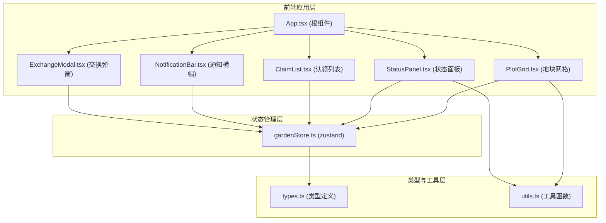

## 1. 架构设计



**数据流向说明：**
1. App.tsx 初始化时从 gardenStore 加载 36 个初始地块数据
2. 用户交互（点击地块/添加日志/标记交换）→ 调用 gardenStore 的 action → 更新 state
3. 订阅 store 的组件（PlotGrid、StatusPanel、ClaimList 等）自动 re-render 反映最新状态
4. Canvas 图表（环图、折线图）由 StatusPanel 在 useEffect 中监听状态变化后重绘

## 2. 技术描述
- **前端框架**：React 18 + TypeScript
- **构建工具**：Vite 5 + @vitejs/plugin-react
- **状态管理**：zustand 4
- **工具库**：uuid（生成 ID）、lucide-react（图标）
- **图表绘制**：原生 Canvas API（不引入 chart 库以保证性能）
- **初始化方式**：`npm init vite-init@latest` 选择 react-ts 模板

## 3. 路由定义
| 路由 | 用途 |
|------|------|
| / | 菜园主页（单页应用，无额外路由） |

## 4. API 定义（无后端，使用前端 mock 数据）
所有数据存储于 zustand store 中，页面初始化时自动生成：
- 36 个地块（6x6），初始状态为"空闲"
- 模拟生长数据（近 7 天随机高度值）
- 随机用户名池（用于认领时分配）

## 5. 数据模型

### 5.1 类型定义

```typescript
// 地块状态枚举
type PlotStatus = 'idle' | 'planted' | 'harvestable';

// 种植日志条目
interface JournalEntry {
  id: string;
  cropName: string;
  plantDate: string;
  waterNote: string;
  timestamp: number;
}

// 地块数据
interface Plot {
  id: string;
  row: number;
  col: number;
  status: PlotStatus;
  ownerName?: string;
  ownerAvatar?: string;
  cropName?: string;
  plantDate?: string;
  daysToHarvest?: number;
  waterRecords: string[];
  journal: JournalEntry[];
  exchangeable: boolean;
  // 动画标记
  highlight?: boolean;
  waterDrop?: boolean;
}

// 菜园统计
interface GardenStats {
  idle: number;
  planted: number;
  harvestable: number;
}

// 通知
interface Notification {
  id: string;
  message: string;
  type: 'success' | 'info' | 'warning';
  timestamp: number;
}
```

### 5.2 Zustand Store Action 定义

| Action | 参数 | 功能 |
|--------|------|------|
| `claimPlot(plotId)` | plotId: string | 认领地块，分配随机用户名 |
| `selectPlot(plotId)` | plotId: string | 切换当前关注地块，触发闪烁动画 |
| `addJournal(plotId, entry)` | plotId, entry | 添加种植日志，触发水滴动画 |
| `markHarvestable(plotId)` | plotId: string | 标记地块为待收获 |
| `toggleExchangeable(plotId)` | plotId: string | 切换可交换状态 |
| `exchangePlots(plotIdA, plotIdB)` | 两个 plotId | 交换双方地块状态与所有权 |
| `addNotification(message, type)` | 消息与类型 | 推送全局通知 |
| `dismissNotification(id)` | 通知 ID | 移除通知 |
| `clearAnimFlags(plotId, flag)` | 清除动画标记 | 定时重置 highlight/waterDrop 标志 |

## 6. 性能保障

| 约束 | 策略 |
|------|------|
| 地块网格渲染 < 50ms | 使用 React.memo 包裹单个 PlotCell 组件，避免无关 re-render；36 个 DOM 节点数极少 |
| Canvas 图表 ≥ 30fps | 仅在 store 中相关状态变化时重绘；使用 requestAnimationFrame 节流；折线图仅 7 个数据点 |
| 动画流畅 | 所有过渡使用 CSS transform/opacity（GPU 加速），避免改变布局属性；水滴/闪烁等动画使用 CSS keyframes |
