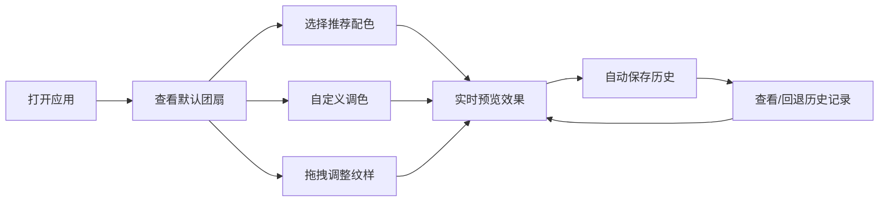

## 1. 产品概述

古风团扇花纹配色设计工具，旨在为传统纹样设计师和汉服爱好者提供在线团扇配色方案设计与实时预览平台。

- 解决传统纹样设计中配色试错成本高、缺乏实时预览和灵感推荐的问题
- 目标用户：传统纹样设计师、汉服爱好者、工艺美术从业者
- 产品价值：降低配色设计门槛，提供古风配色灵感推荐，所见即所得的实时预览体验

## 2. 核心功能

### 2.1 功能模块

1. **团扇画布模块**：高精度团扇绘制与纹样展示交互区

2. **调色板模块**：配色方案推荐与自定义调色盘

3. **历史记录模块**：配色快照保存与回退恢复

### 2.2 功能详情

| 模块名称 | 功能点 | 功能描述 |
|-----------|--------|----------|
| 团扇画布 | 扇面绘制 | 半透明圆形扇面，径向渐变底纹（浅米色#F5E6CA到淡金色#E8D5B5） |
| 团扇画布 | 花鸟纹样 | 中央牡丹（6层8瓣贝塞尔曲线）、金色花心、散布梅花与蝴蝶 |
| 团扇画布 | 纹样交互 | 点击选中纹样，弹出颜色选择器修改颜色 |
| 团扇画布 | 拖拽移动 | 蝴蝶、梅花纹样支持鼠标拖拽移动位置 |
| 团扇画布 | 形状切换 | 圆形/海棠形切换，贝塞尔曲线组成的花瓣形轮廓 |
| 调色板 | 推荐配色 | 6套古风预设配色（宋韵、唐风等），每套5色，点击即应用 |
| 调色板 | 自定义调色盘 | 12个空槽位，支持从色板拖拽颜色填充 |
| 调色板 | 古风色板 | 24色古风色系（宋瓷青、檀木红、琥珀黄、点翠蓝等） |
| 历史记录 | 快照保存 | 配色应用后自动生成120x120px缩略图快照 |
| 历史记录 | 回退恢复 | 点击历史记录恢复对应配色方案 |
| 历史记录 | 删除操作 | 长按记录弹出删除按钮 |

## 3. 核心流程

用户打开应用 → 查看默认团扇纹样 → 选择推荐配色或自定义调色 → 实时预览配色效果 → 调整纹样颜色/位置 → 保存配色历史 → 回退/删除历史记录

## 4. 用户界面设计

### 4.1 设计风格

- **主色调**：米色（#F5F0E8）与檀木红（#8B4513）搭配，典雅古风
- **辅助色**：宋瓷青#78A29B、琥珀黄#D9A05B、点翠蓝#0072B5、金色#FFD700
- **按钮样式**：圆弧角8px，浅棕色半透明阴影（rgba(139,90,43,0.15)）
- **字体**：衬线体（serif），模拟古风书写感
- **整体风格**：典雅精致，传统东方美学与现代交互结合

### 4.2 页面布局

| 区域 | 位置 | 主要元素 |
|------|------|----------|
| 画布区 | 左侧主区域 | 团扇画布、形状切换按钮 |
| 调色板区 | 右侧 | 推荐配色区、自定义调色盘 |
| 历史记录区 | 画布下方 | 配色历史缩略图栏 |

### 4.3 动画效果

- 颜色过渡：ease-out缓出，0.5秒平滑过渡
- 配色应用：多米诺骨牌式依次过渡（间隔0.1秒）
- 扇面呼吸：缩放1.01倍，周期2秒
- 形状切换：0.8秒平滑过渡
- 按钮水波纹：半径40px，颜色#FFF0D5
- 悬停放大：色块悬停放大1.1倍

### 4.4 性能要求

- 颜色切换动画帧率 ≥ 45fps
- 历史缩略图生成耗时 ≤ 50ms
- 历史记录最多保存15条
