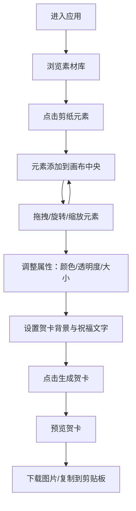

## 1. 产品概述

民俗剪纸技艺云端展览与交互拼贴应用——让用户在线浏览和体验中国传统剪纸艺术的魅力，通过拖拽、缩放、旋转等交互操作将不同动物剪纸元素自由组合到画布上，创作并导出个性化数字化剪纸贺卡。

- 目标用户：喜爱中国传统文化的普通用户、文创爱好者、节庆贺卡制作者
- 核心价值：将传统非遗技艺与数字创意工具结合，提供零门槛的剪纸创作体验

## 2. 核心功能

### 2.1 用户角色

无需角色区分，所有用户均可使用全部功能。

### 2.2 功能模块

1. **主页面**：头部导航、左侧剪纸素材库、中央创作画布、右侧属性面板
2. **贺卡导出**：生成贺卡图片、预览弹窗、下载与剪贴板分享

### 2.3 页面详情

| 页面名称 | 模块名称 | 功能描述 |
|----------|----------|----------|
| 主页面 | 头部导航 | 应用标题、品牌展示 |
| 主页面 | 剪纸素材库 | 8种动物剪纸元素缩略图网格展示，点击添加到画布，选中状态高亮 |
| 主页面 | 创作画布 | Canvas画布，支持拖拽移动、滚轮旋转、Ctrl+滚轮缩放，宣纸纹理背景 |
| 主页面 | 属性面板 | 选中元素颜色替换（10种预设色）、透明度滑块、大小滑动条、贺卡背景色和祝福文字设置 |
| 主页面 | 贺卡导出 | "生成贺卡"按钮导出800×600图片，预览模态框，下载与剪贴板复制 |

## 3. 核心流程

用户进入应用 → 从左侧素材库点击剪纸元素添加到画布 → 在画布上拖拽/旋转/缩放排列元素 → 在右侧面板调整元素颜色、透明度、大小 → 设置贺卡背景色和祝福文字 → 点击"生成贺卡"导出图片 → 预览并下载/复制分享

## 4. 用户界面设计

### 4.1 设计风格

- 主色调：深红色#8B0000到暗金色#5C3A21渐变背景，营造传统喜庆氛围
- 强调色：金色#FFD700（选中边框、面板标题）、橘红色#FF6347（主要按钮）
- 按钮风格：圆角按钮，悬停缩放1.05倍，颜色变化动画
- 字体：宋体用于中文标题和文字，衬线体呼应传统文化
- 布局：三栏布局（左侧素材库300px + 中央画布自适应 + 右侧属性面板280px）
- 图标/元素风格：白色轮廓剪纸图案在透明背景上

### 4.2 页面设计概述

| 页面名称 | 模块名称 | UI元素 |
|----------|----------|--------|
| 主页面 | 头部导航 | 居中标题、渐变背景、金色文字 |
| 主页面 | 剪纸素材库 | 100×100px圆角8px缩略图网格，10px间距，悬停放大120px并显示名称，选中金色3px边框，半透明深褐色背景rgba(50,25,0,0.6)，金色1px边框 |
| 主页面 | 创作画布 | 宣纸纹理背景，柔和阴影，拖拽时蓝色虚线圈#4A90D9选中指示，右上方"生成贺卡"按钮 |
| 主页面 | 属性面板 | "属性设置"金色宋体18px标题，10色色块选择器，透明度滑块0.0-1.0，大小滑动条100-300px，背景色输入框，祝福文字输入框，"应用文字"按钮，半透明深褐色背景 |
| 主页面 | 贺卡导出模态框 | 半透明黑色遮罩，居中500px宽，贺卡预览图，"复制图片到剪贴板"按钮 |

### 4.3 响应式设计

- 桌面优先设计，屏幕宽度≥768px时完整三栏布局
- 屏幕宽度<768px时，左右面板折叠为汉堡菜单，创作画布占满主区域
- 所有按钮和控件保持可点击区域≥44px，适配触摸操作

### 4.4 3D场景指引

不适用
