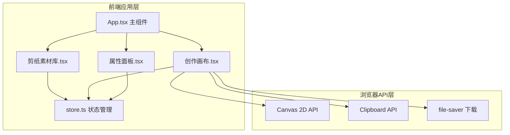
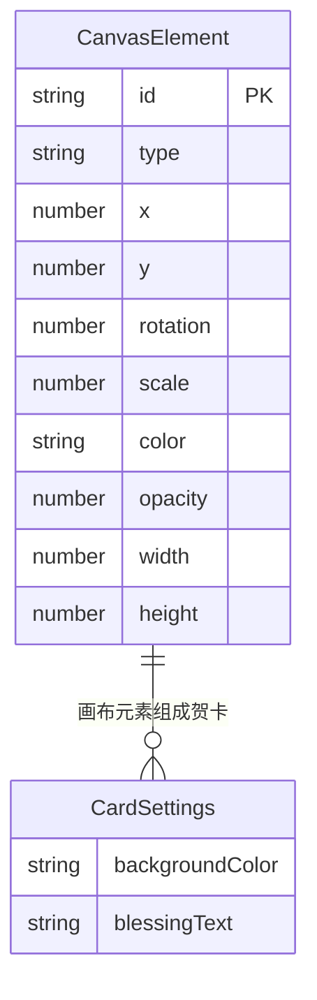

## 1. 架构设计



## 2. 技术说明

- 前端：React@18 + TypeScript + Vite
- 初始化工具：vite-init (react-ts 模板)
- 状态管理：Zustand
- 文件下载：file-saver
- 后端：无
- 数据库：无

## 3. 路由定义

| 路由 | 用途 |
|------|------|
| / | 主页面，包含素材库、画布、属性面板 |

单页面应用，无需多路由。

## 4. API定义

无后端API，所有数据和逻辑在前端处理。

## 5. 服务器架构图

不适用

## 6. 数据模型

### 6.1 数据模型定义



### 6.2 数据定义

```typescript
interface CanvasElement {
  id: string;
  type: string;
  x: number;
  y: number;
  rotation: number;
  scale: number;
  color: string;
  opacity: number;
  width: number;
  height: number;
}

interface CardSettings {
  backgroundColor: string;
  blessingText: string;
}

interface AppState {
  elements: CanvasElement[];
  selectedElementId: string | null;
  cardSettings: CardSettings;
  addElement: (type: string) => void;
  updateElement: (id: string, updates: Partial<CanvasElement>) => void;
  removeElement: (id: string) => void;
  selectElement: (id: string | null) => void;
  setCardSettings: (settings: Partial<CardSettings>) => void;
}
```

8种剪纸元素类型：龙、凤、鱼、虎、鹤、鹿、蝙蝠、蝴蝶
