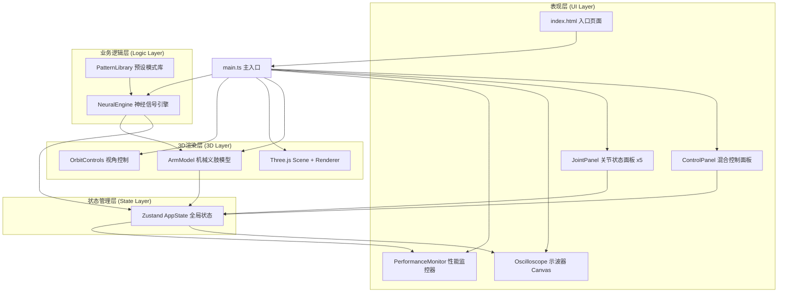

## 1. 架构设计



## 2. 技术选型说明

| 技术栈 | 版本 | 用途 |
|--------|------|------|
| TypeScript | 5.x | 类型安全的开发语言，target ES2020 |
| Vite | 5.x | 构建工具与开发服务器（端口3000） |
| Three.js | 0.160.x | 3D场景渲染、模型创建与交互 |
| @types/three | 0.160.x | Three.js TypeScript类型定义 |
| Zustand | 4.x | 轻量级全局状态管理 |
| HTML5 Canvas | - | 示波器波形绘制 |
| file-saver | 2.x | 信号数据导出（可选功能） |

## 3. 项目目录结构

```
auto120/
├── index.html                          # 入口HTML页面
├── package.json                        # 项目依赖配置
├── vite.config.js                      # Vite构建配置
├── tsconfig.json                       # TypeScript编译配置
└── src/
    ├── main.ts                         # 应用主入口
    ├── arm/
    │   ├── ArmModel.ts                 # 机械义肢3D模型类
    │   └── JointPanel.ts               # 关节状态面板UI类
    ├── neural/
    │   ├── NeuralEngine.ts             # 神经信号模拟引擎
    │   └── PatternLibrary.ts           # 预设神经信号模式库
    ├── ui/
    │   ├── ControlPanel.ts             # 混合控制面板UI
    │   └── Oscilloscope.ts             # 示波器Canvas渲染类
    └── store/
        └── AppState.ts                 # Zustand全局状态定义
```

## 4. 核心模块定义

### 4.1 ArmModel (src/arm/ArmModel.ts)

```typescript
export interface JointData {
  index: number;
  name: string;
  currentAngle: number;
  targetAngle: number;
  torque: number;
  lastPulseTime: number;
}

export class ArmModel {
  constructor(scene: THREE.Scene, store: typeof useAppStore);
  public setJointAngle(jointIndex: number, angle: number): void;
  public getJointWorldPosition(jointIndex: number): THREE.Vector3;
  public highlightJoint(jointIndex: number, duration: number): void;
  public calibrateJoint(jointIndex: number, duration: number): Promise<void>;
  public update(deltaTime: number): void;
  public getJointMeshes(): THREE.Mesh[];
}
```

**职责**：
- 创建肩、肘、腕、指、指尖五个关节的3D几何体
- 配置金属材质（#708090到#454545渐变）、发丝纹和铆钉细节
- 管理关节层级父子关系和旋转轴
- 处理关节角度插值动画（平滑过渡）
- 提供关节世界坐标用于UI面板定位

### 4.2 NeuralEngine (src/neural/NeuralEngine.ts)

```typescript
export interface WaveformSample {
  timestamp: number;
  values: number[];  // 每个关节的信号值
}

export class NeuralEngine {
  constructor(store: typeof useAppStore);
  public selectPattern(patternName: string): void;
  public setManualSignal(jointIndex: number, value: number): void;
  public setSensitivity(sensitivity: number): void;
  public getWaveformData(): WaveformSample[];
  public start(): void;
  public stop(): void;
  public togglePause(): void;
}
```

**职责**：
- 生成正弦波到方波渐变的脉冲波形
- 管理每条迹线最多6000个采样点的环形缓冲
- 根据关节角度和敏感度调节振幅和频率
- 处理模式演示时的多迹线相位偏移（0.5秒延迟）
- 每帧最多追加100个新采样点，保持性能

### 4.3 Oscilloscope (src/ui/Oscilloscope.ts)

```typescript
export class Oscilloscope {
  constructor(canvas: HTMLCanvasElement, store: typeof useAppStore);
  public update(waveformData: WaveformSample[]): void;
  public setTraceColors(colors: string[]): void;
  public resize(width: number, height: number): void;
}
```

**职责**：
- Canvas绘制黑色背景和暗绿色#003300网格线
- 绘制亮青色#00FFFF信号迹线，线宽2px
- 实现波形实时滚动效果
- 模式演示时绘制五条彩色迹线（红#FF4444、绿#44FF44、蓝#4444FF、黄#FFFF44、紫#FF44FF）
- 优化渲染：每帧仅绘制最新100个点区域

### 4.4 ControlPanel (src/ui/ControlPanel.ts)

```typescript
export class ControlPanel {
  constructor(
    container: HTMLElement,
    armModel: ArmModel,
    neuralEngine: NeuralEngine,
    store: typeof useAppStore
  );
  public setMode(mode: 'manual' | 'pattern'): void;
  public updateJointDisplay(jointIndex: number, angle: number): void;
}
```

**职责**：
- 创建五个关节角度滑块（120px宽，6px轨道，18px圆形滑块）
- 创建全局敏感度旋钮（30px半径，12档刻度0.1-2.0）
- 创建模式库滚动列表（220px宽，60px条目高）
- 创建暂停/恢复按钮（40x40px）
- 实现50ms防抖延迟模拟神经传导
- 处理所有UI交互事件和状态更新

### 4.5 JointPanel (src/arm/JointPanel.ts)

```typescript
export class JointPanel {
  constructor(
    jointIndex: number,
    armModel: ArmModel,
    neuralEngine: NeuralEngine,
    store: typeof useAppStore
  );
  public updatePosition(screenX: number, screenY: number): void;
  public updateData(angle: number, torque: number, timestamp: number): void;
  public getElement(): HTMLElement;
}
```

**职责**：
- 创建半透明悬浮卡片（rgba(20,20,30,0.85)，8px圆角，1px浅蓝色边框）
- 显示关节角度（0-180°整数）
- 绘制环形扭矩进度条（绿色到红色渐变）
- 显示最后脉冲时间戳（mm:ss.ms格式）
- 创建校准按钮，触发2秒归零动画
- 实现0.3秒阻尼跟随效果

### 4.6 AppState (src/store/AppState.ts)

```typescript
export interface AppState {
  // 模式状态
  currentMode: 'manual' | 'pattern';
  isPaused: boolean;
  sensitivity: number;

  // 关节状态 [肩, 肘, 腕, 指, 指尖]
  jointAngles: number[];
  jointTorques: number[];
  jointLastPulse: number[];
  jointTargets: number[];

  // 信号数据
  waveformData: WaveformSample[];
  currentPattern: string | null;
  patternProgress: number;

  // 性能数据
  fps: number;
  sampleRate: number;

  // Actions
  setMode: (mode: 'manual' | 'pattern') => void;
  togglePause: () => void;
  setSensitivity: (s: number) => void;
  setJointAngle: (index: number, angle: number) => void;
  setJointTorque: (index: number, torque: number) => void;
  setJointLastPulse: (index: number, time: number) => void;
  appendWaveform: (sample: WaveformSample) => void;
  selectPattern: (name: string | null) => void;
  setPatternProgress: (progress: number) => void;
  setPerformance: (fps: number, sampleRate: number) => void;
  reset: () => void;
}

export const useAppStore = create<AppState>((set, get) => ({ ... }));
```

## 5. 关键数据结构

### 5.1 预设模式 (src/neural/PatternLibrary.ts)

```typescript
export interface PatternKeyframe {
  time: number;           // 时间点（秒）
  jointAngles: number[];  // 五个关节的目标角度
  jointTorques: number[]; // 五个关节的扭矩值
}

export interface NeuralPattern {
  id: string;
  name: string;
  description: string;
  duration: number;       // 总时长 3-5秒
  keyframes: PatternKeyframe[];
  waveformType: 'sine' | 'square' | 'mixed';
}

export const patterns: Record<string, NeuralPattern> = {
  grasp: { ... },      // 抓握
  lift: { ... },       // 抬举
  rotate: { ... },     // 旋转
  tap: { ... },        // 点按
  pulse: { ... },      // 脉冲发射
};
```

## 6. 主循环与时间管理

```typescript
// main.ts 主循环伪代码
const clock = new THREE.Clock();
let lastFrameTime = performance.now();
let frameCount = 0;
let fpsUpdateTime = 0;

function animate() {
  requestAnimationFrame(animate);
  if (store.getState().isPaused) return;

  const delta = clock.getDelta();
  const now = performance.now();

  // 1. 更新3D模型关节角度插值
  armModel.update(delta);

  // 2. 神经引擎生成新采样点（最多100个/帧）
  neuralEngine.update(delta);

  // 3. 示波器Canvas渲染
  oscilloscope.update(store.getState().waveformData);

  // 4. 更新关节面板位置和数据
  jointPanels.forEach((panel, i) => {
    const worldPos = armModel.getJointWorldPosition(i);
    const screenPos = projectToScreen(worldPos, camera, renderer);
    panel.updatePosition(screenPos.x, screenPos.y);
  });

  // 5. FPS计算（每秒更新一次）
  frameCount++;
  if (now - fpsUpdateTime >= 1000) {
    const fps = Math.round(frameCount * 1000 / (now - fpsUpdateTime));
    const sampleRate = neuralEngine.getSampleRate();
    store.getState().setPerformance(fps, sampleRate);
    frameCount = 0;
    fpsUpdateTime = now;
  }

  // 6. Three.js渲染
  renderer.render(scene, camera);
}
```

## 7. 性能优化策略

| 优化点 | 策略 |
|--------|------|
| 3D渲染 | 复用Geometry，使用MeshStandardMaterial，合理设置像素比 |
| 波形绘制 | 环形缓冲区，每帧仅重绘增量区域（最新100点），避免全屏清屏 |
| 状态更新 | Zustand选择器订阅，避免不必要的组件重渲染 |
| DOM操作 | 关节面板使用transform定位而非top/left，启用GPU合成 |
| 内存管理 | 波形数据固定长度6000点环形覆盖，避免数组持续增长 |
| 事件节流 | 滑块拖拽使用requestAnimationFrame合并更新 |

## 8. 启动脚本

```bash
# 安装依赖
npm install

# 启动开发服务器（端口3000）
npm run dev
```
