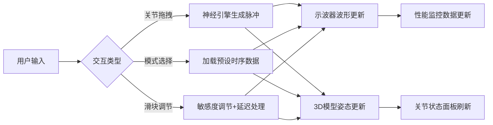

## 1. 产品概述

活体机械义肢神经信号模拟器 - 一个面向硬核科幻爱好者和技术研究人员的交互式Web应用，通过3D可视化和实时信号波形展示，直观呈现仿生义肢中神经脉冲如何驱动机械关节运动的全过程。

- **核心价值**：将抽象的神经-机械接口概念转化为可交互、可观察的视觉体验，降低理解门槛
- **目标用户**：科幻爱好者、神经工程研究者、学生及教育工作者

## 2. 核心功能

### 2.1 用户角色

| 角色 | 使用场景 | 核心权限 |
|------|----------|----------|
| 普通用户 | 浏览和交互体验 | 所有交互功能、模式切换、参数调节 |

### 2.2 功能模块

1. **3D机械义肢模块**：高精度五关节机械臂模型（肩、肘、腕、指、指尖），支持交互拖拽
2. **神经信号示波器**：Canvas实时绘制神经脉冲波形，支持多迹线叠加显示
3. **关节状态面板**：每个关节独立显示角度、扭矩、脉冲时间戳，支持校准
4. **神经信号模式库**：五种预设动作模式（抓握、抬举、旋转、点按、脉冲发射）
5. **混合控制面板**：关节角度滑块、全局敏感度旋钮、模式选择
6. **性能监控器**：实时FPS和采样率显示，低帧率告警
7. **暂停/恢复控制**：全局动画和信号暂停功能

### 2.3 功能详情

| 模块名称 | 子功能 | 功能描述 |
|----------|--------|----------|
| 3D机械义肢 | 关节交互 | 点击/拖拽关节触发角度变化，伴随0.3秒淡蓝色光晕 |
| 3D机械义肢 | 视角控制 | 鼠标拖拽旋转（水平0-360°，垂直15-75°），滚轮缩放（1.5-6.0单位） |
| 神经信号示波器 | 波形绘制 | 黑色背景、暗绿网格、亮青信号迹线，线宽2px，实时滚动 |
| 神经信号示波器 | 多迹线模式 | 模式演示时显示五条不同颜色迹线（红绿蓝黄紫），相位偏移0.5秒 |
| 关节状态面板 | 状态显示 | 角度（0-180°）、扭矩环形进度条（绿-红渐变）、脉冲时间戳（mm:ss.ms） |
| 关节状态面板 | 校准功能 | 2秒归零动画，cubic-bezier缓出，同步显示校准波形 |
| 信号模式库 | 模式列表 | 宽220px滚动列表，条目高60px，深灰背景，悬停高亮 |
| 混合控制面板 | 角度滑块 | 五个120px宽滑块，轨道6px，滑块18px，拖拽实时显示数值 |
| 混合控制面板 | 敏感度旋钮 | 30px半径，12档刻度（0.1-2.0，步长0.1），防滑纹路 |
| 混合控制面板 | 神经延迟 | 50ms稳定延迟模拟真实神经传导 |
| 性能监控器 | 实时数据 | FPS（绿色）、采样率（蓝色），monospace字体12px |
| 性能监控器 | 告警机制 | FPS<30时红色边框0.5秒周期闪烁 |
| 暂停控制 | 暂停/恢复 | 40x40px按钮，播放/暂停图标，背景#333，悬停#555 |

## 3. 核心流程

用户打开应用后，首先经历1.5秒渐入动画，随后可以通过三种方式与系统交互：

1. **直接交互模式**：点击/拖拽3D模型关节 → 生成对应脉冲波形 → 关节光晕反馈
2. **预设模式**：从模式库选择动作 → 五关节按预设时序联动 → 示波器显示多迹线波形
3. **自由调节模式**：使用底部滑块调节各关节角度 → 50ms延迟后模型响应 → 示波器实时更新

## 4. 用户界面设计

### 4.1 设计风格

- **主色调**：青色#00BFFF（神经信号）、金属灰#708090（机械材质）、枪铁色#454545（金属暗部）
- **背景**：纯黑#000000到深蓝#0A0A1A的线性渐变
- **面板样式**：1px浅色边框（透明度0.3）、4px发光阴影（与主色同色）、半透明背景
- **按钮状态**：悬停亮度+20%，点击缩放0.95，禁用透明度0.4
- **字体**：monospace系字体用于数据显示，无衬线字体用于界面文本

### 4.2 页面布局

| 区域 | 位置 | 内容 |
|------|------|------|
| 性能监控 | 左上角 | FPS、采样率显示（160x80px） |
| 暂停按钮 | 右上角 | 播放/暂停切换（40x40px） |
| 3D场景 | 左侧主区域 | 机械义肢模型，默认45°俯视，距离3.5单位 |
| 示波器面板 | 右侧上方 | Canvas波形显示 |
| 模式库面板 | 右侧下方 | 220px宽滚动列表 |
| 混合控制面板 | 底部 | 90%宽度，180px高度，半透明 |
| 关节状态面板 | 关节附近悬浮 | 跟随3D模型位置，阻尼移动 |

### 4.3 响应式设计

- **宽度<1024px**：示波器和模式库改为上下堆叠，3D场景高度缩减至60%
- **宽度<600px**：滑块控制面板改为垂直滚动列表

### 4.4 动画效果

- **启动渐入**：1.5秒（背景→义肢淡入→信号面板滑入→控制面板滑入，各0.5秒间隔）
- **模式切换**：0.3秒缓出过渡
- **面板跟随**：镜头旋转时0.3秒阻尼延迟
- **关节光晕**：0.3秒淡蓝色发光
- **校准动画**：2秒缓出归零

### 4.5 3D场景配置

- **材质**：金属灰#708090到枪铁色#454545渐变，发丝纹法线贴图，铆钉细节
- **光照**：主光+补光+轮廓光三点布光，突出金属质感
- **相机**：默认前方45°俯视，距离3.5单位
- **交互**：OrbitControls限制旋转和缩放范围
- **后处理**：轻微Bloom增强光晕效果

## 5. 性能指标

- **3D渲染**：1080p分辨率下≥50FPS
- **信号处理**：波形绘制和动画计算≥30FPS
- **示波器约束**：最多6条迹线，每条最多6000采样点，每帧仅更新最新100个点
