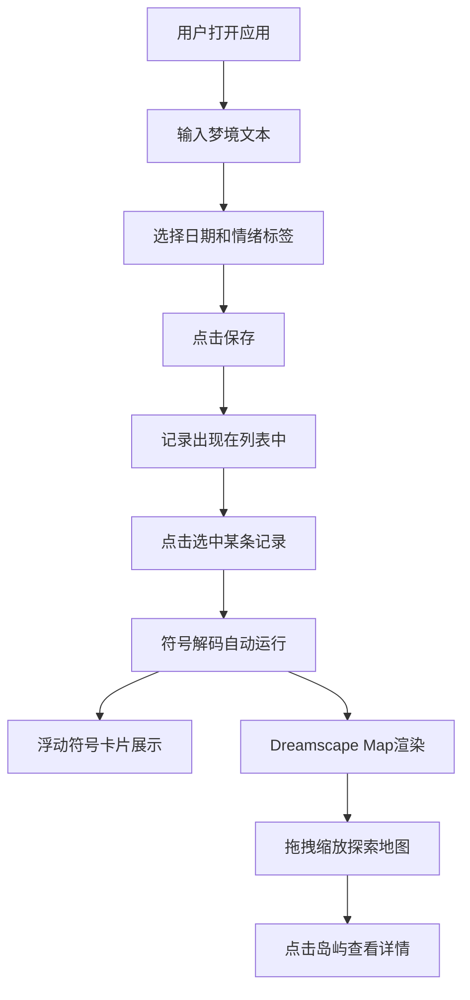

## 1. 产品概述

梦境图鉴与符号解码器是一款帮助用户记录、可视化和解码梦境的沉浸式Web应用。通过梦境日记、符号解码引擎和梦幻地图可视化三大模块，让用户探索梦境中反复出现的符号与模式。
- 目标用户：对梦境解析、自我探索和心理学感兴趣的用户
- 核心价值：将抽象的梦境体验转化为可交互的视觉图鉴，提供直觉式的符号解码体验

## 2. 核心功能

### 2.1 用户角色
| 角色 | 注册方式 | 核心权限 |
|------|----------|----------|
| 普通用户 | 无需注册 | 记录梦境、解码符号、查看可视化地图 |

### 2.2 功能模块
1. **梦日记模块**：梦境文本输入、日期选择、情绪标签、梦境记录列表
2. **符号解码模块**：关键词提取、符号库匹配、浮动符号卡片展示
3. **梦境可视化模块**：Dreamscape Map 梦幻地图、漂浮岛屿、关联连线、拖拽缩放、岛屿详情弹窗

### 2.3 页面详情
| 页面名称 | 模块名称 | 功能描述 |
|----------|----------|----------|
| 主页面 | 梦日记模块 | 文本输入框支持markdown简易格式（#标题、**强调），日期选择器默认当天可前选30天，6种情绪标签（平静#A8D8EA、喜悦#F7C948、悲伤#6A9FB5、恐惧#8B5E83、愤怒#D94A4A、混乱#B0A1C8），选中标签外发光8px，保存后右侧显示记录列表（日期降序，标签颜色小块，文本摘要前15字） |
| 主页面 | 符号解码模块 | 选定梦境后自动运行解码，内置30个常见梦境符号（各配emoji），匹配成功符号以浮动卡片展示（80x80px，半透明白色背景，左上emoji，右下匹配次数，从左到右自动换行底部对齐） |
| 主页面 | 梦境可视化模块 | Canvas渲染Dreamscape Map（宽60%高600px），深紫#1A0A2E到深蓝#0D1B2A径向渐变背景，支持拖拽缩放，匹配符号形成漂浮岛屿（半径30-50px随机，自然类绿色系#2E8B57~#98FB98，建筑类灰色系#696969~#D3D3D3），岛屿间半透明浅蓝曲线连接（透明度0.2-0.8随关联强度变化），点击岛屿弹出详情框（符号名称、匹配次数、相关语境片段） |

## 3. 核心流程

用户打开应用 → 在左侧梦日记模块输入梦境文本、选择日期和情绪标签 → 点击保存 → 梦境记录出现在右侧列表 → 点击列表中的某条记录 → 符号解码模块自动提取关键词并匹配符号库 → 匹配的符号以浮动卡片展示 → 右侧可视化模块渲染Dreamscape Map → 用户拖拽缩放探索地图 → 点击岛屿查看符号详情

## 4. 用户界面设计

### 4.1 设计风格
- 主背景色#121212，卡片/面板#1E1E1E，字体浅灰#E0E0E0
- 强调色：柔和紫#BB86FC、蓝紫#6200EA
- 按钮样式：圆角12px，hover时0.2s缓动底色过渡至#333333
- 字体：正文14-16px，标题18-20px，使用思源黑体或Noto Sans SC
- 布局：左右分栏（左40%右60%），2px柔光分隔线（紫色渐变#BB86FC到透明）
- 面板统一：圆角12px、内边距16px、0.5px浅色边框#333333、阴影0 4px 12px rgba(0,0,0,0.4)

### 4.2 页面设计概览
| 页面名称 | 模块名称 | UI元素 |
|----------|----------|--------|
| 主页面 | 梦日记模块 | 左侧面板，文本输入框，日期选择器，6个情绪标签（80x30px圆角矩形，选中时外发光8px），保存按钮，右侧记录列表（日期+颜色小块+15字摘要），0.3s ease-in-out动画 |
| 主页面 | 符号解码模块 | 梦境文本下方，浮动符号卡片（80x80px，半透明白色背景，左上emoji右下次数），自动换行底部对齐 |
| 主页面 | 梦境可视化模块 | Canvas区域（60%宽600px高），深紫到深蓝径向渐变背景，漂浮岛屿（30-50px半径），浅蓝半透明曲线连接，点击弹出详情框 |

### 4.3 响应式设计
- 桌面端：左右分栏布局（40%/60%）
- 移动端（<768px）：上下堆叠，各占满屏宽，卡片和岛屿等比缩小至80%
- 触摸优化：Canvas支持触摸拖拽和双指缩放

### 4.4 视觉细节
- 所有交互元素hover添加0.2s缓动底色过渡（从当前色到#333333）
- 所有状态变更带0.3s ease-in-out缓动动画
- 符号卡片出现带缩放动画
- 列表切换带淡入淡出
- 地图缩放带平滑过渡
