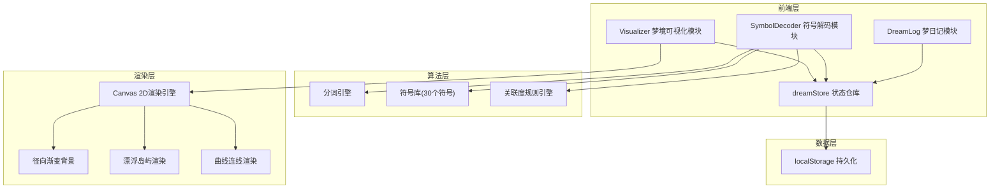
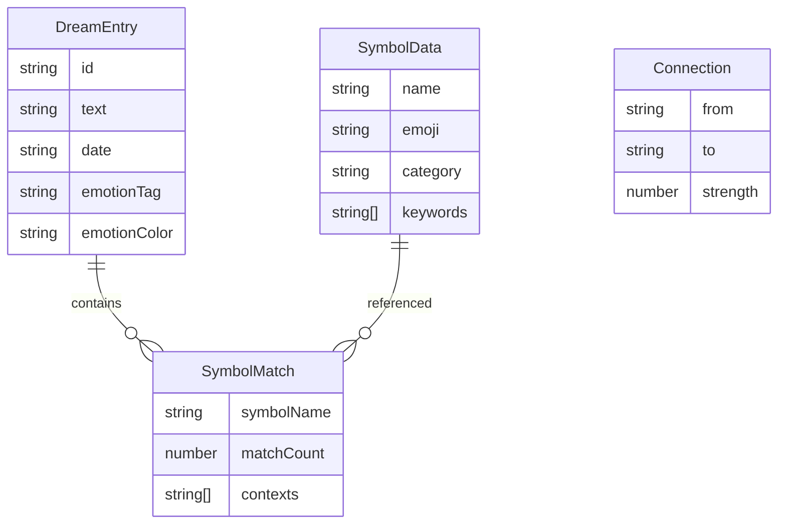

## 1. 架构设计



## 2. 技术说明
- 前端：React@18 + TypeScript + Vite + Zustand
- 初始化工具：vite-init (react-ts模板)
- 后端：无（纯前端应用）
- 数据持久化：localStorage
- 渲染引擎：Canvas 2D API

## 3. 路由定义
| 路由 | 用途 |
|------|------|
| / | 主页面，包含梦日记、符号解码和可视化三大模块 |

## 4. 文件结构
```
├── package.json
├── vite.config.js
├── tsconfig.json
├── index.html
└── src/
    ├── main.tsx
    ├── App.tsx
    ├── types.ts
    ├── dream/
    │   └── DreamLog.tsx
    ├── decode/
    │   ├── SymbolDecoder.tsx
    │   └── Visualizer.tsx
    └── store/
        └── dreamStore.ts
```

## 5. 核心数据模型

### 5.1 数据模型定义



### 5.2 类型定义

```typescript
interface DreamEntry {
  id: string;
  text: string;
  date: string;
  emotionTag: string;
  emotionColor: string;
}

interface SymbolData {
  name: string;
  emoji: string;
  category: 'nature' | 'architecture' | 'emotion' | 'action' | 'object';
  keywords: string[];
}

interface SymbolMatch {
  symbolName: string;
  emoji: string;
  category: string;
  matchCount: number;
  contexts: string[];
}

interface Connection {
  from: string;
  to: string;
  strength: number;
}

interface DreamStore {
  dreams: DreamEntry[];
  selectedDream: DreamEntry | null;
  decodedSymbols: SymbolMatch[];
  connections: Connection[];
  addDream: (dream: DreamEntry) => void;
  selectDream: (dream: DreamEntry) => void;
  setDecodedSymbols: (symbols: SymbolMatch[]) => void;
  setConnections: (connections: Connection[]) => void;
}
```

## 6. 核心算法

### 6.1 符号解码算法
1. 将梦境文本分词（按空格、标点分割，中文按字/词分割）
2. 遍历30个符号的关键词列表，统计每个关键词在文本中出现的次数
3. 匹配次数 > 0 的符号生成 SymbolMatch，提取关键词周围的文本作为语境片段
4. 计算符号间关联度：两个符号在同一句子中出现则关联度+1，归一化到0.2-0.8

### 6.2 岛屿布局算法
1. 使用力导向布局的简化版本，在Canvas中心区域随机分布
2. 有连接关系的岛屿靠近，无连接的远离
3. 岛屿位置在首次渲染时计算，拖拽时更新

### 6.3 Canvas渲染循环
1. 清除画布
2. 绘制径向渐变背景
3. 绘制连接曲线（贝塞尔曲线，透明度随强度变化）
4. 绘制漂浮岛屿（圆形，类别映射颜色，带呼吸动画）
5. 绘制岛屿上的emoji和名称
6. requestAnimationFrame循环，保持30FPS以上
