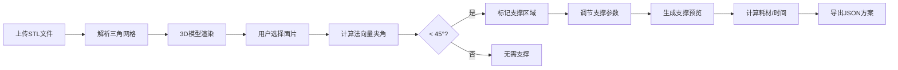

## 1. 产品概述
3D打印支撑结构设计工具，帮助用户在浏览器中设计并测试FDM打印模型的支撑方案，解决悬垂部分坍塌问题，降低用户凭经验规划支撑的难度。
- 核心功能：STL模型上传解析、悬垂面检测、支撑参数调节、支撑预览与导出
- 目标用户：3D打印爱好者、设计师、工程师
- 产品价值：可视化支撑设计，减少打印失败，优化耗材使用

## 2. 核心功能

### 2.1 功能模块
1. **模型视图区**：STL文件上传、3D模型渲染、面片选择高亮
2. **参数面板**：支撑形状选择、密度调节、接触面类型设置
3. **支撑预览**：实时生成支撑结构3D预览、体积与耗材估算
4. **方案导出**：JSON格式支撑描述文件生成与下载

### 2.2 页面详情
| 页面名称 | 模块名称 | 功能描述 |
|-----------|-------------|---------------------|
| 主界面 | 模型上传模块 | 支持50MB以内STL文件上传，解析二进制/ASCII格式 |
| 主界面 | 3D视图模块 | Three.js渲染三角网格，半透明浅灰色材质，支持旋转缩放 |
| 主界面 | 面片选择模块 | 点击面片高亮红色#FF4500，自动计算法向量夹角 |
| 主界面 | 支撑标记模块 | 小于45°的悬垂面用橙色#FFA500点状网格覆盖，密度可调 |
| 主界面 | 参数调节模块 | 树形/柱形支撑选择，密度2-8点/cm²滑块，触角式/平顶式接触 |
| 主界面 | 支撑预览模块 | 亮青色#00FFFF半透明管状支撑，从平台延伸到支撑点 |
| 主界面 | 信息展示模块 | 支撑体积cm³、耗材重量g、增加时间min实时计算 |
| 主界面 | 导出模块 | 生成JSON支撑方案文件并自动下载 |

## 3. 核心流程
用户上传STL模型 → 系统解析渲染3D网格 → 用户点击选择悬垂面片 → 系统计算法向量夹角并标记需支撑区域 → 用户调整支撑参数 → 系统实时生成支撑预览 → 系统计算体积/耗材/时间 → 用户导出支撑方案JSON文件

## 4. 用户界面设计

### 4.1 设计风格
- 主色调：深色主题#1E1E1E背景，磨砂深灰#2C2C2C面板，暗蓝灰#1A2A3A信息栏
- 强调色：深蓝色#1E90FF滑块高亮，亮青色#00FFFF支撑预览，橙色#FFA500支撑点，红色#FF4500选中面片
- 按钮：圆角6px，主按钮#1E90FF（悬停#00BFFF），次按钮#555（悬停#666）
- 字体：12px无衬线字体#B0B0B0标签，白色#FFFFFF信息文本
- 布局：左60%模型视图，右40%参数+信息栏，垂直分割
- 动画：0.3秒缓出过渡，响应式堆叠布局（<768px）

### 4.2 页面设计概述
| 页面名称 | 模块名称 | UI Elements |
|-----------|-------------|-------------|
| 主界面 | 模型视图区 | Three.js画布、上传按钮、旋转/缩放交互、面片点击高亮 |
| 主界面 | 参数面板 | 280px宽磨砂面板、下拉菜单、滑块（轨道#444，滑块头#1E90FF圆形16px）、标签横向排列 |
| 主界面 | 信息栏 | 200px宽暗蓝灰背景、白色文本、三项指标数值显示 |
| 主界面 | 按钮区 | 生成预览主按钮、导出方案次按钮 |

### 4.3 响应式
- 桌面端（≥768px）：左右布局，模型视图60%，参数+信息40%
- 移动端（<768px）：上下堆叠布局，模型视图在上，参数面板在下
- 动画过渡：0.3秒ease-out缓出效果
- 触摸优化：支持触摸拖拽旋转，双击重置视图

### 4.4 3D场景指导
- 环境：深色背景#1E1E1E，无HDRI，保持专业简洁
- 光照：双平行光（顶光+侧光）+ 环境光，突出模型轮廓和细节
- 相机：透视相机，初始距离包含完整模型，支持OrbitControls旋转缩放
- 交互：左键旋转，滚轮缩放，右键平移，点击拾取面片
- 性能：50MB模型加载≤5秒，支撑更新≤0.5秒，帧率≥30FPS
- 后处理：无复杂后处理，保持清晰锐利的线条和填充
