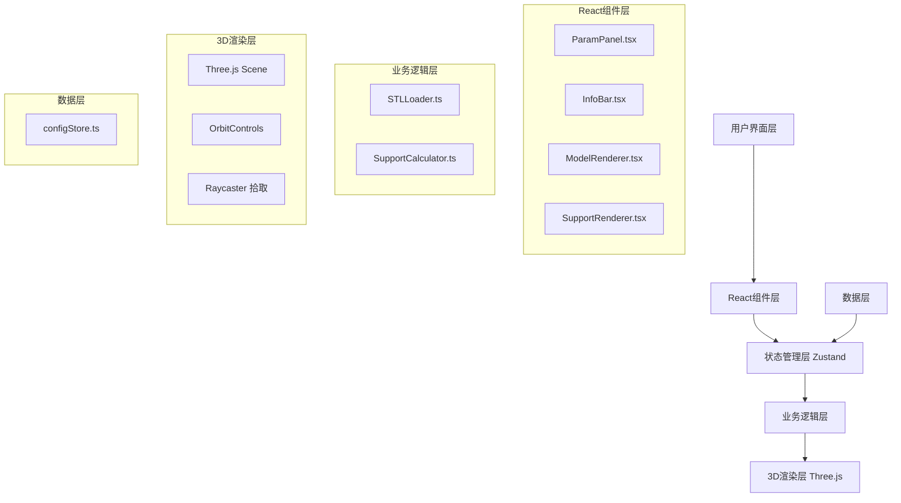
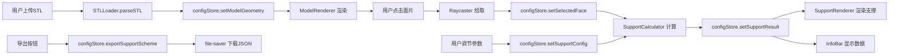

## 1. 架构设计



## 2. 技术描述
- 前端框架：React 18 + TypeScript 5
- 构建工具：Vite 5
- 3D渲染：Three.js 0.160 + @types/three
- 状态管理：Zustand 4
- 文件处理：file-saver 2.0
- 唯一标识：uuid 9.0
- 路径别名：@/ 指向 src/
- 初始化方式：Vite react-ts 模板

## 3. 项目结构
```
auto123/
├── package.json
├── vite.config.js
├── tsconfig.json
├── index.html
└── src/
    ├── model/
    │   ├── STLLoader.ts          # STL文件解析
    │   └── ModelRenderer.tsx      # 3D模型渲染组件
    ├── support/
    │   ├── SupportCalculator.ts   # 支撑计算逻辑
    │   └── SupportRenderer.tsx    # 支撑预览渲染组件
    ├── components/
    │   ├── ParamPanel.tsx         # 参数调节面板
    │   └── InfoBar.tsx            # 信息展示栏
    ├── store/
    │   └── configStore.ts         # Zustand全局状态
    ├── App.tsx                    # 主应用组件
    └── main.tsx                   # 入口文件
```

## 4. 核心模块定义

### 4.1 STLLoader.ts
```typescript
export interface STLParseResult {
  geometry: THREE.BufferGeometry;
  faceCount: number;
  vertexCount: number;
  normals: THREE.Vector3[];
}

export function parseSTL(file: File): Promise<STLParseResult>;
export function parseBinarySTL(buffer: ArrayBuffer): THREE.BufferGeometry;
export function parseASCIISTL(content: string): THREE.BufferGeometry;
```

### 4.2 SupportCalculator.ts
```typescript
export interface SupportPoint {
  x: number;
  y: number;
  z: number;
  faceIndex: number;
}

export interface SupportConfig {
  shape: 'tree' | 'column';
  density: number;
  contactType: 'tentacle' | 'flat';
  treeTrunkDiameter?: number;
  treeBranchAngle?: number;
  columnDiameter?: number;
  tentacleDiameter?: number;
}

export interface SupportResult {
  points: SupportPoint[];
  volume: number;
  materialWeight: number;
  estimatedTime: number;
  geometry: THREE.BufferGeometry;
}

export function calculateSupportAngle(normal: THREE.Vector3): number;
export function needsSupport(angle: number, threshold: number = 45): boolean;
export function generateSupportPoints(
  geometry: THREE.BufferGeometry,
  faceIndex: number,
  density: number
): SupportPoint[];
export function calculateSupportVolume(
  points: SupportPoint[],
  config: SupportConfig,
  buildPlateY: number
): number;
export function generateSupportGeometry(
  points: SupportPoint[],
  config: SupportConfig,
  buildPlateY: number
): THREE.BufferGeometry;
```

### 4.3 configStore.ts
```typescript
export interface ConfigState {
  modelFile: File | null;
  modelFileName: string;
  modelGeometry: THREE.BufferGeometry | null;
  selectedFaceIndex: number | null;
  selectedFaceNormal: THREE.Vector3 | null;
  supportConfig: SupportConfig;
  supportResult: SupportResult | null;
  isLoading: boolean;
  error: string | null;
  
  setModelFile: (file: File | null) => void;
  setModelGeometry: (geo: THREE.BufferGeometry | null) => void;
  setSelectedFace: (index: number | null, normal: THREE.Vector3 | null) => void;
  setSupportConfig: (config: Partial<SupportConfig>) => void;
  setSupportResult: (result: SupportResult | null) => void;
  setLoading: (loading: boolean) => void;
  setError: (error: string | null) => void;
  reset: () => void;
  exportSupportScheme: () => object;
}
```

## 5. 数据模型

### 5.1 支撑方案导出格式
```typescript
interface SupportScheme {
  modelFileName: string;
  exportTime: string;
  supportConfig: {
    shape: 'tree' | 'column';
    density: number;
    contactType: 'tentacle' | 'flat';
  };
  supportPoints: Array<{
    x: number;
    y: number;
    z: number;
    faceIndex: number;
  }>;
  metadata: {
    totalVolume: number;
    materialWeight: number;
    estimatedTime: number;
    pointCount: number;
  };
}
```

### 5.2 状态数据流


## 6. 性能优化策略
1. **STL解析优化**：Web Worker异步解析大文件，避免阻塞UI
2. **几何体优化**：使用BufferGeometry而非Geometry，合并绘制调用
3. **支撑计算缓存**：参数未变化时复用计算结果，使用useMemo
4. **渲染优化**：支撑几何体合并为单个BufferGeometry，减少draw call
5. **交互优化**：Raycaster只在点击时触发，避免每帧检测
6. **内存管理**：模型切换时正确dispose几何体和材质，避免内存泄漏

## 7. 构建配置
- Vite配置：React插件，路径别名@/，sourcemap开启
- TypeScript：严格模式，target ES2020，moduleResolution bundler
- 依赖版本锁定：精确版本号，避免语义化版本差异
