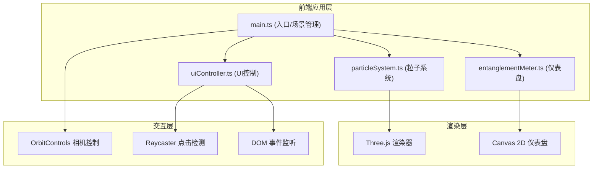

## 1. 架构设计



## 2. 技术描述

- **前端框架**：原生 TypeScript + Three.js
- **构建工具**：Vite 5.x
- **3D引擎**：Three.js r150+
- **类型系统**：TypeScript 5.x 严格模式
- **无后端**：纯前端可视化项目，无服务端依赖

### 技术选型说明

1. **Three.js**：轻量级WebGL库，适合3D可视化场景，支持粒子系统、几何体变形、材质定制
2. **TypeScript**：提供类型安全，提升代码可维护性
3. **Vite**：快速开发服务器，原生ESM支持，热更新迅速
4. **Canvas 2D**：仪表盘使用2D Canvas绘制，性能更优且易于实现指针动画

## 3. 文件结构

```
project/
├── package.json
├── vite.config.js
├── tsconfig.json
├── index.html
└── src/
    ├── main.ts              # 场景初始化、渲染循环、事件分发
    ├── particleSystem.ts    # 粒子系统：双球体、缠绕光带、脉动效果
    ├── entanglementMeter.ts # Canvas仪表盘：刻度、指针、动画
    └── uiController.ts      # UI控制：点击检测、控制面板、状态管理
```

### 模块职责

| 文件 | 职责 | 对外接口 |
|------|------|----------|
| main.ts | 初始化Three.js场景、相机、渲染器，管理渲染循环，协调各模块 | - |
| particleSystem.ts | 创建两个纠缠球体、缠绕光带，处理表面脉动动画，管理自旋状态 | `createParticles(scene)`, `setSpin(index, state)`, `pulse(index)` |
| entanglementMeter.ts | Canvas绘制半圆仪表盘，处理指针动画、纠缠度数值缓动 | `createMeter(container)`, `update(value)`, `resize()` |
| uiController.ts | Raycaster点击检测，控制面板显示隐藏，按钮交互，纠缠度逻辑 | `init(camera, particles, meter)`, `dispose()` |

## 4. 核心数据结构

### 自旋状态类型

```typescript
type SpinState = 'up' | 'down' | 'superposition';
```

### 粒子配置

```typescript
interface ParticleConfig {
  color: string;
  position: THREE.Vector3;
  radius: number;
  pulseFrequency: number;
  pulseAmplitude: number;
}
```

### 纠缠度状态

```typescript
interface EntanglementState {
  currentValue: number;
  targetValue: number;
  animationProgress: number;
  isAnimating: boolean;
}
```

## 5. 关键算法

### 5.1 球体表面脉动

使用正弦波扰动球体顶点位置：
- 频率：2Hz
- 振幅：0.03单位
- 对每个顶点应用：`position += normal * sin(time * frequency + phase) * amplitude`

### 5.2 缠绕光带螺旋

参数方程生成双螺旋路径：
- 主方向：两球心连线
- 螺旋半径：随距离变化
- 旋转速度：0.5圈/秒

### 5.3 纠缠度更新

- 行为一致时：+5 ~ +10（递增）
- 行为不一致时：-8 ~ -15（递减）
- 缓动函数：easeOutCubic
- 动画时长：0.5秒

### 5.4 easeOutCubic 缓动

```
function easeOutCubic(t):
  return 1 - pow(1 - t, 3)
```

## 6. 性能优化

- **几何体细分**：球体使用64x64分段，平衡质量与性能
- **粒子数量**：背景星尘粒子控制在500个以内
- **材质复用**：相同属性的粒子共享材质实例
- **动画优化**：使用requestAnimationFrame，避免重复计算
- **事件节流**：鼠标移动事件适当节流

## 7. 构建与运行

- **开发命令**：`npm run dev`
- **构建命令**：`npm run build`
- **预览命令**：`npm run preview`
- **部署路径**：base设置为 `'./'` 支持相对路径部署
