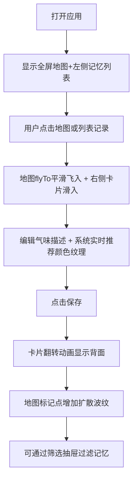

## 1. 产品概述

情绪气味记忆地图是一个让用户在地图上记录气味记忆的交互式Web应用。用户可以标记地点和日期，描述环境中的气味，系统自动生成带有颜色纹理和动画的气味记忆卡片，帮助用户通过视觉化方式保存和唤起气味相关的情感记忆。

- 目标用户：喜欢记录生活、追求感官体验的用户，有怀旧情感需求的人群
- 产品价值：将抽象的气味体验转化为可视化的数字记忆，通过地图空间+情感色彩+诗歌文字的多重维度，创造独特的记忆保存方式

## 2. 核心功能

### 2.1 功能模块

1. **主界面地图**：全屏交互式Leaflet地图，支持点击标记、平滑飞行动画、标记点脉冲动画
2. **左侧记忆面板**：毛玻璃效果悬浮面板，显示定位按钮、搜索框、时间倒序记忆列表
3. **气味编辑卡片**：右侧滑入式卡片，包含景致图片、日期选择、气味描述输入、颜色纹理智能推荐
4. **记忆卡片翻转动画**：保存后卡片翻页，显示编号、时间和随机情感短诗
5. **筛选抽屉**：左侧滑出抽屉，按气味类别和情感标签过滤记忆
6. **标记点聚合**：超过50个标记点时自动聚合，点击展开

### 2.2 页面详情

| 页面名称 | 模块名称 | 功能描述 |
|-----------|-------------|---------------------|
| 主界面 | 地图区域 | 全屏Leaflet地图，中心中国(35.8617,104.1954)，缩放级别3，支持点击选点 |
| 主界面 | 左侧记忆面板 | 320px宽半透明面板，毛玻璃模糊，定位+搜索+记忆列表(带彩色圆点) |
| 主界面 | 地图标记点 | 脉冲动画圆点，颜色对应情感标签，保存后增加扩散波纹 |
| 编辑卡片 | 景致图片区 | 随机季节场景占位图，渐入动画fadeIn 0.5s |
| 编辑卡片 | 表单区 | 日期选择器、气味文本输入框、3x3颜色纹理网格预览 |
| 编辑卡片 | 卡片背面 | 翻页动画rotateY 0.6s，显示编号/时间/情感短诗 |
| 筛选抽屉 | 分类过滤 | 气味类别(花香/木质/食物/环境)和情感标签(愉悦/怀旧/清新/压抑)筛选 |

## 3. 核心流程

用户打开应用 → 查看世界地图上已有记忆标记 → 点击地图空白位置或左侧列表记录 → 地图平滑飞入目标位置 → 右侧滑出气味编辑卡片 → 输入日期和气味描述 → 系统实时推荐颜色纹理 → 点击保存 → 卡片翻转动画显示背面信息 → 地图上新增标记点带扩散波纹 → 可通过左侧筛选抽屉过滤记忆

## 4. 用户界面设计

### 4.1 设计风格

- **主题**：深色太空主题，营造梦幻神秘的记忆氛围
- **主色调**：#0F3460(深空蓝)、#1A1A2E(深紫蓝)、#16213E(暗靛蓝)
- **强调色**：#E94560(霓虹粉)、#FF6B6B(暖红)、#00D2FF(冷青)
- **面板效果**：毛玻璃磨砂(backdrop-filter: blur(10px))，1px半透明白色边框
- **字体**：衬线字体Playfair Display用于短诗，无衬线字体用于界面文本
- **动画**：所有交互0.3s平滑过渡，脉冲动画周期2s，扩散波纹3s循环

### 4.2 页面设计概述

| 页面名称 | 模块名称 | UI元素 |
|-----------|-------------|-------------|
| 主界面 | 地图区域 | 全屏Leaflet地图、脉冲动画标记点、扩散波纹效果、聚合簇 |
| 主界面 | 左侧记忆面板 | 320px宽圆角面板、定位按钮、搜索框、纵向记忆列表(8px彩色圆点) |
| 编辑卡片 | 上半部分 | 400px宽圆角卡片(16px)、随机景致图片(fadeIn 0.5s) |
| 编辑卡片 | 表单区域 | 日期选择器、文本输入框(聚焦边框#E94560)、3x3色块网格(64px,2px间距) |
| 编辑卡片 | 卡片背面 | rotateY翻转0.6s、Playfair Display短诗、编号+时间戳 |
| 筛选抽屉 | 左侧滑出 | 250px宽#0F3460背景、气味类别+情感标签多选过滤 |

### 4.3 响应式

- 桌面端(>768px)：左侧悬浮面板320px，右侧地图区域，卡片从右滑入400px
- 移动端(≤768px)：地图占满宽度，左侧面板变为底部悬浮栏(高80px，横向滚动列表)，卡片全屏或底部弹出
- 触控优化：增大点击区域，支持触摸滑动

### 4.4 性能要求

- 地图交互帧率：≥40fps
- 卡片编辑界面渲染延迟：≤100ms
- 标记点聚合：超过50个自动聚合，簇大小24px-60px根据点数变化
