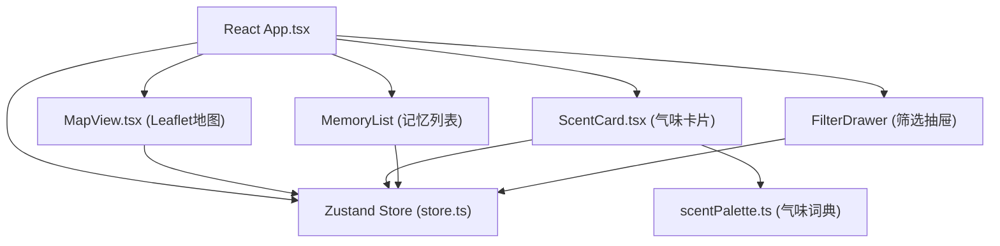
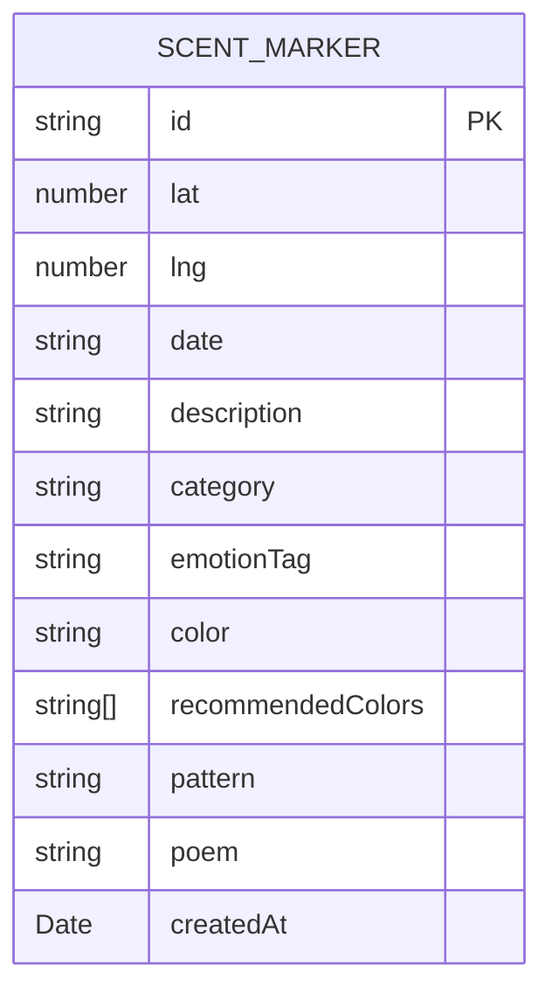

## 1. 架构设计

纯前端单页应用，无后端服务，状态通过Zustand管理，数据暂存于内存(可扩展为localStorage持久化)。



## 2. 技术描述

- **前端框架**：React 18 + TypeScript
- **构建工具**：Vite 5
- **地图库**：Leaflet + react-leaflet
- **状态管理**：Zustand
- **ID生成**：uuid
- **样式方案**：CSS Modules + 全局CSS变量(无Tailwind，保持轻量且便于动画控制)
- **无后端**：纯前端实现，mock数据内置

## 3. 项目文件结构

```
├── package.json
├── vite.config.js
├── tsconfig.json
├── index.html
└── src/
    ├── types.ts              # 类型定义
    ├── store.ts              # Zustand状态管理
    ├── App.tsx               # 主布局组件
    ├── data/
    │   └── scentPalette.ts   # 气味词典、颜色纹理映射、短诗库
    └── components/
        ├── MapView.tsx       # Leaflet地图渲染和标记交互
        ├── ScentCard.tsx     # 气味编辑卡片
        ├── MemoryPanel.tsx   # 左侧记忆列表面板
        └── FilterDrawer.tsx  # 筛选抽屉
```

## 4. 数据模型

### 4.1 数据模型定义



### 4.2 TypeScript类型定义

```typescript
// src/types.ts
type ScentCategory = 'floral' | 'woody' | 'food' | 'environment';
type EmotionTag = 'joyful' | 'nostalgic' | 'fresh' | 'oppressive';

interface ScentMarker {
  id: string;
  lat: number;
  lng: number;
  date: string;
  description: string;
  category: ScentCategory;
  emotionTag: EmotionTag;
  color: string;
  recommendedColors: string[];
  pattern: string;
  poem: string;
  createdAt: Date;
}

interface ColorTexture {
  colors: string[];
  pattern: string;
  gradient: string;
}
```

## 5. 状态管理(Zustand Store)

```typescript
// src/store.ts
interface ScentState {
  markers: ScentMarker[];
  selectedId: string | null;
  filters: {
    categories: ScentCategory[];
    emotions: EmotionTag[];
  };
  isFilterOpen: boolean;
  isCardOpen: boolean;
  // actions
  addMarker: (marker: ScentMarker) => void;
  selectMarker: (id: string | null) => void;
  setFilters: (filters: Partial<ScentState['filters']>) => void;
  toggleFilter: () => void;
  toggleCard: (open: boolean) => void;
}
```

## 6. 核心模块说明

### 6.1 MapView.tsx
- 使用react-leaflet渲染MapContainer，中心[35.8617, 104.1954]，zoom=3
- 处理地图点击事件，创建新标记或选中已有标记
- CircleMarker实现脉冲动画(通过CSS @keyframes)
- 超过50个标记点时实现简单聚合算法
- 点击标记触发flyTo动画(duration=1.5s)

### 6.2 ScentCard.tsx
- 右侧滑入动画(transform: translateX)
- 上半部分随机景致图片(fadeIn动画)
- 表单：日期选择器(type=date)、textarea气味描述
- 关键词实时匹配scentPalette.ts中的气味词典
- 3x3色块网格，使用CSS background生成纹理(repeating-linear-gradient + radial-gradient)
- 保存按钮触发flip翻转动画(transform: rotateY(180deg))
- 背面显示编号、时间、Playfair Display字体短诗

### 6.3 scentPalette.ts
- 内置30种气味词典(关键词→类别+情感标签)
- 30种颜色色板(按情感标签分组)
- 纹理pattern模板字符串(CSS gradient语法)
- 30首情感短诗数组

## 7. 性能优化

- 地图标记点使用Canvas或Leaflet的canvas渲染模式(如需要)
- 颜色推荐使用防抖处理关键词输入
- CSS动画优先使用transform和opacity属性(触发GPU加速)
- 标记点聚合减少同时渲染的DOM节点数量
- React.memo优化列表渲染
