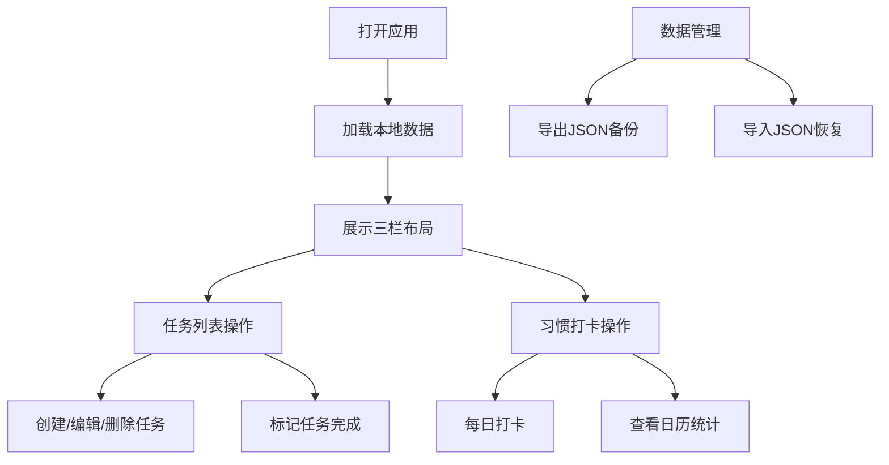

## 1. 产品概述
Tracker 是一款个人生产力工具，帮助用户高效规划和管理日常任务与习惯。解决传统待办清单缺乏习惯追踪、无法直观展示长期进度和连续打卡天数的问题。
- 主要用户：需要管理日常任务和培养习惯的个人用户
- 核心价值：任务管理 + 习惯追踪一体化，直观展示进度，数据本地存储安全隐私

## 2. 核心功能

### 2.1 用户角色
| 角色 | 注册方式 | 核心权限 |
|------|----------|----------|
| 普通用户 | 无需注册，直接使用 | 完整使用所有功能，数据存储在本地浏览器 |

### 2.2 功能模块
1. **任务管理模块**：任务创建、编辑、删除、分类筛选、优先级标记
2. **习惯追踪模块**：习惯创建、每日打卡、日历视图、连续打卡统计
3. **提醒通知模块**：任务提醒设置、浏览器桌面通知
4. **数据管理模块**：数据导入导出（JSON格式）、本地存储

### 2.3 页面详情
| 页面名称 | 模块名称 | 功能描述 |
|----------|----------|----------|
| 主页 | 左侧导航栏 | 分类导航、统计概览（今日任务数、连续打卡天数） |
| 主页 | 中间任务列表 | 任务卡片列表、按优先级和截止日期排序、任务完成切换、任务删除 |
| 主页 | 右侧习惯日历 | 月度日历视图、习惯打卡状态展示、连续打卡奖杯标识 |
| 任务弹窗 | 任务表单 | 创建/编辑任务，设置标题、截止日期、优先级、分类、提醒时间 |
| 习惯弹窗 | 习惯表单 | 创建/编辑习惯，设置习惯名称、图标 |

## 3. 核心流程
用户打开应用 → 查看今日任务和习惯日历 → 点击添加任务/习惯 → 填写表单保存 → 完成任务时勾选 → 习惯每日打卡 → 查看连续打卡天数 → 可随时导出/导入数据

## 4. 用户界面设计

### 4.1 设计风格
- **主色调**：深蓝色（#1e3a5f）作为主色，体现专业和专注
- **辅助色**：浅灰色（#f0f2f5）背景，红色（#ef4444）标记高优先级
- **卡片风格**：圆角卡片设计，统一圆角半径 8px
- **字体**：现代无衬线字体，清晰易读
- **动效**：统一 0.3 秒过渡动画，悬停阴影效果，点击缩放反馈

### 4.2 页面设计概览
| 页面名称 | 模块名称 | UI 元素 |
|----------|----------|---------|
| 主页 | 左侧栏 | 深蓝色背景、白色文字、统计数字高亮、分类列表 |
| 主页 | 中间栏 | 浅灰背景、白色任务卡片、红色高优先级标签、删除按钮 |
| 主页 | 右侧栏 | 日历网格、打卡状态（对勾/叉号/灰色）、奖杯图标 |

### 4.3 响应式
- 桌面端：三栏布局（左 20% + 中 50% + 右 30%）
- 平板端：两栏布局，习惯日历移至底部
- 移动端（< 768px）：单栏布局，左侧栏折叠为汉堡菜单
- 触摸优化：按钮最小尺寸 44px，适合手指点击

### 4.4 性能要求
- 任务列表首次渲染 < 500ms
- 查询和筛选操作响应 < 200ms
- 页面切换流畅无卡顿
