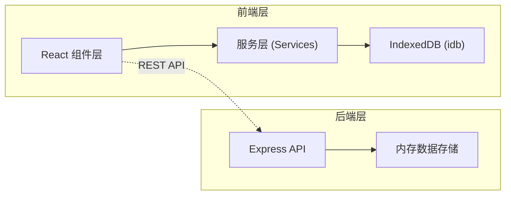

## 1. 架构设计



## 2. 技术描述

- **前端框架**：React 18 + TypeScript
- **构建工具**：Vite 5
- **状态管理**：React useState/useReducer（轻量级场景）
- **本地数据库**：IndexedDB（idb 库封装）
- **后端框架**：Express 4
- **后端语言**：TypeScript
- **HTTP 通信**：REST API + CORS
- **ID 生成**：uuid
- **通知**：浏览器 Notification API

## 3. 项目结构

```
auto13/
├── package.json
├── vite.config.js
├── tsconfig.json
├── index.html
├── src/
│   ├── client/          # 前端代码
│   │   ├── App.tsx      # 主应用组件
│   │   ├── components/  # 组件
│   │   │   ├── TaskBoard.tsx
│   │   │   ├── TaskItem.tsx
│   │   │   ├── HabitCalendar.tsx
│   │   │   ├── Sidebar.tsx
│   │   │   └── Modal.tsx
│   │   └── services/    # 服务层
│   │       ├── dbService.ts
│   │       ├── taskService.ts
│   │       └── habitService.ts
│   └── server/          # 后端代码
│       └── server.ts
```

## 4. 路由定义

| 路由 | 用途 |
|------|------|
| / | 主页面（任务列表 + 习惯日历） |

## 5. API 定义

### 5.1 任务相关 API

```typescript
// 任务类型定义
interface Task {
  id: string;
  title: string;
  dueDate: string; // ISO date string
  priority: 'high' | 'medium' | 'low';
  category: 'work' | 'study' | 'life';
  completed: boolean;
  remindMinutes?: number; // 5 | 15 | 30
  createdAt: string;
}

// GET /api/tasks - 获取所有任务
// 响应: Task[]

// POST /api/tasks - 创建任务
// 请求体: Omit<Task, 'id' | 'createdAt'>
// 响应: Task

// PUT /api/tasks/:id - 更新任务
// 请求体: Partial<Task>
// 响应: Task

// DELETE /api/tasks/:id - 删除任务
// 响应: { success: boolean }
```

### 5.2 习惯相关 API

```typescript
// 习惯类型定义
interface Habit {
  id: string;
  name: string;
  icon?: string;
  createdAt: string;
}

// 打卡记录
interface HabitCheck {
  habitId: string;
  date: string; // YYYY-MM-DD
  completed: boolean;
}

// GET /api/habits - 获取所有习惯
// 响应: Habit[]

// POST /api/habits - 创建习惯
// 响应: Habit

// PUT /api/habits/:id - 更新习惯
// 响应: Habit

// DELETE /api/habits/:id - 删除习惯
// 响应: { success: boolean }
```

## 6. 数据模型

### 6.1 IndexedDB 数据库结构

```
数据库名: trackerDB
版本: 1

对象仓库:
- tasks (keyPath: id)
  索引: by_dueDate (dueDate), by_priority (priority), by_category (category)

- habits (keyPath: id)
  索引: by_name (name)

- habitChecks (keyPath: [habitId, date])
  索引: by_habitId (habitId), by_date (date)
```

### 6.2 服务器内存数据结构

```typescript
interface ServerData {
  tasks: Task[];
  habits: Habit[];
  habitChecks: HabitCheck[];
}
```

## 7. 核心模块说明

### 7.1 dbService.ts
- 封装 IndexedDB 操作
- 提供任务和习惯的 CRUD 方法
- 使用 idb 库简化 IndexedDB 使用

### 7.2 TaskBoard.tsx
- 任务面板主组件
- 管理任务列表状态
- 处理任务的增删改查
- 按优先级和截止日期排序

### 7.3 HabitCalendar.tsx
- 习惯日历组件
- 渲染月度日历视图
- 显示打卡状态
- 计算连续打卡天数

### 7.4 server.ts
- Express 服务器
- 提供 REST API 接口
- 内存数组模拟数据存储
- CORS 跨域支持
