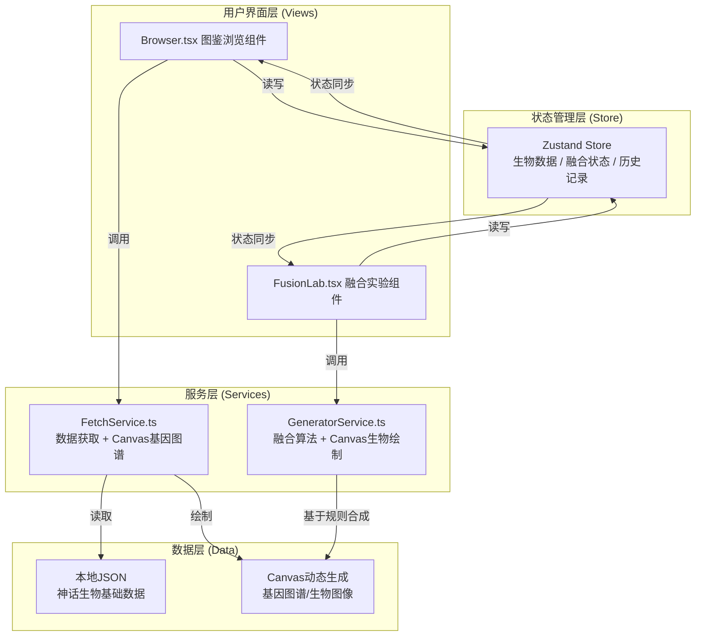

## 1. 架构设计



## 2. 技术描述

- **前端框架**：React@18 + TypeScript
- **构建工具**：Vite@5 + @vitejs/plugin-react
- **状态管理**：Zustand@4
- **拖拽库**：react-beautiful-dnd@13
- **唯一ID**：uuid@9
- **Canvas绑定**：原生HTML5 Canvas API（基因图谱绘制、融合生物绘制、雷达图）
- **样式方案**：原生CSS + CSS Modules（内联style + 全局index.css）
- **后端**：无（纯前端应用，数据存储在本地JSON和内存状态）

## 3. 目录结构

```
d:\Pro\tasks\auto132
├── .trae/
│   └── documents/
│       ├── PRD.md
│       └── ARCHITECTURE.md
├── index.html
├── package.json
├── vite.config.js
├── tsconfig.json
└── src/
    ├── main.tsx
    ├── App.tsx
    ├── index.css
    ├── components/
    │   ├── Browser.tsx
    │   ├── FusionLab.tsx
    │   ├── CreatureCard.tsx
    │   ├── GeneFragment.tsx
    │   ├── FusionSlot.tsx
    │   ├── CreatureModal.tsx
    │   ├── RadarChart.tsx
    │   ├── HistoryPanel.tsx
    │   └── LoadingScreen.tsx
    ├── services/
    │   ├── FetchService.ts
    │   └── GeneratorService.ts
    ├── store/
    │   └── useCreatureStore.ts
    ├── types/
    │   └── index.ts
    └── data/
        └── creatures.json
```

## 4. 类型定义 (TypeScript)

```typescript
// 文化区域枚举
type CultureRegion = '东方' | '西方' | '北欧' | '希腊' | '埃及' | '印度' | '东亚' | '中美洲' | '非洲';

// 基因类型
type GeneType = '形态' | '颜色' | '能力' | '属性';

// 形态基因
type MorphologyGene = '翅膀' | '鳞片' | '触须' | '犄角' | '尾巴' | '爪子' | '毛皮' | '甲壳' | '触手' | '尖刺';

// 基因片段
interface GeneFragment {
  id: string;
  name: string;
  type: GeneType;
  value: string | MorphologyGene;
  color: string;
  creatureId: string;
  creatureName: string;
}

// 能力属性
interface Abilities {
  strength: number;     // 力量 0-100
  agility: number;      // 敏捷 0-100
  wisdom: number;       // 智慧 0-100
  mystery: number;      // 神秘 0-100
  charm: number;        // 魅力 0-100
  longevity: number;    // 长寿 0-100
}

// 神话生物
interface Creature {
  id: string;
  name: string;
  region: CultureRegion;
  description: string;
  primaryColor: string;
  secondaryColor: string;
  genes: GeneFragment[];
  abilities: Abilities;
  morphology: MorphologyGene[];
}

// 融合槽状态
type FusionSlotContent = GeneFragment | null;

// 融合结果
interface FusionResult {
  id: string;
  timestamp: number;
  name: string;
  description: string;
  abilities: Abilities;
  parentGenes: [GeneFragment, GeneFragment];
  parentCreatures: [string, string];
  morphology: MorphologyGene[];
  colorPalette: string[];
}

// Store状态
interface CreatureStore {
  creatures: Creature[];
  loading: boolean;
  slotA: FusionSlotContent;
  slotB: FusionSlotContent;
  fusionResult: FusionResult | null;
  fusionProgress: number;
  history: FusionResult[];
  selectedCreature: Creature | null;
  actions: {
    loadCreatures: () => Promise<void>;
    setSlot: (slot: 'A' | 'B', content: GeneFragment | null) => void;
    triggerFusion: () => Promise<void>;
    saveToHistory: (result: FusionResult) => void;
    deleteFromHistory: (id: string) => void;
    clearHistory: () => void;
    selectCreature: (c: Creature | null) => void;
  };
}
```

## 5. 数据模型 (creatures.json)

包含12个来自不同文化的神话生物样本数据：
- 东方：龙、凤凰、麒麟
- 西方：狮鹫、独角兽、凤凰
- 北欧：巨狼芬里尔、世界蛇耶梦加得
- 希腊：美杜莎、刻耳柏洛斯
- 埃及：阿努比斯、凤凰贝努

每个生物包含：名称、区域、描述、主副色调、6-8个基因片段、6项能力属性、2-4个形态基因。

## 6. 核心算法

### 6.1 FetchService - 基因图谱绘制
- 渐变背景：createLinearGradient 深紫(#1a0033) → 深蓝(#001a4d)
- 曲线绘制：二次贝塞尔曲线(quadraticCurveTo)，每条基因使用生物主色+偏移色相
- 发光效果：shadowBlur + shadowColor

### 6.2 GeneratorService - 融合生成
- **名称生成**：取两个父生物名各一半拼接 + 随机后缀
- **属性合成**：(基因A权重 × A属性 + 基因B权重 × B属性) / 2 + 随机偏移±5
- **形态组合**：合并两个父生物的形态基因，去重后取前4个
- **文案生成**：基于文化区域模板 + 形态基因 + 属性关键词组合
- **Canvas绘制**：
  - 使用贝塞尔曲线绘制身体轮廓
  - 根据形态基因添加：翅膀(贝塞尔叶片)、鳞片(重复圆弧)、触须(螺旋曲线)等
  - 渐变填充使用双父生物颜色插值

### 6.3 雷达图绘制
- 六边形坐标计算：x = cx + r × cos(angle), y = cy + r × sin(angle)
- 坐标旋转：每项属性间隔60°
- 数据点：按属性值/100缩放半径
- 填充：半透明金色rgba(255, 215, 0, 0.3) + 边线#FFD700

## 7. 性能优化

- 基因图谱Canvas使用 memo 缓存，避免重复绘制
- 拖拽操作使用 react-beautiful-dnd 硬件加速层
- 融合计算使用 Promise + setTimeout 模拟异步，避免UI阻塞
- 历史记录列表使用虚拟滚动思想（限制最大数量50条）
- CSS变换使用 transform 而非 layout 属性，触发GPU加速
