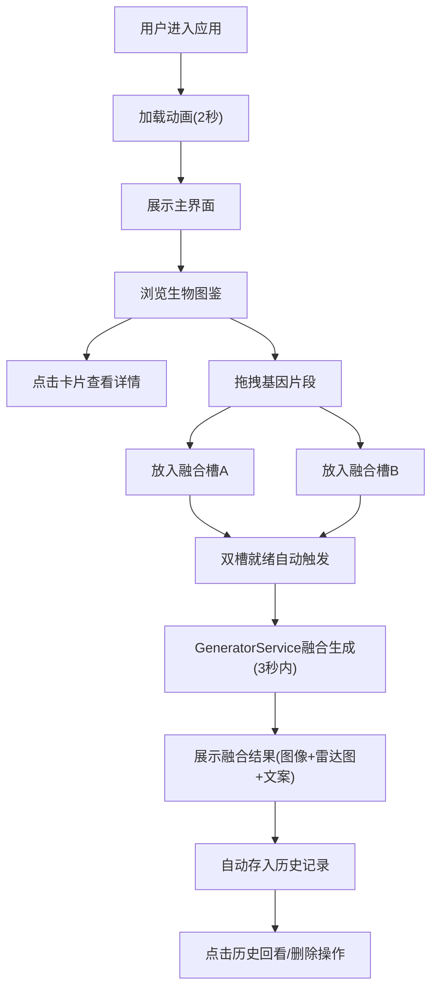

## 1. 产品概述

跨文化神话生物图鉴与基因融合模拟器是一款面向神话爱好者、创意工作者和普通用户的交互式Web应用。用户可以浏览来自世界各地文化的神话生物图文资料，并通过拖拽基因片段的方式，将不同生物的特征进行融合，实时生成全新的融合生物形象与属性描述。

- 核心目的：为用户提供沉浸式的神话生物探索体验和创造性的基因融合玩法
- 目标用户：神话文化爱好者、创意设计师、游戏开发者、学生群体
- 市场价值：融合教育性与娱乐性，兼具文化科普和创意生成工具属性

## 2. 核心功能

### 2.1 功能模块

1. **生物图鉴浏览模块 (Browser)**：神话生物卡片网格展示、详情模态框、基因图谱Canvas绘制、能力雷达图
2. **基因融合实验模块 (FusionLab)**：拖拽基因片段、融合槽接收区、自动融合生成、Canvas绘制融合生物、属性雷达图、文案描述生成
3. **历史记录管理**：融合结果倒序列表、小图预览、详情回看、单条删除、清空全部

### 2.2 页面详情

| 页面名称 | 模块名称 | 功能描述 |
|---------|---------|---------|
| 主界面 | 加载动画 | 2秒三星旋转发光动画，淡入过渡效果 |
| 主界面 | 布局容器 | 左右分栏(60%/40%)，中间金色分隔线，独立滚动条 |
| 图鉴浏览区 | 卡片网格 | 横向滚动网格，每行4个，毛玻璃卡片，悬停放大效果 |
| 图鉴浏览区 | 详情模态框 | 700px宽毛玻璃弹窗，大图、基因列表、能力雷达图 |
| 融合实验区 | 基因拖拽 | 从卡片拖拽基因片段(40x6px发光矩形)到融合槽 |
| 融合实验区 | 融合槽 | 双槽布局(300x100px虚线边框)，子槽接收基因片段 |
| 融合实验区 | 生成展示 | 400x400px融合生物Canvas、六边形雷达图、自动文案 |
| 融合实验区 | 历史记录 | 30%宽度右侧面板，时间倒序，删除/清空操作 |

## 3. 核心流程

用户进入应用 → 2秒加载动画 → 浏览生物图鉴卡片 → 点击卡片查看详情 → 从卡片拖拽基因片段 → 放入融合槽A和融合槽B → 系统自动调用生成服务 → 3秒内生成融合结果 → 展示融合生物图像+雷达图+文案 → 自动保存到历史记录 → 点击历史记录回看详情

## 4. 用户界面设计

### 4.1 设计风格
- **主色调**：深蓝 #0F0F23（背景主色）
- **辅色**：金色 #FFD700（强调色/边框/雷达图）、蓝紫 #6A5ACD（辅助色/渐变）
- **背景**：深色科幻风格，毛玻璃效果(backdrop-filter: blur(8px))
- **按钮/卡片**：圆角设计，卡片16px圆角，悬停scale(1.05)放大+边框高亮，过渡0.3s ease
- **字体**：系统默认无衬线字体(sans-serif)，标题20px，正文14px，浅灰#B0B0B0，名称#E0E0E0
- **图标**：基因图谱用Canvas曲线绘制，能力值用六边形雷达图

### 4.2 页面设计概述

| 页面名称 | 模块名称 | UI元素 |
|---------|---------|---------|
| 加载页 | 三星动画 | 纯黑背景，三颗紫-青渐变发光星球，缓旋转动画，2秒后淡出 |
| 主界面 | 分栏布局 | 左60%图鉴区+中1px金色竖线+右40%融合区，100vh高度无溢出 |
| 图鉴区 | 卡片网格 | 220x320px毛玻璃卡片，每行4个，横向滚动，独立滚动条 |
| 图鉴区 | 基因图谱Canvas | 180x60px，深紫→深蓝渐变背景，多条彩色曲线基因 |
| 图鉴区 | 文化角标 | 左上角12px半透明#aaa标签 |
| 融合区 | 融合槽 | 300x100px半透明虚线框，深灰#1A1A1A，子槽#2A2A2A |
| 融合区 | 雷达图 | 六边形，边线#FFD700，半透明金色填充，6项属性0-100 |
| 融合区 | 历史记录 | 右侧30%宽#222深灰面板，自定义暗色细滚动条 |
| 模态框 | 详情弹窗 | 700px宽毛玻璃，0.6黑色遮罩，点击遮罩关闭 |

### 4.3 响应式
- 桌面端优先设计，100vh全屏布局
- 拖拽操作桌面端鼠标交互优先
- 元素交互：悬停显示手形光标，拖拽时半透明跟随鼠标

### 4.4 交互动效
- 卡片悬停：transform: scale(1.05) + 边框高亮，0.3s ease过渡
- 加载动画：3颗星球缓旋转+发光效果，2秒后淡入主界面
- 模态框：背景遮罩淡入，内容缩放弹出
- 融合生成：3秒进度感，结果淡入展示
- 拖拽元素：被拖拽元素半透明(opacity: 0.6)跟随鼠标

## 5. 性能指标
- 首次加载时间：≤ 3秒
- 拖拽响应延迟：< 100ms
- 融合生成时长：≤ 3秒（含Canvas绘制）
- 交互帧率：≥ 55fps
