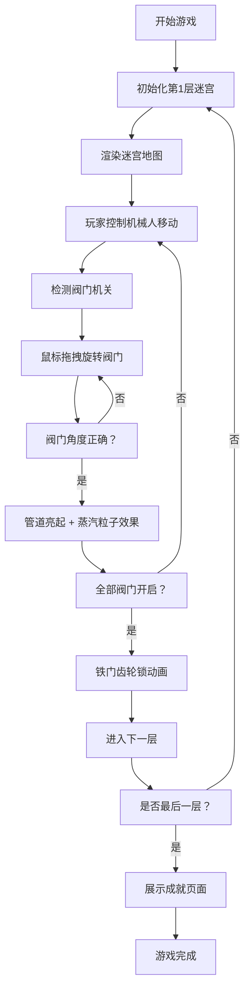

## 1. 产品概述
蒸汽朋克风格的2D地下城迷宫探险游戏，玩家操控齿轮驱动的机械人在随机生成的金属管道迷宫中探索，通过调整压力阀和转动齿轮机关解开谜题，层层深入地下迷宫。

- **核心目标**：为玩家提供沉浸式的蒸汽朋克风格解谜探险体验
- **目标用户**：喜爱解谜、探索、蒸汽朋克美学的玩家
- **产品价值**：独特的机械美学设计 + 程序化迷宫生成 + 交互反馈丰富的机关系统

## 2. 核心功能

### 2.1 功能模块
1. **游戏主界面**：俯视2D迷宫地图Canvas渲染、机械人角色控制、阀门机关交互
2. **控制面板**：层数显示、阀门仪表盘、物品背包、体力值进度条
3. **图鉴系统**：机械生物和机关类型卡片展示、翻转动画
4. **成就系统**：通关成就展示、铜质齿轮徽章、进度追踪

### 2.2 页面详情
| 页面名称 | 模块名称 | 功能描述 |
|-----------|-------------|---------------------|
| 游戏主页面 | 迷宫地图Canvas | 深铜色背景、铆钉接缝Tile纹理、墙体/地面渲染、角色8方向移动、齿轮旋转动画 |
| 游戏主页面 | 阀门机关系统 | 鼠标拖拽旋转（0-360度，15度步进）、咔嗒声效、管道绿色亮光#00FF66、蒸汽粒子效果（橙红渐变，2-6px，0.8秒） |
| 游戏主页面 | 铁门系统 | 所有阀门开启后触发、齿轮锁动画、通往下一层 |
| 控制面板 | 层数显示 | 当前迷宫层数展示 |
| 控制面板 | 阀门仪表盘 | 半径60px半圆弧、红色指针#E74C3C、刻度0-100、显示已开阀门百分比 |
| 控制面板 | 物品背包 | 5个槽位、CSS Grid布局、金色边框、拖拽排序、拾取动画（缩放0→1，0.3秒，Ease Out） |
| 控制面板 | 体力条 | 进度条、绿#2ECC71→红#E74C3C渐变、每步消耗1点体力 |
| 图鉴面板 | 卡片列表 | 半透明深色背景、毛玻璃效果、圆角8px、瀑布流3列布局、卡片间距12px |
| 图鉴面板 | 卡片翻转 | 鼠标悬停Y轴旋转180度、perspective: 1000px、0.6秒动画、阴影加深效果 |
| 成就页面 | 徽章系统 | SVG铜质齿轮徽章、刻度线点亮动画（金色光晕扩散，0→40px，0.5秒Ease Out） |
| 成就页面 | 羊皮纸背景 | 深棕色羊皮纸纹理、CSS渐变泛黄边缘、Georgia衬线字体 |
| 成就页面 | 成就卡片 | 每行2列卡片布局、完成度80%+徽章发光闪烁动画 |

## 3. 核心流程

## 4. 用户界面设计

### 4.1 设计风格
- **主色调**：铜色#8B7355、铁灰#4A4A4A、暗金#B8860B
- **背景色**：深铜色#3D2B1F
- **按钮效果**：浮雕效果（Box-shadow模拟凸起凹陷，内阴影高光#D4AF37，外阴影暗部#3D2B1F）
- **字体**：Georgia衬线字体（复古风格）
- **整体风格**：蒸汽朋克工业美学，铆钉、齿轮、管道元素贯穿

### 4.2 页面设计概述
| 页面名称 | 模块名称 | UI元素 |
|-----------|-------------|-------------|
| 游戏主页面 | 迷宫地图 | Canvas渲染、深铜背景、铆钉Tile、角色精灵图（齿轮旋转动画）、金属踩踏音效 |
| 控制面板 | 侧边栏 | 宽280px、拉丝金属纹理（CSS径向+重复线性渐变）、铜色边框#8B7355、四角铆钉装饰 |
| 图鉴面板 | 侧边栏 | 宽220px、半透明深色、毛玻璃backdrop-filter、圆角8px、翻转动画卡片 |
| 成就页面 | 全屏 | 深棕羊皮纸纹理、泛黄边缘渐变、Georgia字体、SVG齿轮徽章、2列成就卡片 |

### 4.3 响应式设计
- **桌面端（1280px+）**：地图居中，控制面板右侧悬挂，图鉴左侧悬浮
- **移动端（320px-768px）**：控制面板折叠为底部抽屉，抽屉滑入动画（下→上，0.3秒），图鉴可展开收起
- **触摸优化**：阀门旋转支持触摸拖拽，角色移动支持虚拟方向键

### 4.4 性能指标
- 交互反馈延迟 ≤ 100ms
- 迷宫生成时间 ≤ 0.5秒（浏览器端计算）
- Canvas渲染帧率 ≥ 60fps
