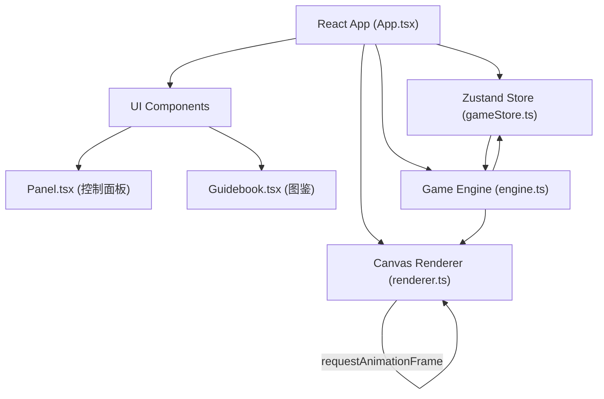

## 1. 架构设计


## 2. 技术栈说明
- **前端框架**：React 18 + TypeScript
- **构建工具**：Vite 5
- **状态管理**：Zustand 4
- **Canvas渲染**：原生Canvas 2D API
- **唯一ID**：uuid
- **样式方案**：内联CSS-in-JS + CSS变量（无需Tailwind，保持精细样式控制）

### 依赖版本
```json
{
  "react": "^18.3.1",
  "react-dom": "^18.3.1",
  "typescript": "^5.4.5",
  "vite": "^5.2.11",
  "@vitejs/plugin-react": "^4.3.1",
  "zustand": "^4.5.2",
  "uuid": "^9.0.1"
}
```

## 3. 文件结构
```
d:\Pro\tasks\auto134/
├── package.json
├── vite.config.js
├── tsconfig.json
├── index.html
├── .trae/documents/
│   ├── PRD.md
│   └── TechnicalArchitecture.md
└── src/
    ├── main.tsx                (入口文件，未在需求中列出但必需)
    ├── game/
    │   ├── engine.ts           (迷宫生成、阀门状态、碰撞检测)
    │   └── renderer.ts         (Canvas地图渲染、角色动画、粒子效果)
    ├── ui/
    │   ├── App.tsx             (根组件，布局管理、响应式)
    │   ├── Panel.tsx           (控制面板：层数/仪表盘/背包/体力)
    │   └── Guidebook.tsx       (图鉴面板：卡片翻转/瀑布流)
    └── store/
        └── gameStore.ts        (Zustand状态管理)
```

## 4. 模块职责与API定义

### 4.1 src/game/engine.ts - 游戏引擎
**职责**：纯逻辑层，不涉及DOM/渲染
```typescript
// 核心类型
export interface Position { x: number; y: number }
export interface Cell { type: 'wall' | 'floor' | 'pipe' | 'door'; tileId: number }
export interface Valve {
  id: string;
  pos: Position;
  currentAngle: number;   // 0-360
  targetAngle: number;    // 需要调整到的目标角度
  isOpen: boolean;
  connectedPipeIds: string[];
}
export interface MazeData {
  width: number;
  height: number;
  cells: Cell[][];
  rooms: Room[];
  valves: Valve[];
  doorPos: Position;
  doorOpen: boolean;
}
export interface PlayerState {
  pos: Position;          // 格子坐标
  targetPos: Position;    // 目标格子（插值用）
  moveProgress: number;   // 0-1 当前步插值进度
  direction: number;      // 0-7 八角方向
  stamina: number;
  maxStamina: number;
  gearRotation: number;   // 齿轮动画角度
}

// 迷宫生成：递归分割算法，5-7房间，每房2-4出口
export function generateMaze(level: number): MazeData;

// 碰撞检测：判断某格是否可通行
export function isWalkable(maze: MazeData, pos: Position): boolean;

// 阀门角度更新（步进15度，限制0-360）
export function updateValveAngle(valve: Valve, deltaDeg: number): Valve;

// 检查阀门是否到位（容差±7.5度）
export function checkValveOpen(valve: Valve): boolean;

// 检查所有阀门是否开启 → 门是否可开
export function checkAllValvesOpen(valves: Valve[]): boolean;

// 移动玩家：接收目标方向，更新位置，消耗体力
export function movePlayer(
  player: PlayerState,
  maze: MazeData,
  direction: 0|1|2|3|4|5|6|7,
  deltaTime: number
): { player: PlayerState; moved: boolean; collided: boolean };
```

### 4.2 src/game/renderer.ts - Canvas渲染器
**职责**：纯渲染层，接收engine数据→绘制到Canvas
```typescript
export interface RenderState {
  maze: MazeData;
  player: PlayerState;
  particles: Particle[];
  tileSize: number;       // 每格像素大小
  animationTime: number;  // 全局时间戳（ms）
}
export interface Particle {
  x: number; y: number;
  vx: number; vy: number;
  life: number; maxLife: number;  // 0-1
  size: number;
  color: string;
}

export class GameRenderer {
  constructor(canvas: HTMLCanvasElement);

  // 主渲染入口
  render(state: RenderState): void;

  // 绘制背景 + 16x16铆钉Tile（wall/floor两种）
  private drawTiles(ctx: CanvasRenderingContext2D, maze: MazeData): void;

  // 绘制管道网络，已连通的显示绿色亮光#00FF66
  private drawPipes(ctx: CanvasRenderingContext2D, maze: MazeData, time: number): void;

  // 绘制阀门（旋转显示 + 鼠标悬停高亮）
  private drawValves(ctx: CanvasRenderingContext2D, valves: Valve[], time: number): void;

  // 绘制铁门（齿轮锁动画）
  private drawDoor(ctx: CanvasRenderingContext2D, doorPos: Position, isOpen: boolean, time: number): void;

  // 绘制机械人角色（八角方向精灵 + 齿轮旋转动画）
  private drawPlayer(ctx: CanvasRenderingContext2D, player: PlayerState, tileSize: number): void;

  // 绘制粒子系统（蒸汽橙红渐变）
  private drawParticles(ctx: CanvasRenderingContext2D, particles: Particle[]): void;

  // 生成蒸汽喷射粒子
  static spawnSteamParticles(pos: Position, tileSize: number): Particle[];
}
```

### 4.3 src/store/gameStore.ts - Zustand全局状态
```typescript
import { create } from 'zustand';
import { MazeData, PlayerState, Valve } from '../game/engine';

export interface InventoryItem {
  id: string;
  name: string;
  icon: string;    // emoji或符号
  description: string;
}

export interface GuideEntry {
  id: string;
  name: string;
  category: 'creature' | 'mechanism';
  discovered: boolean;
  frontText: string;   // 卡片正面文字/符号
  backText: string;    // 背面描述
}

export interface Achievement {
  id: string;
  name: string;
  description: string;
  completed: boolean;
  level: number;       // 对应徽章刻度点亮段
}

interface GameStore {
  // 迷宫相关
  currentLevel: number;
  maxLevel: number;
  maze: MazeData | null;
  doorAnimation: number;  // 0-1

  // 玩家相关
  player: PlayerState;

  // 背包
  inventory: (InventoryItem | null)[];  // 固定5槽

  // 图鉴
  guideEntries: GuideEntry[];

  // 成就
  achievements: Achievement[];

  // UI状态
  showGuidebook: boolean;
  showAchievements: boolean;
  isMobile: boolean;
  panelDrawerOpen: boolean;

  // 动作
  generateNewLevel: () => void;
  movePlayerAction: (dir: 0|1|2|3|4|5|6|7) => void;
  rotateValve: (valveId: string, deltaDeg: number) => void;
  pickupItem: (item: InventoryItem) => boolean;
  reorderInventory: (fromIdx: number, toIdx: number) => void;
  consumeStamina: (amount: number) => void;
  discoverGuideEntry: (id: string) => void;
  toggleGuidebook: () => void;
  toggleAchievements: () => void;
  setIsMobile: (v: boolean) => void;
  togglePanelDrawer: () => void;
  resetGame: () => void;
}

export const useGameStore = create<GameStore>((set, get) => ({ ... }));
```

### 4.4 src/ui/Panel.tsx - 控制面板
- **Props**：无（内部读取useGameStore）
- **子组件**：
  - `Gauge` - 半圆弧阀门仪表盘（SVG绘制）
  - `InventorySlot` - 背包槽位（支持拖拽HTML5 DnD）
  - `StaminaBar` - 体力进度条（CSS渐变）

### 4.5 src/ui/Guidebook.tsx - 图鉴面板
- **CSS关键**：
  ```css
  .guide-card { perspective: 1000px; }
  .guide-card-inner { transition: transform 0.6s; transform-style: preserve-3d; }
  .guide-card:hover .guide-card-inner { transform: rotateY(180deg); }
  .guide-card-front, .guide-card-back { backface-visibility: hidden; }
  .guide-card-back { transform: rotateY(180deg); }
  ```

### 4.6 src/ui/App.tsx - 根组件
- **布局**：CSS Grid / Flex，响应式媒体查询
- **Canvas引用**：`useRef<HTMLCanvasElement>`
- **游戏循环**：`useEffect` + `requestAnimationFrame`（60fps）
- **输入处理**：键盘（WASD/方向键8向）、鼠标（Canvas事件→阀门拖拽判定）
- **音效**：Web Audio API合成（咔嗒、踩踏、蒸汽，无需外部音频文件）

## 5. 关键算法

### 5.1 迷宫生成（递归分割）
```
输入: 区域矩形(x,y,w,h)，剩余房间数n
1. 若 n <= 1 或 区域太小，生成单个房间，标记出口
2. 否则沿长边随机位置垂直或水平分割
3. 左右/上下递归分割，分配剩余房间数
4. 在分割墙上开1-2个门保证连通
5. 每个房间随机放置0-2个阀门机关
```
**时间复杂度保证**：迷宫固定大小约40x30格，递归深度≤4，总运算≤1000次，浏览器≤0.5秒

### 5.2 8方向移动向量
```typescript
const DIR_VECTORS: Record<0|1|2|3|4|5|6|7, [number, number]> = {
  0: [ 0, -1],  // N
  1: [ 1, -1],  // NE
  2: [ 1,  0],  // E
  3: [ 1,  1],  // SE
  4: [ 0,  1],  // S
  5: [-1,  1],  // SW
  6: [-1,  0],  // W
  7: [-1, -1],  // NW
};
```
每步动画时长0.15秒，线性插值位置。斜向移动需同时检查两直向邻格都是walkable。

### 5.3 性能优化
- **Tile缓存**：墙/地砖图案预渲染至离屏Canvas，主循环直接drawImage
- **脏矩形**：仅重绘移动/变化区域
- **Zustand选择器**：组件用`useGameStore(state => state.x)`避免不必要重渲染
- **粒子池**：对象池复用Particle，避免频繁GC
