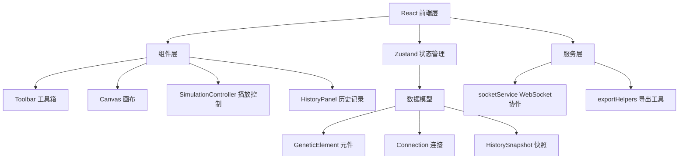

## 1. 架构设计



## 2. 技术描述

- **前端框架**：React 18 + TypeScript
- **构建工具**：Vite
- **状态管理**：Zustand
- **拖拽库**：react-beautiful-dnd（或原生HTML5拖拽）
- **实时协作**：Socket.IO Client
- **UI样式**：CSS Modules + CSS Variables
- **图标**：lucide-react
- **导出**：file-saver + gif.js
- **路由**：单页应用，无需路由

## 3. 目录结构

```
auto135/
├── package.json
├── vite.config.js
├── tsconfig.json
├── index.html
└── src/
    ├── models/
    │   └── GeneticElement.ts
    ├── store/
    │   └── useGeneStore.ts
    ├── components/
    │   ├── Toolbar.tsx
    │   ├── Canvas.tsx
    │   ├── SimulationController.tsx
    │   └── HistoryPanel.tsx
    ├── services/
    │   └── socketService.ts
    ├── utils/
    │   └── exportHelpers.ts
    ├── App.tsx
    ├── main.tsx
    └── styles/
        └── index.css
```

## 4. 数据模型

### 4.1 GeneticElement

```typescript
type ElementType = 'promoter' | 'operator' | 'structural-gene' | 'repressor' | 'inducer';
type ShapeType = 'rectangle' | 'diamond' | 'triangle' | 'circle' | 'hexagon';

interface GeneticElement {
  id: string;
  type: ElementType;
  position: { x: number; y: number };
  color: string;
  shape: ShapeType;
  label: string;
}
```

### 4.2 Connection

```typescript
interface Connection {
  id: string;
  fromId: string;
  toId: string;
  color: string;
}
```

### 4.3 HistorySnapshot

```typescript
interface HistorySnapshot {
  id: string;
  timestamp: number;
  elements: GeneticElement[];
  connections: Connection[];
  result?: SimulationResult;
}
```

### 4.4 SimulationState

```typescript
interface SimulationState {
  isPlaying: boolean;
  currentStep: number;
  totalSteps: number;
  status: 'idle' | 'running' | 'blocked' | 'complete';
}
```

## 5. Zustand Store 状态

- `elements: GeneticElement[]` - 画布元件列表
- `connections: Connection[]` - 连接关系列表
- `history: HistorySnapshot[]` - 历史快照列表
- `selectedElementId: string | null` - 当前选中元件
- `dragging: GeneticElement | null` - 正在拖拽的元件
- `connectionStartId: string | null` - 正在创建连接的起点
- `simulation: SimulationState` - 模拟播放状态
- `remoteCursors: RemoteCursor[]` - 远端用户光标

## 6. Socket.IO 消息协议

### 发送消息

- `element:add` - 添加元件
- `element:move` - 移动元件
- `element:remove` - 删除元件
- `connection:add` - 添加连接
- `connection:remove` - 删除连接
- `cursor:move` - 光标移动

### 接收消息

- `elements:sync` - 全量同步元件和连接
- `element:added` - 远端添加元件
- `element:moved` - 远端移动元件
- `element:removed` - 远端删除元件
- `connection:added` - 远端添加连接
- `connection:removed` - 远端删除连接
- `cursor:moved` - 远端光标移动
- `user:joined` - 新用户加入
- `user:left` - 用户离开
