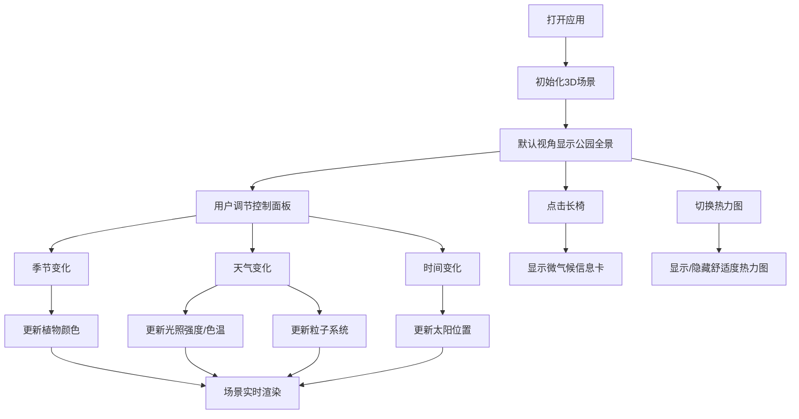

## 1. 产品概述

城市公园微气候与光影模拟工具是一款面向城市景观设计师的交互式3D应用，用于模拟不同季节和天气条件下公园中光线、植物色彩和行人舒适度的动态变化，辅助设计师进行景观方案评估和优化。

- 目标用户：城市景观设计师、城市规划师
- 核心价值：可视化模拟公园在不同环境条件下的光影效果和微气候舒适度，提升设计决策效率

## 2. 核心功能

### 2.1 用户角色
| 角色 | 注册方式 | 核心权限 |
|------|----------|----------|
| 设计师 | 无需注册 | 使用全部模拟功能，调整参数查看效果 |

### 2.2 功能模块
1. **3D公园场景**：地形、步道、5种形态树木、长椅、路灯
2. **光照系统**：太阳轨迹模拟、动态阴影、季节/天气光照变化
3. **热力图系统**：地面舒适度可视化、2D热力图叠加
4. **控制面板**：季节、天气、时间调节，热力图开关
5. **长椅交互**：点击长椅显示微气候数据卡片

### 2.3 功能详情
| 模块名称 | 子模块 | 功能描述 |
|----------|--------|----------|
| 公园场景 | 地形与步道 | 生成公园地形基底和步行路径 |
| 公园场景 | 树木系统 | 5种树形（球形、锥形、伞形、柱形、垂柳形），随季节变色 |
| 公园场景 | 设施布置 | 长椅、路灯等公园设施 |
| 光照系统 | 太阳轨迹 | 根据时间计算太阳方位角和高度角 |
| 光照系统 | 天气光照 | 晴/多云/阴/小雨四种天气的光照强度和色温 |
| 光照系统 | 阴影系统 | 2048x2048阴影贴图，软阴影 |
| 热力图 | 光照采样 | 30x30网格采样地面光照强度 |
| 热力图 | 颜色映射 | 蓝→绿→红渐变表示舒适度 |
| 控制面板 | 参数调节 | 季节滑块、天气下拉、时间滑块 |
| 控制面板 | 热力图开关 | 显示/隐藏热力图 |
| 长椅交互 | 信息卡片 | 显示温度、湿度、风速、体感舒适度 |

## 3. 核心流程

用户打开应用 → 默认视角俯视45度查看公园全景 → 通过左上角控制面板调整参数（季节/天气/时间） → 实时观察场景光影和植物颜色变化 → 可开启热力图查看舒适度分布 → 点击长椅查看具体位置微气候数据 → 拖动/缩放场景自由浏览

## 4. 用户界面设计

### 4.1 设计风格
- **主色调**：深灰背景#1A1A1A，淡蓝边框#87CEEB
- **交互风格**：半透明毛玻璃控制面板，圆角设计
- **字体**：无衬线字体，14px常规 / 16px标题加粗
- **整体氛围**：专业、科技感、沉浸式3D体验

### 4.2 界面布局
| 区域 | 元素 | UI特点 |
|------|------|--------|
| 全屏 | 3D场景 | 黑色背景，无滚动条 |
| 左上角 | 控制面板 | 宽280px，半透明深灰+毛玻璃，淡蓝边框，圆角12px |
| 长椅位置 | 信息卡片 | 宽200px，白色背景，阴影，圆角8px，浅灰文字 |
| 移动端 | 折叠按钮 | <768px时控制面板折叠为图标按钮 |

### 4.3 响应式设计
- 桌面端（≥768px）：控制面板固定悬浮在左上角
- 移动端（<768px）：控制面板折叠为图标按钮，点击展开
- 触控优化：支持双指缩放、单指旋转场景

### 4.4 3D场景指导
- **环境**：黑色背景，突出公园场景
- **光照**：环境光+半球光+方向光，支持动态调整
- **相机**：PerspectiveCamera，视野60度，俯视45度，距离原点20单位
- **控制器**：OrbitControls，支持旋转、缩放、平移
- **阴影**：PCFSoftShadowMap，2048x2048分辨率，软度0.3
- **后处理**：暂不使用后期处理，保持性能
- **性能**：稳定30fps以上，热力图每5帧更新
