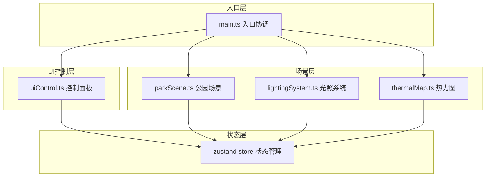

## 1. 架构设计



## 2. 技术描述

- **前端框架**：TypeScript + Vite（纯TS，非React/Vue）
- **3D引擎**：Three.js r160+
- **状态管理**：zustand
- **UI控件**：lil-gui
- **构建工具**：Vite 5+
- **TypeScript**：严格模式，target ES2020

## 3. 文件结构

```
src/
├── main.ts              # 入口文件，场景初始化，动画循环
├── parkScene.ts         # 公园场景生成与管理
├── lightingSystem.ts    # 光照系统管理
├── thermalMap.ts        # 热力图系统
├── uiControl.ts         # UI控制面板
└── store.ts             # zustand 状态管理
```

### 模块职责与调用关系

| 文件 | 职责 | 输入 | 输出 | 调用方 |
|------|------|------|------|--------|
| main.ts | 初始化渲染器、相机、控制器；协调各模块；启动动画循环 | 无 | 场景实例 | 入口 |
| parkScene.ts | 生成地形、树木、长椅、路灯；响应季节更新 | 季节、天气、时间 | 场景组对象 | main.ts |
| lightingSystem.ts | 管理环境光、半球光、方向光；太阳轨迹计算 | 时间、季节、天气 | 光照强度系数 | main.ts |
| thermalMap.ts | 生成热力图平面；采样光照并映射颜色 | 光照数据、显示状态 | 热力图网格 | main.ts |
| uiControl.ts | 创建lil-gui控制面板；绑定参数调节 | 状态store | UI交互事件 | main.ts |
| store.ts | 全局状态管理：季节、天气、时间、热力图显示 | UI操作 | 状态快照 | 所有模块 |

### 数据流向

```
用户操作 → uiControl.ts → zustand store → parkScene.ts / lightingSystem.ts → 场景更新
                                                          ↓
                                                    thermalMap.ts
                                                          ↓
                                                    热力图更新
```

## 4. 核心数据模型

### 4.1 季节类型
```typescript
type Season = 'spring' | 'summer' | 'autumn' | 'winter';
```

季节对应树叶颜色：
- 春季：#6B8E23（橄榄绿）
- 夏季：#228B22（森林绿）
- 秋季：#FF8C00（暗橙色）
- 冬季：#8B4513（棕色/枝干）

### 4.2 天气类型
```typescript
type Weather = 'sunny' | 'cloudy' | 'overcast' | 'rainy';
```

| 天气 | 方向光强度 | 色温 | 湿度 |
|------|------------|------|------|
| 晴天 | 1.2 | 5500K | 30% |
| 多云 | 0.6 | 6500K | 50% |
| 阴天 | 0.3 | 7000K | 70% |
| 小雨 | 0.4 | 6000K | 90% |

### 4.3 树木类型
```typescript
type TreeShape = 'sphere' | 'cone' | 'umbrella' | 'column' | 'weeping';
```

- sphere：球形树冠
- cone：锥形树冠
- umbrella：伞形树冠
- column：柱形树冠
- weeping：垂柳形树冠

### 4.4 微气候数据
```typescript
interface MicroClimateData {
  temperature: number;   // -5°C ~ 40°C
  humidity: number;      // 百分比
  windSpeed: number;     // 2 m/s 恒定
  comfortIndex: number;  // 体感舒适度指数
  comfortLevel: 'cold' | 'comfortable' | 'hot';
}
```

舒适度算法：`温度 + 0.33 * 湿度 - 0.7 * 风速`
- < 15：冷
- 15-28：舒适
- > 28：热

### 4.5 全局状态
```typescript
interface AppState {
  season: Season;
  weather: Weather;
  timeOfDay: number;       // 6 ~ 18 小时
  showThermalMap: boolean;
  sunIntensity: number;    // 光照强度系数（供热力图使用）
  selectedBench: Bench | null;
}
```

## 5. 性能优化策略

1. **阴影优化**：阴影贴图2048x2048，使用PCFSoftShadowMap
2. **热力图节流**：每5帧更新一次，不阻塞主渲染循环
3. **粒子系统降级**：移动端自动从2000降为500粒子
4. **内存管理**：
   - 切换季节/天气时，旧纹理和几何体调用dispose()
   - 使用FinalizationRegistry辅助清理
   - 树木材质复用，减少draw call
5. **帧率目标**：稳定30fps以上

## 6. 性能预算

| 项目 | 预算 |
|------|------|
| 帧率 | ≥30fps |
| 三角形数量 | ~50000 |
| Draw Call | <100 |
| 内存占用 | <200MB |
| 粒子数量 | 2000（桌面）/ 500（移动） |
