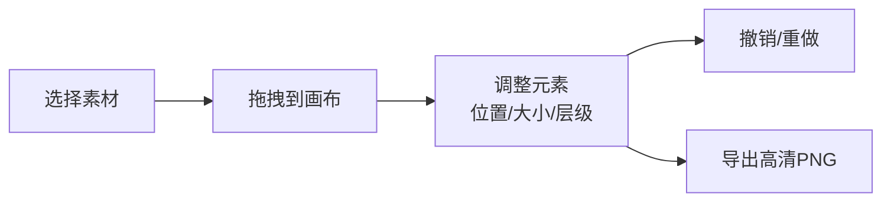

## 1. 产品概述

拼图式电影海报生成器是一款创意工具，让用户从经典电影的角色、场景、道具三种素材库中拖拽元素，自由组合成独一无二的海报，最后导出为高清PNG图片。

- 主要目的：提供一个有趣的创意工具，让用户通过拖拽拼贴的方式创作个性化电影海报
- 目标用户：电影爱好者、设计师、创意工作者
- 产品价值：低门槛的创意表达工具，激发用户的艺术创作灵感

## 2. 核心功能

### 2.1 功能模块

1. **素材面板**：三栏标签页切换（角色/场景/道具），素材缩略图拖拽功能
2. **海报画布**：元素拖拽放置、选中移动、滚轮缩放、右键菜单操作
3. **工具栏**：撤销、重做、清空画布、导出PNG
4. **模板轮播**：场景面板自动轮播海报模板预览，提供布局灵感

### 2.2 页面详情

| 页面名称 | 模块名称 | 功能描述 |
|-----------|-------------|---------------------|
| 主页面 | 素材面板 | 左侧280px深红背景面板，金色装饰线，三标签页切换，80x80px缩略图，悬停放大1.1倍带阴影 |
| 主页面 | 海报画布 | 右侧800x1200px纯白画布，3px虚线出血位，支持拖拽放置、选中移动、滚轮缩放、右键菜单 |
| 主页面 | 工具栏 | 画布底部半透明工具条，撤销/重做/清空/导出四个按钮，撤销支持30步 |
| 主页面 | 模板轮播 | 场景标签页每5秒自动轮播，3秒展示+0.5秒渐隐过渡，拖拽时暂停 |

## 3. 核心流程

用户从左侧素材面板拖拽素材 → 素材放置到右侧画布 → 用户调整元素位置/大小/层级 → 用户可撤销重做操作 → 点击导出生成高清PNG

## 4. 用户界面设计

### 4.1 设计风格

- 主色调：深红 #2C0E0E（素材面板背景）、金色 #D4AF37（装饰线）
- 画布背景：纯白 #FFFFFF
- 工具栏背景：半透明 #1A1A1A
- 设计风格：复古电影风，经典优雅，强调金色与深红的对比
- 交互风格：所有过渡0.2秒缓动，流畅自然
- 性能要求：拖拽帧率不低于50fps，画布缩放无卡顿

### 4.2 页面设计概述

| 页面名称 | 模块名称 | UI元素 |
|-----------|-------------|-------------|
| 主页面 | 整体布局 | 左右分栏，左侧素材面板，右侧画布区域 |
| 主页面 | 素材面板 | 深红背景、金色装饰线、标签页切换、素材网格 |
| 主页面 | 画布区域 | 白色背景、虚线出血位、绝对定位元素、选中高亮 |
| 主页面 | 工具栏 | 圆角半透明背景、四个功能按钮、悬浮在画布底部 |
| 主页面 | 模板轮播 | 淡入淡出过渡、自动播放、拖拽暂停 |

### 4.3 响应式

- 桌面端优先设计
- 画布固定尺寸800x1200px，确保导出比例准确
- 素材面板固定宽度280px

### 4.4 交互细节

- 素材缩略图：80x80px，圆角8px，悬停放大1.1倍并投射阴影
- 画布元素：点击选中高亮，拖拽移动，滚轮按比例缩放
- 右键菜单：水平翻转、层叠顺序调整（上移一层/下移一层/置顶/置底）
- 工具栏按钮：悬停效果，点击反馈
- 导出弹窗：预览图、下载按钮、300dpi分辨率
