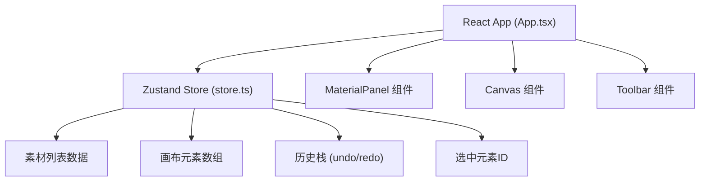

## 1. 架构设计

纯前端应用，采用 React + TypeScript + Vite 技术栈，Zustand 管理全局状态。



## 2. 技术描述

- 前端框架：React 18 + TypeScript
- 构建工具：Vite
- 状态管理：Zustand + Immer
- 拖拽实现：HTML5 Drag and Drop API
- 图片导出：html2canvas 或原生 Canvas API
- 唯一ID：uuid

## 3. 目录结构

```
src/
├── main.tsx           # React入口
├── App.tsx            # 主布局组件
├── store.ts           # Zustand状态管理
└── components/
    ├── MaterialPanel.tsx  # 左侧素材面板
    ├── Canvas.tsx         # 右侧海报画布
    └── Toolbar.tsx        # 底部工具栏
```

## 4. 数据模型

### 4.1 素材类型

```typescript
interface Material {
  id: string;
  type: 'character' | 'scene' | 'prop';
  name: string;
  imageUrl: string;
  defaultWidth: number;
  defaultHeight: number;
}
```

### 4.2 画布元素

```typescript
interface CanvasElement {
  id: string;
  materialId: string;
  type: 'character' | 'scene' | 'prop';
  imageUrl: string;
  x: number;
  y: number;
  width: number;
  height: number;
  scale: number;
  flipped: boolean;
  zIndex: number;
}
```

### 4.3 Store 状态

```typescript
interface PosterState {
  materials: Material[];
  elements: CanvasElement[];
  selectedId: string | null;
  history: CanvasElement[][];
  historyIndex: number;
  maxHistory: number;
}
```

## 5. 核心功能实现方案

### 5.1 拖拽系统

- 素材面板：HTML5 draggable 属性，dragstart 事件传递素材数据
- 画布区域：监听 dragenter/dragover/drop 事件，计算放置位置
- 画布元素：mousedown/mousemove/mouseup 实现拖拽移动

### 5.2 历史记录

- 每次操作前保存当前 elements 状态到 history 数组
- undo：historyIndex - 1，恢复对应状态
- redo：historyIndex + 1，恢复对应状态
- 最多保存30步历史记录

### 5.3 导出PNG

- 使用 Canvas API 绘制所有元素
- 设置300dpi输出分辨率
- 提供预览弹窗和下载按钮

### 5.4 模板轮播

- setInterval 实现自动轮播
- CSS transition 实现淡入淡出效果
- 监听拖拽事件，拖拽开始时暂停，结束后恢复
