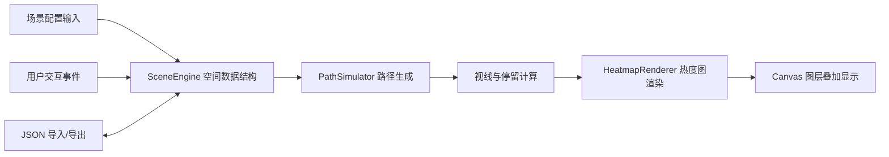

## 1. 产品概述

博物馆数字交互展柜视线热力图设计工具，帮助策展人在浏览器中模拟参观者行为，预测展品关注度分布，优化布展方案。

- **核心问题**：传统布展难以预测参观者停留位置和视线轨迹，导致核心展品放置位置不合理
- **目标用户**：博物馆策展人、空间设计师、展览规划师
- **核心价值**：通过数据可视化辅助布展决策，提升参观者体验和展品曝光率

## 2. 核心功能

### 2.1 功能模块

1. **场景编辑器**：展厅尺寸设置、展柜拖拽放置、展品配置
2. **路径模拟器**：A*寻路算法生成参观者行走路径，视线方向计算
3. **热力图渲染器**：基于停留数据生成视线热度分布图
4. **数据分析器**：点击查询停留时间、展品注视统计、遮挡分析
5. **数据管理器**：JSON 格式导入导出场景配置

### 2.2 页面详情

| 页面名称 | 模块名称 | 功能描述 |
|-----------|-------------|---------------------|
| 编辑器主页 | 顶部工具栏 | 新建/保存/导入场景、运行模拟、切换编辑模式 |
| 编辑器主页 | 中央画布 | 栅格化展厅平面、展柜拖拽编辑、展品放置、热度图叠加 |
| 编辑器主页 | 右侧面板 | 展柜参数（尺寸/角度）、展品参数（类型/高度/朝向）、模拟统计数据 |
| 编辑器主页 | 状态条 | 当前场景信息、操作提示、性能指标 |

## 3. 核心流程

### 3.1 主工作流程
策展人新建场景 → 设置展厅尺寸 → 拖拽放置展柜 → 调整展柜角度 → 添加展品并配置参数 → 设置参观者起点 → 运行路径模拟 → 查看热度图 → 点击查询分析数据 → 导出/保存场景

### 3.2 核心数据流


## 4. 用户界面设计

### 4.1 设计风格

**色彩系统**：
- 主背景：深灰蓝 `#1E1E2E`
- 控制面板渐变：深紫 `#2D1B69` → 黑色
- 画布背景：深灰 `#2C2C2C`
- 栅格线：浅灰 `#E0E0E0`
- 展柜：半透明蓝 `#4FC3F7`
- 路径：半透明黄 `#FFD54F`
- 参观者起点：绿色圆点
- 热度图：冷色蓝 `#0000FF` → 暖色红 `#FF0000` 渐变
- 高亮文字：青色 `#00E5FF`
- 图标发光：金色 `#FFD700`

**排版系统**：
- 标题字体：现代无衬线显示字体（Space Grotesk 或同类）
- 正文字体：清晰易读的无衬线字体
- 数值字体：等宽数字字体，便于数据对比
- 层级：大标题（24px）、小标题（16px）、正文（14px）、辅助文字（12px）

**交互设计**：
- 顶部工具栏：icon-font 图标按钮，悬停放大 1.1 倍 + 金色外发光
- 右侧面板：毛玻璃效果 `backdrop-filter: blur(8px)`
- 展柜拖拽：实时碰撞检测，手柄旋转显示角度数值
- 过渡动画：参数面板高度动画 300ms ease-out，热度图淡入 800ms 从底向上

### 4.2 页面布局

```
┌─────────────────────────────────────────────────────────┐
│  [工具栏]  新建  保存  导入  导出  运行模拟  [模式切换] │
├──────────────┬──────────────────────────────────┬───────┤
│              │                                  │       │
│              │                                  │ 右侧 │
│              │                                  │ 信息 │
│   左侧留白   │         Canvas 编辑区            │ 面板 │
│              │       (1200 x 800px)             │ 320px │
│              │                                  │       │
│              │                                  │       │
├──────────────┴──────────────────────────────────┴───────┤
│  状态栏：场景名称 | 展柜数量 | 展品数量 | 渲染耗时      │
└─────────────────────────────────────────────────────────┘
```

### 4.3 响应式设计

- **桌面端（>1024px）**：三栏布局，右侧面板固定展开
- **平板端（≤1024px）**：右侧面板折叠为抽屉，可拖拽滑出
- **触控优化**：拖拽区域最小 44x44px，支持双指缩放画布

### 4.4 Canvas 图层管理

```
Layer 4 (最上层): 交互反馈层 - 选中高亮、拖拽预览、手柄
Layer 3: 热度图层 - 高斯模糊后的热度分布
Layer 2: 路径层 - 参观者行走路径动画
Layer 1: 对象层 - 展柜、展品、起点标记
Layer 0 (底层): 栅格背景层
```
