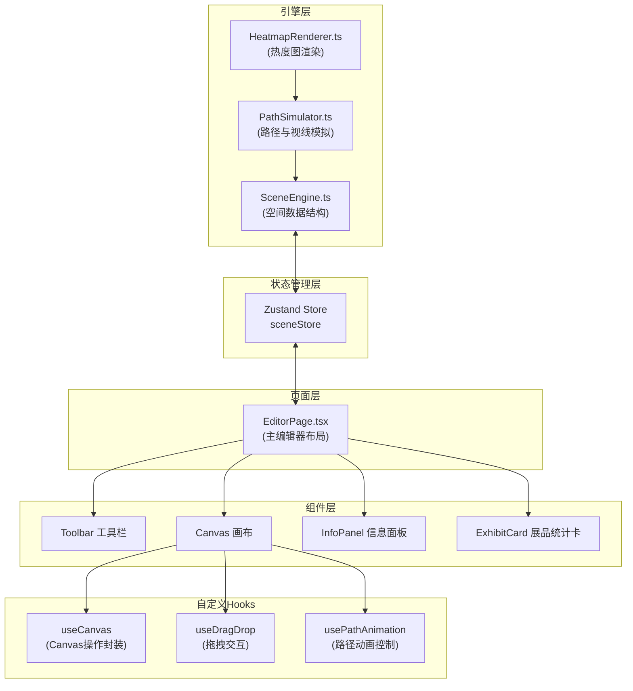

## 1. 架构设计



## 2. 技术描述

- **前端框架**：React 18 + TypeScript 5
- **构建工具**：Vite 5
- **状态管理**：Zustand 4
- **Canvas API**：原生 2D Context（无需额外库）
- **唯一标识**：uuid
- **图标库**：lucide-react
- **CSS方案**：CSS Modules + CSS Variables

## 3. 目录结构

```
src/
├── pages/
│   └── EditorPage.tsx          # 主编辑器页面
├── components/
│   ├── Toolbar.tsx             # 顶部工具栏
│   ├── EditorCanvas.tsx        # Canvas 编辑区
│   ├── InfoPanel.tsx           # 右侧信息面板
│   ├── ExhibitCard.tsx         # 展品统计卡片
│   ├── ExhibitLibrary.tsx      # 展品库
│   ├── SliderInput.tsx         # 滑块输入组件
│   └── Drawer.tsx              # 移动端抽屉
├── engine/
│   ├── SceneEngine.ts          # 场景数据与空间计算
│   ├── PathSimulator.ts        # A*寻路与视线模拟
│   └── HeatmapRenderer.ts      # 热度图渲染
├── hooks/
│   ├── useCanvas.ts            # Canvas 操作封装
│   ├── useDragDrop.ts          # 拖拽逻辑
│   ├── usePathAnimation.ts     # 路径动画
│   └── useHeatmapAnimation.ts  # 热度图动画
├── store/
│   └── sceneStore.ts           # Zustand 状态管理
├── types/
│   └── index.ts                # 全局类型定义
├── utils/
│   ├── astar.ts                # A*寻路算法
│   ├── gaussianBlur.ts         # 高斯模糊
│   ├── colorGradient.ts        # 色阶映射
│   └── geometry.ts             # 几何计算工具
├── styles/
│   ├── variables.css           # CSS 变量
│   └── animations.css          # 动画定义
├── App.tsx
├── main.tsx
└── index.css
```

## 4. 数据模型

### 4.1 核心类型定义

```typescript
// 2D 点坐标
interface Point2D {
  x: number;
  y: number;
}

// 展厅配置
interface HallConfig {
  width: number;           // 宽度（米）
  height: number;          // 高度（米）
  gridSize: number;        // 栅格大小（米）
  backgroundColor: string;
}

// 展柜
interface Showcase {
  id: string;
  position: Point2D;       // 中心位置（米）
  width: number;           // 宽度（米）
  depth: number;           // 深度（米）
  rotation: number;        // 旋转角度（度）
  color: string;
}

// 展品类型
type ExhibitType = 'sculpture' | 'painting' | 'jewelry';

// 展品照度推荐
interface ExhibitLighting {
  type: ExhibitType;
  minLux: number;
  maxLux: number;
  recommended: number;
}

// 展品
interface Exhibit {
  id: string;
  showcaseId: string;
  type: ExhibitType;
  position: Point2D;       // 相对展柜位置（米）
  height: number;          // 离地高度（米）0.5-2.5
  facing: number;          // 朝向（度）
  icon: string;
  color: string;
}

// 参观者起点
interface VisitorStart {
  id: string;
  position: Point2D;       // 位置（米）
  radius: number;          // 半径（米）
}

// 路径点
interface PathPoint {
  position: Point2D;
  timestamp: number;       // 时间戳（秒）
  gazeDirection: number;   // 视线方向（度）
  dwellTime: number;       // 停留时间（秒）
}

// 参观者路径
interface VisitorPath {
  id: string;
  points: PathPoint[];
  targetShowcaseId: string;
  duration: number;        // 总时长（秒）
}

// 热度图数据点
interface HeatmapPoint {
  position: Point2D;
  intensity: number;       // 强度 0-1
  dwellTime: number;       // 累计停留时间
}

// 展品统计
interface ExhibitStats {
  exhibitId: string;
  totalGazes: number;      // 总注视次数
  avgGazeDuration: number; // 平均注视时长
  occlusionRate: number;   // 被遮挡比例 0-1
}

// 完整场景
interface Scene {
  id: string;
  name: string;
  hall: HallConfig;
  showcases: Showcase[];
  exhibits: Exhibit[];
  visitorStarts: VisitorStart[];
  paths: VisitorPath[];
  heatmapData: HeatmapPoint[];
  createdAt: number;
  updatedAt: number;
}
```

### 4.2 A* 寻路网格

```typescript
interface GridNode {
  x: number;
  y: number;
  walkable: boolean;
  g: number;               // 从起点到当前节点的代价
  h: number;               // 到终点的预估代价
  f: number;               // g + h
  parent: GridNode | null;
}

// 展柜遮挡区域计算
function getShowcaseObstacles(
  showcases: Showcase[],
  gridSize: number
): Set<string> {
  // 返回被展柜占据的栅格坐标集合（"x,y" 格式）
}
```

## 5. 性能指标与优化策略

### 5.1 性能目标

| 操作 | 耗时上限 | 优化策略 |
|------|----------|----------|
| 热度图渲染（10条路径） | ≤ 500ms | OffscreenCanvas、Web Workers、分层渲染 |
| 路径计算（10条路径） | ≤ 2s | A* 启发式优化、路径缓存、并行计算 |
| 展柜拖拽帧率 | ≥ 50fps | requestAnimationFrame、局部重绘 |

### 5.2 关键优化

1. **Canvas 分层渲染**：热度图单独离屏画布，避免每帧重绘整个场景
2. **空间索引**：RTree 或网格索引加速碰撞检测和最近点查询
3. **增量更新**：热度图只更新变化区域，路径动画使用时间戳插值
4. **对象池**：复用 PathPoint 和 HeatmapPoint 对象，减少 GC
5. **Web Worker**：路径计算和高斯模糊在 Worker 线程执行

## 6. 导入导出格式校验

```typescript
interface ImportResult<T> {
  success: boolean;
  data?: T;
  errors?: string[];
}

function validateSceneSchema(data: unknown): ImportResult<Scene> {
  // 使用类型守卫校验每个字段
  // 检查必填字段、数值范围、ID 引用完整性
}
```
