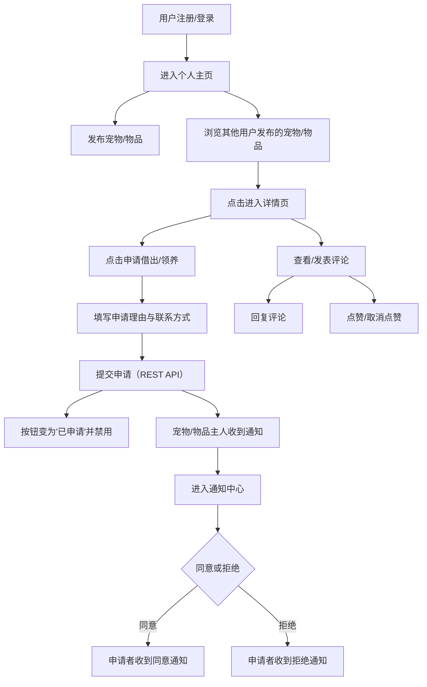

## 1. 产品概述

宠物共享社群平台——让宠物主人发布宠物信息与闲置物品，其他用户可预约借出或领养，辅以实时通知与互动评价，构建温暖的宠物互助社区。

- 目标用户：有宠物的主人、希望短期借出/领养宠物的爱宠人士、闲置宠物用品持有者
- 核心价值：降低宠物临时照顾与物品流转的门槛，建立信任驱动的宠物共享生态

## 2. 核心功能

### 2.1 用户角色

| 角色 | 注册方式 | 核心权限 |
|------|----------|----------|
| 宠物主人 | 注册登录 | 发布宠物/物品、处理申请、查看通知、评论互动 |
| 访客用户 | 注册登录 | 浏览宠物/物品、提交借出/领养申请、查看通知、评论互动 |

### 2.2 功能模块

1. **注册登录页**：用户注册与登录，进入个人主页
2. **个人主页**：展示用户发布的宠物卡片和闲置物品卡片网格
3. **详情页**：宠物/物品详细信息展示 + 评论区（支持树形回复与点赞）
4. **通知中心**：接收申请通知，支持同意/拒绝操作，数字角标闪烁

### 2.3 页面详情

| 页面名称 | 模块名称 | 功能描述 |
|----------|----------|----------|
| 注册登录页 | 注册表单 | 输入用户名、密码，提交注册 |
| 注册登录页 | 登录表单 | 输入用户名、密码，登录后跳转个人主页 |
| 个人主页 | 宠物卡片区 | 网格展示宠物卡片（照片、品种、年龄、性格、是否可借出），点击进入详情 |
| 个人主页 | 闲置物品区 | 网格展示物品卡片（名称、图片、新旧、所在地、是否可借出），点击进入详情 |
| 个人主页 | 发布入口 | 支持新增宠物/物品的发布按钮 |
| 详情页 | 基本信息区 | 展示宠物/物品完整信息 |
| 详情页 | 申请操作区 | "申请借出"/"申请领养"按钮，填写理由与联系方式后提交 |
| 详情页 | 评论区 | 树形评论列表、发表评论、回复评论、爱心点赞/取消点赞 |
| 通知中心 | 通知列表 | 按时间倒序展示通知卡片，含申请者首字母头像、昵称、时间、内容 |
| 通知中心 | 操作按钮 | 每条通知"同意"/"拒绝"按钮，操作后双方收到通知 |
| 通知中心 | 角标提示 | 右上角未读数量角标，新通知到达时闪烁动画 |

## 3. 核心流程

**用户发布 → 浏览申请 → 通知交互 → 评价互动**

## 4. 用户界面设计

### 4.1 设计风格

- **主色调**：浅米色 (#FFF8F0) 背景 + 淡橙色 (#FF9A5C) 强调色
- **辅助色**：少量绿色点缀 (#7BC47F)，通知条彩色分类
- **卡片风格**：圆角（16px）毛玻璃效果（backdrop-blur + 半透明白底），悬浮时上浮 4px + 阴影加深
- **字体**：中文优先使用 Noto Sans SC，英文使用 Quicksand；标题 24px/粗体，正文 14px/常规
- **布局**：桌面端网格卡片布局（3列），移动端单列纵向
- **通知卡片**：左侧 4px 彩色竖条（借出=橙色、领养=绿色、系统=蓝色），渐变动画 0.3s
- **评论区头像**：动态生成彩色圆块，背景色由用户名哈希决定
- **按钮**：圆角 8px，主按钮淡橙色填充，次按钮白色描边

### 4.2 页面设计概览

| 页面名称 | 模块名称 | UI 元素 |
|----------|----------|---------|
| 注册登录页 | 表单区 | 居中卡片，毛玻璃背景，圆角输入框，淡橙色登录按钮 |
| 个人主页 | 顶部导航 | 左侧 Logo + 右侧通知铃铛（角标）+ 汉堡菜单（移动端） |
| 个人主页 | 宠物卡片 | 毛玻璃卡片，宠物图片上置，下方品种/年龄/性格标签，借出状态徽章 |
| 个人主页 | 物品卡片 | 毛玻璃卡片，物品图片左侧，右侧名称/新旧/所在地，借出状态徽章 |
| 详情页 | 信息区 | 大图 + 详细信息标签页布局 |
| 详情页 | 申请区 | 底部固定操作栏，淡橙色按钮，点击弹出申请表单浮层 |
| 详情页 | 评论区 | 左侧头像圆块 + 评论内容 + 爱心按钮，树形缩进 |
| 通知中心 | 通知卡片 | 左侧彩色竖条 + 首字母头像 + 内容 + 同意/拒绝按钮 |

### 4.3 响应式适配

- 桌面端（≥768px）：3列网格卡片，完整导航栏
- 移动端（<768px）：单列纵向卡片，字体缩小 2px，按钮放大至 44px 触屏友好尺寸，页眉收缩为汉堡菜单
- 切换页面内容 200ms 内渲染完毕
- 列表滚动使用虚拟化或节流确保 16ms 内 DOM 更新
