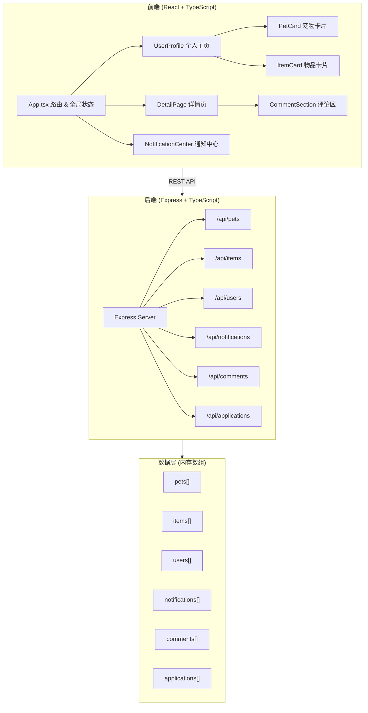
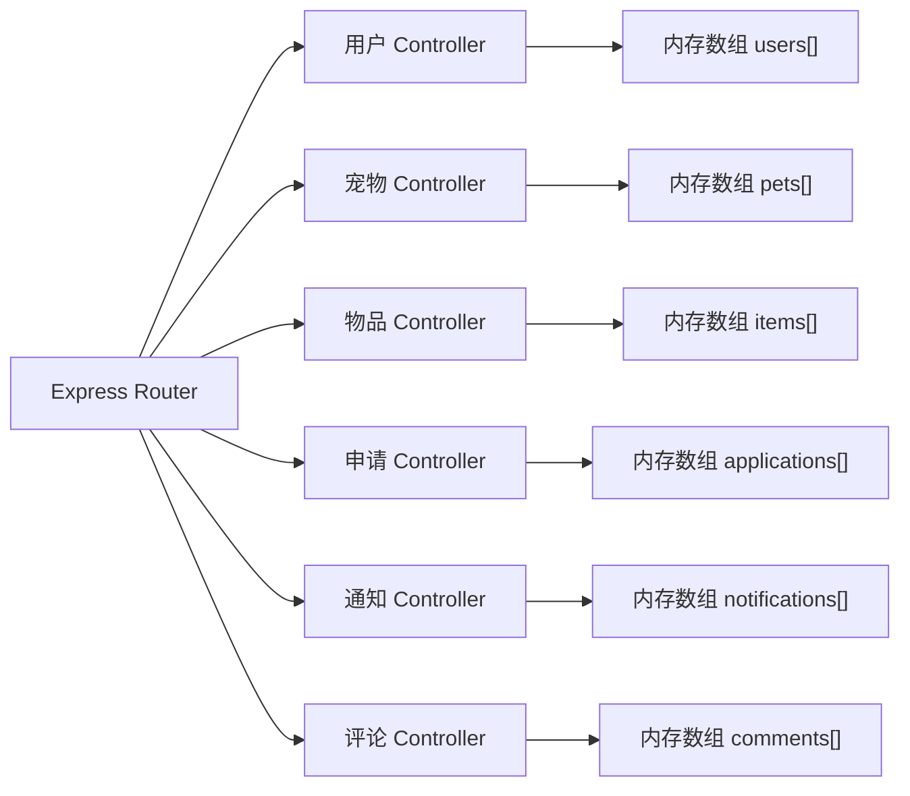
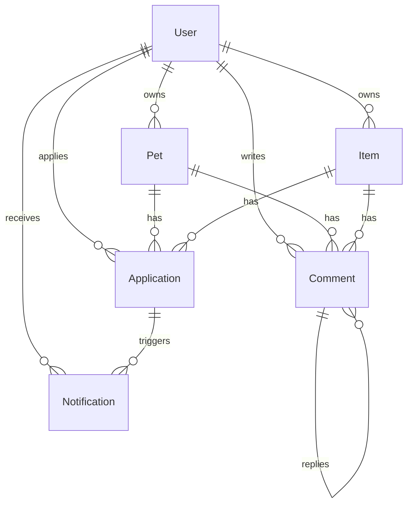

## 1. 架构设计



## 2. 技术说明

- **前端**：React 18 + TypeScript + Vite + Tailwind CSS + Zustand（状态管理）+ React Router DOM
- **初始化工具**：vite-init（react-express-ts 模板）
- **后端**：Express 4 + TypeScript + cors + uuid
- **数据库**：内存数组（暂不使用持久化数据库）
- **前后端通信**：REST API，前端通过 fetch 调用后端端点

## 3. 路由定义

| 路由 | 用途 |
|------|------|
| `/login` | 登录/注册页面 |
| `/profile/:userId` | 个人主页，展示用户发布的宠物和物品 |
| `/detail/:type/:id` | 详情页（type: pet/item），展示详细信息与评论区 |
| `/notifications` | 通知中心页面 |

## 4. API 定义

### 4.1 用户 API

| 方法 | 端点 | 说明 | 请求体 | 响应 |
|------|------|------|--------|------|
| POST | `/api/users/register` | 注册 | `{ username, password }` | `{ user, token }` |
| POST | `/api/users/login` | 登录 | `{ username, password }` | `{ user, token }` |
| GET | `/api/users/:id` | 获取用户信息 | — | `User` |

### 4.2 宠物 API

| 方法 | 端点 | 说明 | 请求体 | 响应 |
|------|------|------|--------|------|
| GET | `/api/pets` | 获取所有宠物 | — | `Pet[]` |
| GET | `/api/pets/:id` | 获取宠物详情 | — | `Pet` |
| POST | `/api/pets` | 发布宠物 | `Pet` | `Pet` |
| GET | `/api/pets?ownerId=xxx` | 获取某用户的宠物 | — | `Pet[]` |

### 4.3 物品 API

| 方法 | 端点 | 说明 | 请求体 | 响应 |
|------|------|------|--------|------|
| GET | `/api/items` | 获取所有物品 | — | `Item[]` |
| GET | `/api/items/:id` | 获取物品详情 | — | `Item` |
| POST | `/api/items` | 发布物品 | `Item` | `Item` |
| GET | `/api/items?ownerId=xxx` | 获取某用户的物品 | — | `Item[]` |

### 4.4 申请 API

| 方法 | 端点 | 说明 | 请求体 | 响应 |
|------|------|------|--------|------|
| POST | `/api/applications` | 提交申请 | `{ type, targetId, applicantId, reason, contact }` | `Application` |
| PUT | `/api/applications/:id` | 处理申请 | `{ status: 'approved' \| 'rejected' }` | `Application` |
| GET | `/api/applications?ownerId=xxx` | 获取某人收到的申请 | — | `Application[]` |

### 4.5 通知 API

| 方法 | 端点 | 说明 | 请求体 | 响应 |
|------|------|------|--------|------|
| GET | `/api/notifications?userId=xxx` | 获取用户通知 | — | `Notification[]` |
| PUT | `/api/notifications/:id/read` | 标记已读 | — | `Notification` |

### 4.6 评论 API

| 方法 | 端点 | 说明 | 请求体 | 响应 |
|------|------|------|--------|------|
| GET | `/api/comments?targetType=xxx&targetId=xxx` | 获取评论列表 | — | `Comment[]` |
| POST | `/api/comments` | 发表评论 | `{ targetType, targetId, userId, content, parentId? }` | `Comment` |
| PUT | `/api/comments/:id/like` | 点赞/取消点赞 | `{ userId }` | `Comment` |

### 4.7 TypeScript 类型定义

```typescript
interface User {
  id: string;
  username: string;
  password: string;
  avatar?: string;
  createdAt: string;
}

interface Pet {
  id: string;
  ownerId: string;
  name: string;
  breed: string;
  age: string;
  personality: string;
  photo: string;
  availableForBorrow: boolean;
  availableForAdoption: boolean;
  createdAt: string;
}

interface Item {
  id: string;
  ownerId: string;
  name: string;
  image: string;
  condition: '全新' | '几乎全新' | '轻微使用痕迹' | '明显使用痕迹';
  location: string;
  availableForBorrow: boolean;
  createdAt: string;
}

interface Application {
  id: string;
  type: 'borrow' | 'adopt';
  targetType: 'pet' | 'item';
  targetId: string;
  targetName: string;
  applicantId: string;
  applicantName: string;
  ownerId: string;
  reason: string;
  contact: string;
  status: 'pending' | 'approved' | 'rejected';
  createdAt: string;
}

interface Notification {
  id: string;
  userId: string;
  type: 'application_received' | 'application_approved' | 'application_rejected';
  applicationId: string;
  message: string;
  read: boolean;
  createdAt: string;
}

interface Comment {
  id: string;
  targetType: 'pet' | 'item';
  targetId: string;
  userId: string;
  username: string;
  content: string;
  parentId: string | null;
  likes: string[];
  createdAt: string;
}
```

## 5. 服务器架构图



## 6. 数据模型

### 6.1 数据模型定义



### 6.2 初始种子数据

后端启动时预置：
- 2 个用户（user1: 小明, user2: 小红）
- 4 只宠物（2只属小明，2只属小红）
- 3 个物品（2个属小明，1个属小红）
- 2 条通知
- 3 条评论（含1条回复）
