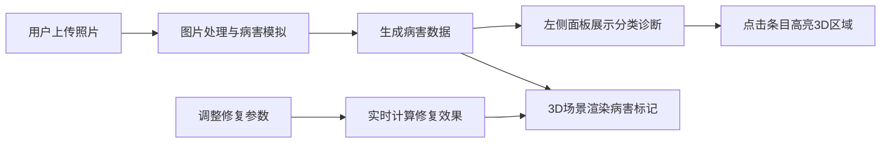

## 1. 产品概述

数字古董鉴定与修复方案生成器是一款面向古董收藏爱好者的专业工具，用户可上传古董局部高清照片和病害描述，系统自动分析病害类型并生成可交互的3D修复方案预览。

- **核心目标**：为古董收藏者提供直观、专业的病害诊断和修复方案可视化工具
- **目标用户**：古董收藏家、文物修复爱好者、艺术品投资者
- **市场价值**：填补数字文物修复可视化领域的空白，降低专业修复方案的理解门槛

## 2. 核心功能

### 2.1 用户角色
| 角色 | 注册方式 | 核心权限 |
|------|----------|----------|
| 普通用户 | 无需注册，直接使用 | 上传图片、查看病害分析、调整修复参数、预览3D修复效果 |

### 2.2 功能模块
1. **病害分析面板**：左侧展示病害分类诊断结果，带颜色标记和交互高亮
2. **3D预览区域**：右侧Three.js渲染古董立体模型，病害粒子标记，支持交互
3. **修复参数控制面板**：材料选择、填充程度调节，实时预览修复效果
4. **图片上传模块**：支持用户上传高清古董照片，自动生成模拟病害数据

### 2.3 页面详情
| 页面名称 | 模块名称 | 功能描述 |
|----------|----------|----------|
| 主应用页面 | 图片上传区 | 支持拖拽上传，文件选择，图片预览 |
| 主应用页面 | 病害分析面板 | 按类型分类展示病害，点击高亮对应3D区域 |
| 主应用页面 | 3D预览区 | 展示古董模型，病害粒子标记，旋转缩放平移交互 |
| 主应用页面 | 修复方案面板 | 材料选择下拉框，填充度滑块，实时更新3D预览 |

## 3. 核心流程

用户上传古董高清照片 → 系统模拟分析病害类型和位置 → 左侧面板展示分类诊断结果 → 3D区域展示带病害标记的模型 → 用户点击病害条目查看详情 → 用户调整修复材料和填充参数 → 系统实时计算并展示修复效果预览

## 4. 用户界面设计

### 4.1 设计风格
- **主色调**：深褐色 #2C1810（博物馆式暗色调）
- **点缀色**：金属铜色 #B8860B
- **面板背景**：羊皮纸色 #F5E6CA，边框 #8B6F47
- **病害颜色**：裂纹红#D32F2F、锈蚀橙#E65100、剥落黄#FBC02D、污染灰#616161
- **修复色**：金色 #FFD700
- **字体**：衬线体（Georgia, "Times New Roman", serif）
- **按钮风格**：圆角8px，金属铜色，悬停颜色加深15%，点击缩放到0.95倍
- **边框与纹理**：磨损纹理边框2px，毛玻璃效果backdrop-filter: blur(8px)

### 4.2 页面设计概述
| 页面名称 | 模块名称 | UI元素 |
|----------|----------|--------|
| 主应用页面 | 病害分析面板 | 320px宽，羊皮纸色背景，磨损边框，分类条目带彩色圆点 |
| 主应用页面 | 3D预览区 | 三.js渲染，半透明材质，发光粒子标记，鼠标交互 |
| 主应用页面 | 修复参数面板 | 材料下拉框，渐变滑块，材料预览，干燥时间显示 |
| 主应用页面 | 信息卡 | 毛玻璃背景，圆角12px，半透明白边框 |

### 4.3 响应式设计
- **桌面端**：左右两栏布局，左侧面板320px固定宽，右侧3D区域自适应
- **平板端（≤768px）**：上下排列，3D区域高度400px，控制面板全宽可折叠
- **移动端**：继续优化触控交互，元素间距适配手指操作

### 4.4 3D场景指引
- **环境**：暗色调博物馆氛围，柔和聚光灯突出古董主体
- **光照**：环境光 + 两盏方向光 + 点光源，营造立体层次感
- **相机**：PerspectiveCamera，初始距离适中，支持OrbitControls交互
- **材质**：古董主体半透明MeshPhysicalMaterial，内部结构可见
- **粒子**：病害区域发光粒子，大小0.05-0.2随机，1.5Hz脉动，透明度渐变
- **动画**：修复过程0.5秒缓入过渡，粒子悬浮效果
- **性能**：30FPS以上，粒子数≤500，模型加载≤3秒
