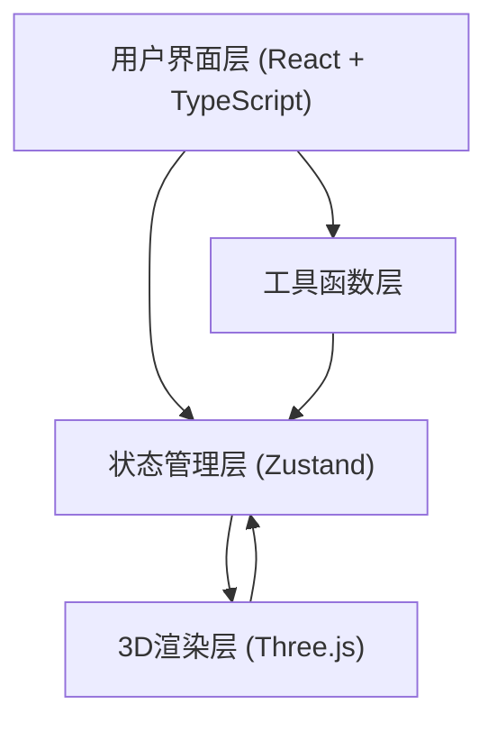

## 1. 架构设计



## 2. 技术描述
- **前端**：React 18 + TypeScript + Vite
- **状态管理**：Zustand
- **3D渲染**：Three.js + @types/three
- **构建工具**：Vite
- **其他依赖**：uuid（唯一标识）
- **无需后端**：纯前端应用，病害数据通过模拟生成

## 3. 目录结构
```
src/
├── app.tsx              # 主应用组件
├── store.ts             # Zustand全局状态
├── features/
│   ├── analysisPanel.tsx   # 病害分析面板
│   └── repairPanel.tsx     # 修复参数面板
├── features/
│   └── threeScene.ts       # Three.js场景管理
└── utils/
    └── fileParser.ts       # 图片处理与病害模拟
```

## 4. 数据模型定义

### 4.1 状态数据结构
```typescript
interface Disease {
  id: string;
  type: 'crack' | 'rust' | 'peeling' | 'contamination';
  name: string;
  color: string;
  position: { x: number; y: number; z: number };
  area: number;
  depth: number;
  repairMethod: string;
}

interface RepairParams {
  material: 'epoxy' | 'acrylate' | 'nanoCalcium';
  fillLevel: number;
}

interface AppState {
  uploadedImages: string[];
  diseases: Disease[];
  highlightedDiseaseId: string | null;
  repairParams: RepairParams;
  modelRef: any;
  actions: {
    addImage: (base64: string) => void;
    setDiseases: (diseases: Disease[]) => void;
    setHighlighted: (id: string | null) => void;
    setRepairParams: (params: Partial<RepairParams>) => void;
    setModelRef: (ref: any) => void;
  };
}
```

### 4.2 材料数据
| 材料类型 | 底色 | 干燥时间 |
|----------|------|----------|
| 环氧树脂 | 透明琥珀色 | 24小时 |
| 丙烯酸酯 | 乳白色 | 6小时 |
| 纳米钙基材料 | 石灰色 | 12小时 |

## 5. 核心模块职责

### 5.1 store.ts
- 管理全局状态：上传图片、病害数据、修复参数、高亮状态、模型引用
- 提供action方法更新状态
- 使用Zustand的create函数创建store

### 5.2 threeScene.ts
- 创建Three.js场景、相机、渲染器、光照
- 加载/创建古董3D模型（使用程序化几何体模拟）
- 管理病害粒子系统（BufferGeometry + PointsMaterial）
- 实现粒子脉动动画和透明度渐变
- 处理鼠标交互（射线检测、悬停信息卡）
- 根据修复参数实时更新修复区域效果
- 每帧更新渲染，确保30FPS以上

### 5.3 analysisPanel.tsx
- 从store读取病害数据，按类型分组
- 渲染带彩色圆点的诊断条目
- 点击条目触发store的高亮动作
- 高亮状态下条目视觉反馈

### 5.4 repairPanel.tsx
- 材料选择下拉框（三种材料）
- 填充程度滑块（0-100%，步长5%）
- 滑块轨道渐变效果（病变色→修复色）
- 材料预览和干燥时间显示
- 参数变化时更新store，触发3D实时更新

### 5.5 fileParser.ts
- 将上传的File对象转换为Base64
- 生成模拟病害数据（随机位置、类型、面积、深度）
- 每种病害类型对应预设的修复方法
- 确保病害数据可被3D场景正确渲染

## 6. 性能优化策略
1. **粒子数量控制**：动态管理粒子数，总数不超过500
2. **BufferGeometry**：使用BufferGeometry而非Geometry，提升性能
3. **材质复用**：同种类型粒子共享材质实例
4. **帧率控制**：requestAnimationFrame中使用时间戳控制更新频率
5. **懒加载**：3D模型和纹理按需加载
6. **防抖处理**：滑块参数变化防抖，避免频繁3D重绘
7. **几何体简化**：模拟模型使用低多边形，平衡视觉效果与性能
