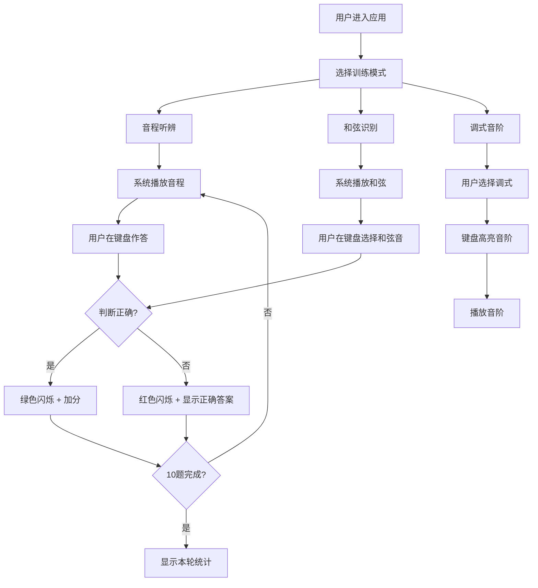

## 1. 产品概述
一款面向音乐学生的浏览器端交互式乐理训练工具，通过可视化钢琴键盘和 Web Audio API 音频反馈，帮助学生直观理解音程、和弦与调式之间的关系，并通过听辨和视奏练习巩固乐理知识。

- 主要用途：音程听辨、和弦识别、调式音阶练习的交互式训练
- 目标用户：音乐教师及其学生，需要乐理听辨和视奏训练的初学者至中级学习者

## 2. 核心功能

### 2.1 用户角色
| 角色 | 注册方式 | 核心权限 |
|------|----------|----------|
| 学生 | 无需注册 | 使用所有训练模式和计分功能 |

### 2.2 功能模块
1. **主训练页面**：音程听辨训练、和弦识别训练、调式音阶练习、实时反馈与计分、音色切换

### 2.3 页面详情
| 页面名称 | 模块名称 | 功能描述 |
|----------|----------|----------|
| 主训练页面 | 顶部标题与得分栏 | 显示应用标题、当前得分、正确率、进度条（每轮10题） |
| 主训练页面 | 左侧钢琴键盘 | 渲染C4到B5共12个可点击琴键，高亮正确答案和用户点击，鼠标悬停播放音高，按下弹性动画与发光效果 |
| 主训练页面 | 右侧答题面板 | 显示当前题目类型和提示，音名选择按钮（C、C#、D等），网格布局圆角矩形按钮，悬停放大1.05倍并投射阴影 |
| 主训练页面 | 模式切换标签 | 音程听辨、和弦识别、调式音阶三种训练模式切换 |
| 主训练页面 | 音色切换控件 | 正弦波、三角波、方波三种音色切换按钮 |
| 主训练页面 | 反馈动画区域 | 答对按钮闪烁绿色，答错闪烁红色并淡入显示正确答案 |

## 3. 核心流程

### 3.1 音程听辨流程
1. 用户选择「音程听辨」模式
2. 系统随机生成两个连续单音（音程从同度到八度）
3. 系统通过 Web Audio API 播放两个音
4. 用户在钢琴键盘上依次点击两个音作答
5. 系统判断答案是否正确，显示音程名称（如大三度、纯五度）
6. 更新得分和进度条

### 3.2 和弦识别流程
1. 用户选择「和弦识别」模式
2. 系统随机生成三音或四音和弦（如大三和弦、小七和弦）
3. 系统播放和弦
4. 用户在钢琴键盘上点击组成该和弦的所有音
5. 答题后高亮显示正确和弦组成音并重新播放原和弦
6. 更新得分和进度条

### 3.3 调式音阶练习流程
1. 用户选择「调式音阶」模式
2. 用户从下拉菜单选择一个调式（如C大调、A小调、D多利亚调式）
3. 系统在钢琴键盘上高亮显示该调式音阶
4. 用户提供播放按钮，点击后依次播放音阶中每个音
5. 此模式不计分，为学习参考模式

### 3.4 流程图

## 4. 用户界面设计

### 4.1 设计风格
- 主色调：深色背景（#1A1A2E），金色点缀（#D4AF37），暗红强调（#8B0000）
- 按钮风格：圆角矩形，背景渐变，悬停放大1.05倍并投射阴影
- 字体：Google Fonts — Playfair Display（标题）+ Source Sans 3（正文）
- 布局风格：左右分栏，左侧钢琴键盘自适应宽度，右侧答题面板
- 图标风格：lucide-react 线性图标
- 动画：所有交互0.3s ease平滑过渡，琴键弹动动画，发光效果

### 4.2 页面设计概述
| 页面名称 | 模块名称 | UI元素 |
|----------|----------|--------|
| 主训练页面 | 顶部标题栏 | 深色渐变背景，金色标题文字，得分数字高亮，进度条金色填充 |
| 主训练页面 | 模式切换标签 | 三个等宽标签按钮，选中时金色下划线，未选中时暗灰色 |
| 主训练页面 | 钢琴键盘区域 | 象牙白渐变白键，纯黑黑键，悬停发光，按下弹性动画和光晕 |
| 主训练页面 | 答题面板 | 题目提示文字，音名网格按钮（4列布局），反馈动画区域 |
| 主训练页面 | 音色切换 | 三个小型切换按钮，选中时金色高亮 |
| 主训练页面 | 调式选择器 | 下拉菜单，金色边框，暗色背景 |

### 4.3 响应式设计
- 桌面优先设计，左右分栏布局
- 宽度≤600px时：键盘自动缩小并显示滚动条，布局切换为上下排列
- 琴键自适应宽度，触摸优化点击区域
- 答题按钮网格在小屏幕上调整列数

### 4.4 动画规范
- 所有过渡动画：0.3s ease
- 琴键按下：弹性动画（scale 0.95 → 1.0）+ 光晕效果（box-shadow）
- 答对：按钮背景闪烁绿色（#22C55E），持续0.6s
- 答错：按钮背景闪烁红色（#EF4444）+ 正确答案文字淡入，持续0.8s
- 进度条：平滑过渡宽度变化
