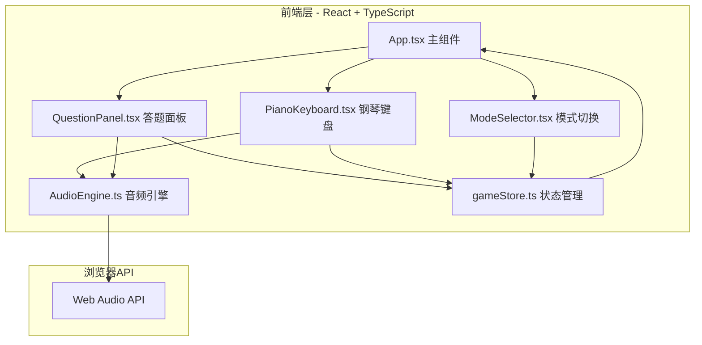

## 1. 架构设计



## 2. 技术说明
- 前端：React@18 + TypeScript + Vite + Tailwind CSS
- 初始化工具：vite-init（react-ts 模板）
- 状态管理：Zustand
- 音频：Web Audio API（原生浏览器API，无外部依赖）
- 后端：无
- 数据库：无（纯前端状态管理）

## 3. 路由定义
| 路由 | 用途 |
|------|------|
| / | 主训练页面，包含所有三种训练模式和计分系统 |

## 4. 文件结构与调用关系

```
src/
├── App.tsx                    # 主组件，管理布局和模式切换
│   ├── imports: gameStore, QuestionPanel, PianoKeyboard, ModeSelector
│   └── 数据流: 从useGameStore获取状态 → 渲染子组件
├── store/
│   └── gameStore.ts           # Zustand状态管理
│       ├── 暴露: 题目状态、答题记录、得分、操作方法
│       └── 被调用: App.tsx, QuestionPanel.tsx
├── components/
│   ├── QuestionPanel.tsx      # 答题面板
│   │   ├── 从gameStore读取题目
│   │   ├── 用户交互后调用store的checkAnswer
│   │   └── 调用AudioEngine播放音频
│   ├── PianoKeyboard.tsx      # 钢琴键盘
│   │   ├── 接收props: onNotePlay, highlightedNotes
│   │   └── 调用AudioEngine播放音符
│   └── ModeSelector.tsx       # 训练模式切换
│       └── 调用gameStore切换模式
├── audio/
│   └── AudioEngine.ts         # Web Audio API封装
│       ├── 生成正弦波、三角波、方波
│       ├── 播放单音和和弦
│       └── 被调用: PianoKeyboard, QuestionPanel
└── styles/
    └── global.css             # 全局样式
```

## 5. 数据模型

### 5.1 核心类型定义

```typescript
type TrainingMode = 'interval' | 'chord' | 'scale'

type WaveType = 'sine' | 'triangle' | 'square'

type NoteName = 'C' | 'C#' | 'D' | 'D#' | 'E' | 'F' | 'F#' | 'G' | 'G#' | 'A' | 'A#' | 'B'

interface IntervalQuestion {
  type: 'interval'
  note1: NoteName
  note2: NoteName
  intervalName: string
  semitones: number
}

interface ChordQuestion {
  type: 'chord'
  notes: NoteName[]
  chordName: string
}

interface ScaleQuestion {
  type: 'scale'
  rootNote: NoteName
  scaleName: string
  notes: NoteName[]
}

type Question = IntervalQuestion | ChordQuestion | ScaleQuestion

interface GameState {
  mode: TrainingMode
  waveType: WaveType
  currentQuestion: Question | null
  score: number
  totalQuestions: number
  correctAnswers: number
  selectedNotes: NoteName[]
  feedback: 'correct' | 'incorrect' | null
  showAnswer: boolean
}
```

### 5.2 音乐理论数据

音程名称映射（半音数 → 音程名）：
| 半音数 | 音程名 |
|--------|--------|
| 0 | 纯一度 |
| 1 | 小二度 |
| 2 | 大二度 |
| 3 | 小三度 |
| 4 | 大三度 |
| 5 | 纯四度 |
| 6 | 增四度/减五度 |
| 7 | 纯五度 |
| 8 | 小六度 |
| 9 | 大六度 |
| 10 | 小七度 |
| 11 | 大七度 |
| 12 | 纯八度 |

和弦类型：
| 和弦名 | 音程结构（半音） | 示例（C为根音） |
|--------|------------------|-----------------|
| 大三和弦 | 0-4-7 | C-E-G |
| 小三和弦 | 0-3-7 | C-Eb-G |
| 增三和弦 | 0-4-8 | C-E-G# |
| 减三和弦 | 0-3-6 | C-Eb-Gb |
| 大七和弦 | 0-4-7-11 | C-E-G-B |
| 小七和弦 | 0-3-7-10 | C-Eb-G-Bb |
| 属七和弦 | 0-4-7-10 | C-E-G-Bb |
| 减七和弦 | 0-3-6-9 | C-Eb-Gb-A |

调式类型：
| 调式名 | 音程结构（半音序列） |
|--------|---------------------|
| 自然大调 | 2-2-1-2-2-2-1 |
| 自然小调 | 2-1-2-2-1-2-2 |
| 多利亚调式 | 2-1-2-2-2-1-2 |
| 弗里几亚调式 | 1-2-2-2-1-2-2 |
| 利底亚调式 | 2-2-2-1-2-2-1 |
| 混合利底亚调式 | 2-2-1-2-2-1-2 |

## 6. 性能约束
- 音频响应延迟：不超过50ms（Web Audio API 调度时间）
- 动画帧率：维持在60fps（使用CSS动画和requestAnimationFrame）
- 音频播放时页面不卡顿：音频处理在独立线程（Web Audio API内部）
