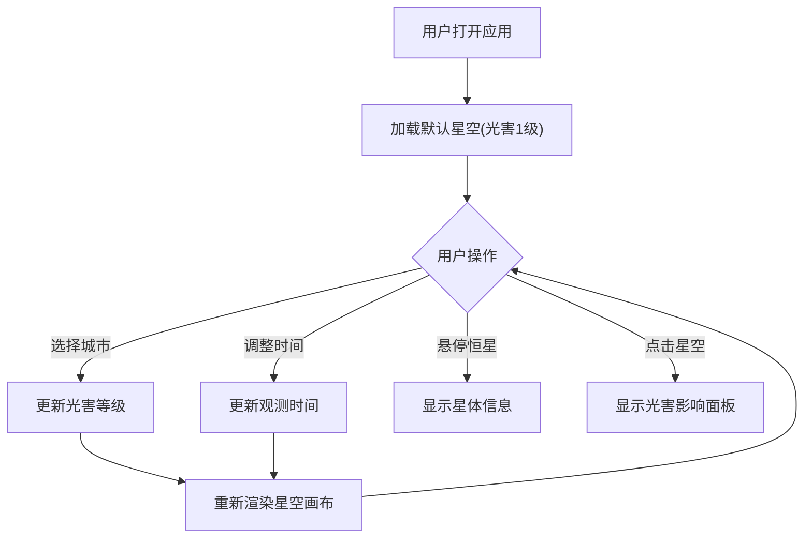

## 1. 产品概述

光污染星空模拟观测器是一款面向天文科普志愿者和公众的浏览器交互工具，通过可视化模拟不同城市光害等级下的星空可见度，帮助公众直观理解光污染对天文观测的破坏性影响。

- 核心目的：以交互式星空画布呈现光害等级1-9级下的恒星、银河和大气辉光差异
- 目标用户：天文科普志愿者、天文爱好者、教育工作者、城市公众
- 价值：将抽象的光害数据转化为沉浸式视觉体验，提升公众对暗夜保护的认识

## 2. 核心功能

### 2.2 功能模块

1. **星空画布页面**：星空渲染、城市光害切换、时间模拟、交互信息展示

### 2.3 页面详情

| 页面名称 | 模块名称 | 功能描述 |
|----------|----------|----------|
| 星空画布页面 | 全球城市光害选择 | 内置10+代表性城市，每个城市对应Bortle 1-9级，选择后画布立即切换 |
| 星空画布页面 | 星空渲染 | 约3000颗恒星，亮度根据星等和光害等级动态衰减，半透明圆形渐变光晕绘制 |
| 星空画布页面 | 银河与大气辉光 | 银河弧形半透明雾状带、底部地平线大气辉光渐变 |
| 星空画布页面 | 时间模拟 | 19:00-05:00滑块（步长10分钟），恒星旋转、月相月光变化 |
| 星空画布页面 | 交互信息 | 鼠标悬停显示恒星名称和星等，点击显示方向光害影响百分比 |
| 星空画布页面 | 控制面板 | 城市搜索下拉框、日期时间滑块、光害模拟开关 |

## 3. 核心流程

用户打开应用 → 默认展示光害1级（最暗）星空 → 通过左侧控制面板选择城市 → 画布根据城市光害等级动态调整恒星可见度 → 拖动时间滑块模拟不同时段星空 → 鼠标悬停/点击获取星体信息和光害影响数据

## 4. 用户界面设计

### 4.1 设计风格

- 主色：极深蓝黑 #0B0D17（背景）、白色/淡蓝（恒星）、紫蓝渐变（银河）
- 强调色：#4A90D9（选中高亮）、暖黄（时间滑块过渡）
- 按钮样式：圆角胶囊形，悬停变色过渡
- 字体：无衬线字体，标题16px加粗，正文13px常规
- 布局：左侧控制面板280px + 右侧星空画布自适应
- 图标风格：线性简约天文图标

### 4.2 页面设计概览

| 页面名称 | 模块名称 | UI元素 |
|----------|----------|--------|
| 星空画布页面 | 控制面板 | 毛玻璃背景(backdrop-filter:blur(8px))、深底白字下拉框、渐变色时间滑块 |
| 星空画布页面 | 星空画布 | 全屏Canvas 2D渲染、恒星渐变光晕、银河雾带、大气辉光 |
| 星空画布页面 | 悬停信息 | 半透明深色浮层，显示恒星名称和星等 |
| 星空画布页面 | 点击信息面板 | 展开式面板，显示该方向光害影响百分比 |

### 4.3 响应式

- 桌面优先设计，最小高度600px
- 控制面板固定280px宽度，星空画布占满剩余宽度
- 切换城市或调整时间时画布过渡动画0.5秒

### 4.4 技术约束

- 性能目标：星空画布帧率稳定30FPS以上
- 使用requestAnimationFrame渲染循环
- 离屏Canvas缓存静态恒星层减少重绘
- 恒星数据预生成并固定（随机但可复现）
