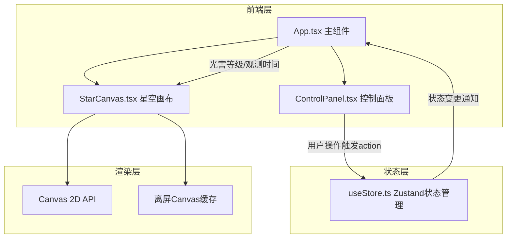

## 1. 架构设计



## 2. 技术说明

- 前端：React@18 + TypeScript + Vite
- 初始化工具：vite-init（react-ts模板）
- 状态管理：Zustand
- 渲染引擎：Canvas 2D API（非WebGL）
- 后端：无
- 数据库：无（内置静态数据）

## 3. 路由定义

| 路由 | 用途 |
|------|------|
| / | 星空画布主页（单页应用，无路由切换） |

## 4. 数据模型

### 4.1 核心数据结构

```typescript
interface City {
  name: string;
  nameEn: string;
  lat: number;
  lon: number;
  bortle: number;
}

interface Star {
  id: number;
  x: number;
  y: number;
  magnitude: number;
  name: string | null;
  baseRadius: number;
  baseAlpha: number;
}

interface StoreState {
  currentCity: City;
  observationTime: number;
  lightPollutionEnabled: boolean;
  stars: Star[];
  setCity: (city: City) => void;
  setTime: (time: number) => void;
  toggleLightPollution: () => void;
  setStars: (stars: Star[]) => void;
}
```

### 4.2 城市光害数据

| 城市 | 光害等级(Bortle) | 纬度 | 经度 |
|------|------------------|------|------|
| 内华达暗夜保护区 | 1 | 38.0 | -117.0 |
| 雷克雅未克 | 2 | 64.1 | -21.9 |
| 拉萨 | 3 | 29.6 | 91.1 |
| 开普敦 | 4 | -33.9 | 18.4 |
| 悉尼 | 5 | -33.9 | 151.2 |
| 伦敦 | 6 | 51.5 | -0.1 |
| 东京 | 7 | 35.7 | 139.7 |
| 纽约 | 8 | 40.7 | -74.0 |
| 北京 | 8 | 39.9 | 116.4 |
| 上海 | 9 | 31.2 | 121.5 |
| 香港 | 9 | 22.3 | 114.2 |
| 新加坡 | 9 | 1.3 | 103.8 |

### 4.3 文件调用关系

```
index.html
  └── src/main.tsx
       └── src/App.tsx（读取useStore状态）
            ├── src/components/StarCanvas.tsx（接收props: stars, bortleScale, time, moonPhase）
            │    └── Canvas 2D渲染（离屏Canvas + requestAnimationFrame）
            └── src/components/ControlPanel.tsx（触发zustand actions）
                 └── src/store/useStore.ts（zustand store）
```

**数据流向**：
1. ControlPanel → zustand action → store状态更新 → App重新渲染 → StarCanvas接收新props
2. StarCanvas内部：使用离屏Canvas缓存静态恒星层，动态层（旋转、光害衰减）在主Canvas上实时绘制
3. 鼠标交互：StarCanvas内部处理hover/click事件，本地state管理信息面板显示
