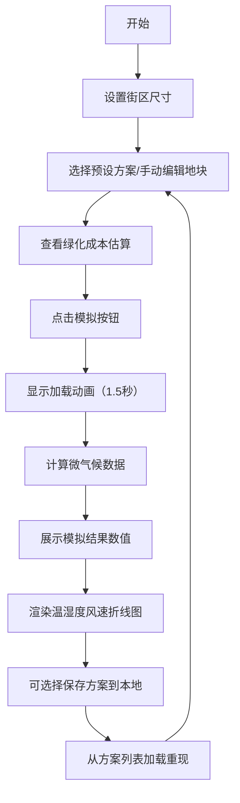

## 1. 产品概述

城市街区绿化微气候模拟应用是一款面向城市规划师、景观设计师的交互式设计工具，通过可视化模拟不同绿化方案对城市街区小气候（温度、湿度、风速）的影响，辅助设计更宜居的公共空间。

- **核心价值**：将抽象的微气候数据转化为直观的可视化结果，降低绿化方案评估门槛
- **目标用户**：城市规划师、景观设计师、建筑设计师、市政规划人员
- **使用场景**：街区绿化方案设计阶段的快速模拟与方案对比

## 2. 核心功能

### 2.1 用户角色

| 角色 | 注册方式 | 核心权限 |
|------|----------|----------|
| 规划师用户 | 无需注册，本地使用 | 使用全部模拟功能，保存/加载本地方案 |

### 2.2 功能模块

1. **街区配置模块**：街区尺寸设置、地块类型编辑网格
2. **绿化方案模块**：预设方案选择、自定义地块编辑、成本估算
3. **模拟引擎模块**：微气候计算、加载动画、结果展示
4. **数据可视化模块**：2D 俯视图渲染、温湿度风速折线图
5. **方案管理模块**：本地存储、方案命名、方案加载与重现

### 2.3 页面详情

| 页面名称 | 模块名称 | 功能描述 |
|---------|----------|---------|
| 主应用页面 | 左侧控制面板 | 街区尺寸设置（宽度/深度 20-100m，步长 5m）、地块类型选择、预设方案列表、模拟按钮、已保存方案列表 |
| 主应用页面 | 右侧可视化区 | 2D 街区网格画布（可点击切换地块类型）、高亮选中动画、地块成本提示 |
| 主应用页面 | 底部图表区 | 温度/湿度/风速三条折线图、鼠标悬停显示数值、Y 轴自适应 |
| 主应用页面 | 模拟结果区 | 平均温度变化、平均湿度变化、平均风速变化数值展示 |
| 主应用页面 | 保存对话框 | 方案命名输入、确认/取消按钮、半透明遮罩背景 |

## 3. 核心流程

用户调整街区尺寸 → 选择预设绿化方案或手动编辑地块 → 查看地块成本估算 → 点击模拟按钮 → 显示加载动画（1.5s） → 展示模拟结果与折线图 → 可保存方案到本地 → 从方案列表加载重现

## 4. 用户界面设计

### 4.1 设计风格

- **主色调**：深色科技感配色，背景深灰 #1E1E1E，画布背景 #2D2D2D
- **强调色**：温度橙红 #FF7043、湿度天蓝 #4FC3F7、风速灰绿 #66BB6A
- **按钮风格**：圆角 8px，悬停亮度提升 20%，点击缩放 transform: scale(0.98) 反馈
- **字体**：无衬线体 system-ui，字号 14-16px
- **装饰元素**：浅灰 #333 装饰线、网格线 #444（0.5px 宽）

### 4.2 页面设计概览

| 页面名称 | 模块名称 | UI 元素 |
|---------|----------|--------|
| 主应用页面 | 左侧控制面板（380px 宽） | 深色背景 #1E1E1E，上下装饰线，内边距 20px，滑块控件，方案卡片列表，保存方案缩略图列表 |
| 主应用页面 | 右侧可视化主区 | 自适应剩余宽度，最小高度 650px，2D 画布（#2D2D2D 背景，网格线），底部图表区（300px 高，#252525 背景） |
| 主应用页面 | 地块交互 | 20x20 像素地块，点击切换类型，高亮边框动画，0.2 秒颜色过渡 |
| 主应用页面 | 折线图表 | Recharts 渲染，线条带 0.5px 发光效果，鼠标悬停提示，Y 轴自适应 |
| 主应用页面 | 保存对话框 | 半透明遮罩，表单圆角 12px，边框 1px 深灰 |

### 4.3 响应式设计

- **桌面优先**：1920x1080 和 1440x900 分辨率下布局自适应
- **窄屏适配**：窗口宽度小于 1024px 时，左侧面板折叠为顶部可展开工具栏
- **画布自适应**：2D 网格画布根据右侧区域宽度等比缩放

### 4.4 动效与交互

- **地块切换**：0.2 秒颜色过渡动画
- **选中高亮**：边框脉冲动画
- **按钮反馈**：悬停亮度提升，点击 0.1 秒缩放
- **模拟加载**：环形进度条，1.5 秒完成
- **图表线条**：0.5px 发光效果（box-shadow: 0 0 4px）
