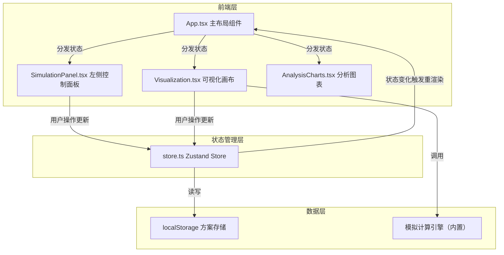

## 1. 架构设计



**数据流向**：用户操作（控制面板/画布点击）→ Zustand Store 更新 → 订阅 store 的组件重渲染 → 可视化与图表同步刷新

## 2. 技术栈说明

- **前端框架**：React 18 + TypeScript
- **构建工具**：Vite + @vitejs/plugin-react
- **状态管理**：Zustand
- **图表库**：Recharts
- **唯一标识**：uuid
- **画布渲染**：HTML5 Canvas 2D API
- **本地存储**：localStorage
- **样式方案**：CSS Modules / 内联样式（深色主题）

## 3. 文件结构与调用关系

```
src/
├── App.tsx              # 主应用组件，布局管理，从 store 获取状态分发给子组件
│                       # 调用关系：引入 store、SimulationPanel、Visualization、AnalysisCharts
├── store.ts             # Zustand 状态管理，所有状态的单一数据源
│                       # 数据流向：用户操作 → action 函数 → 更新 state → 组件订阅刷新
├── SimulationPanel.tsx  # 左侧控制面板，接收用户输入并调用 store action 更新状态
│                       # 调用关系：使用 useStore 获取/更新状态，触发模拟
├── Visualization.tsx    # 右侧可视化主组件，Canvas 渲染 2D 俯视图
│                       # 调用关系：从 store 获取街区配置和绿化布局，调用模拟引擎计算
├── AnalysisCharts.tsx   # 底部图表组件，Recharts 渲染三条折线图
│                       # 调用关系：从 store 获取模拟结果数据进行展示
└── utils/
    └── simulation.ts    # 模拟计算引擎，根据绿化方案计算微气候数据
                        # 调用关系：被 Visualization.tsx 或 store action 调用
```

## 4. 状态模型定义

### 4.1 Zustand Store 状态

```typescript
// 地块类型
type PlotType = 'grass' | 'tree' | 'water' | 'pavement' | 'building';

// 地块单元
interface Plot {
  x: number;
  y: number;
  type: PlotType;
}

// 街区配置
interface BlockConfig {
  width: number;      // 宽度 20-100 米
  depth: number;      // 深度 20-100 米
  gridSize: number;   // 每个地块像素大小 20px
}

// 预设方案
interface PresetScheme {
  id: string;
  name: string;
  description: string;
  canopyCoverage: number;
  temperatureEffect: number;
  humidityEffect: number;
  windEffect: number;
  layout: PlotType[][]; // 基准布局矩阵
}

// 模拟结果
interface SimulationResult {
  avgTempChange: number;     // 平均温度变化 ℃，精度 0.1
  avgHumidityChange: number; // 平均湿度变化 %，精度 0.1
  avgWindChange: number;     // 平均风速变化 m/s，精度 0.01
  tempProfile: number[];     // 温度剖面数据（X 轴方向）
  humidityProfile: number[]; // 湿度剖面数据
  windProfile: number[];     // 风速剖面数据
}

// 保存的方案
interface SavedScheme {
  id: string;
  name: string;
  timestamp: number;
  blockConfig: BlockConfig;
  plots: PlotType[][];
  result: SimulationResult | null;
  thumbnail: string;  // base64 缩略图
}

// Store 状态
interface AppState {
  blockConfig: BlockConfig;
  plots: PlotType[][];
  selectedPlotType: PlotType;
  isSimulating: boolean;
  simulationResult: SimulationResult | null;
  savedSchemes: SavedScheme[];
  activePreset: string | null;
  
  // Actions
  setBlockSize: (width: number, depth: number) => void;
  setSelectedPlotType: (type: PlotType) => void;
  togglePlot: (x: number, y: number) => void;
  applyPreset: (presetId: string) => void;
  runSimulation: () => Promise<void>;
  saveScheme: (name: string, thumbnail: string) => void;
  loadScheme: (id: string) => void;
  deleteScheme: (id: string) => void;
  loadSavedSchemes: () => void;
}
```

### 4.2 成本计算

- 树木：500 元/棵
- 草坪：50 元/平米
- 水体：200 元/平米
- 硬地：0 元/平米
- 建筑：0 元/平米

## 5. 模拟引擎设计

### 5.1 计算原理（简化物理模型）

基于地块类型的加权平均模型，考虑各绿化元素对微气候的影响系数：

- **温度影响**：树木降温最强，水体次之，草坪较弱，硬地/建筑升温
- **湿度影响**：水体增湿最强，草坪次之，树木较弱，硬地/建筑降湿
- **风速影响**：建筑挡风最强，树木次之，水体/草坪影响小

### 5.2 剖面数据生成

沿街区宽度方向（X 轴）均匀采样 N 个点（N = 宽度方向地块数），每个点综合计算其周边地块的影响权重（距离衰减）。

### 5.3 性能约束

- 模拟计算必须在 1.5 秒内完成（含渲染）
- 使用 requestAnimationFrame 或 setTimeout 模拟加载动画
- 计算逻辑使用纯函数，避免重计算

## 6. 性能优化策略

- **Canvas 渲染**：使用 Canvas 2D 绘制网格和地块，避免大量 DOM 元素
- **状态细粒度订阅**：Zustand 使用 selector 只订阅组件需要的状态
- **模拟防抖**：防止用户频繁点击模拟按钮
- **图表优化**：Recharts 数据点数量适中，使用 canvas 渲染模式（如支持）
- **响应式画布**：使用 devicePixelRatio 保证高清屏下的清晰度

## 7. 本地存储方案

- 存储键名：`microclimate_schemes`
- 存储结构：JSON 数组，最多 5 个方案
- 缩略图：Canvas toDataURL 生成 base64
- 加载时机：应用初始化时从 localStorage 读取
