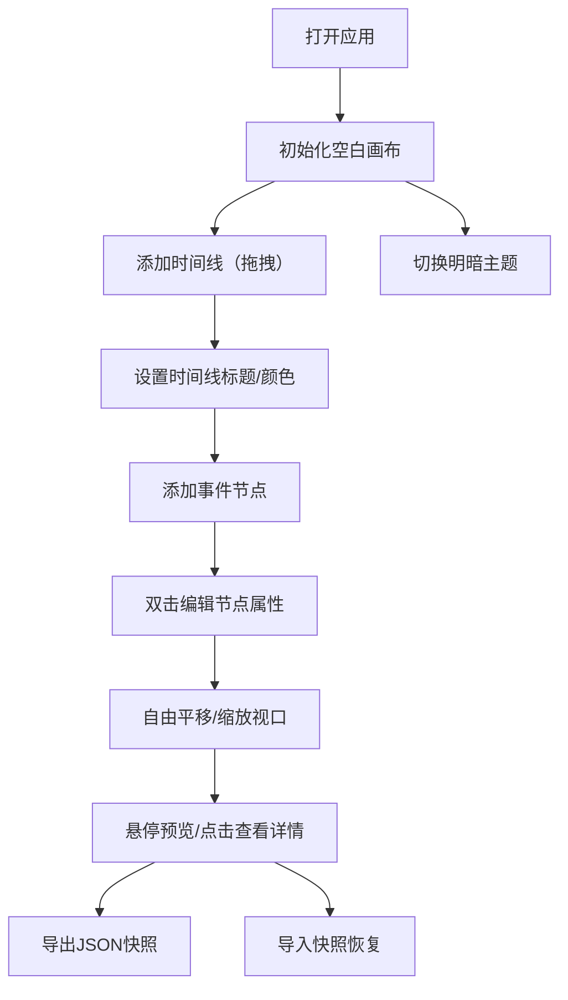

## 1. 产品概述

交互式数据叙事时间线编辑器，帮助数据分析师和非技术人员直观组织和展示复杂数据故事。通过可视化拖拽和Canvas渲染，用户可以创建多时间线、多节点的叙事图表，并支持快照导入导出和主题切换。

- **核心问题**：传统时间线工具难以灵活组织复杂数据关系，非技术人员缺乏直观的可视化编辑手段
- **目标用户**：数据分析师、内容创作者、产品经理、教育工作者
- **产品价值**：降低数据叙事门槛，提供高性能、可交互、可分享的时间线编辑体验

## 2. 核心功能

### 2.1 功能模块

1. **时间线编辑主界面**：Canvas编辑区域、时间线管理、节点管理、视口信息显示
2. **主题切换面板**：暗色/明亮模式切换、可折叠浮动面板
3. **节点详情编辑**：节点属性编辑浮窗、富文本描述
4. **快照管理**：JSON快照导出与导入、视口状态持久化

### 2.2 页面详情

| 页面名称 | 模块名称 | 功能描述 |
|---------|---------|---------|
| 主编辑页 | 时间线管理 | 拖拽添加多条时间线，设置标题和颜色（预设色板循环） |
| 主编辑页 | 节点管理 | 在时间线上添加节点（圆形/菱形/星形），双击编辑标题、描述、日期、标签 |
| 主编辑页 | 视口控制 | 鼠标拖拽平移，滚轮/捏合缩放（0.5x-3x），左下角显示缩放比和时间坐标 |
| 主编辑页 | 快照导出 | 保存当前视口状态为JSON，支持导入恢复 |
| 主编辑页 | 主题面板 | 右上角浮动可折叠面板，切换暗色/明亮模式 |
| 主编辑页 | 节点预览 | 悬停节点显示毛玻璃预览卡片，点击展开详情浮窗 |
| 主编辑页 | 节点详情 | 距视口右边界16px，最大宽度400px，支持富文本编辑，带动画过渡 |

## 3. 核心流程

用户打开应用后，首先看到空白的编辑画布。可以通过拖拽操作添加时间线，在时间线上添加节点，双击编辑节点属性。支持自由平移和缩放视口，左下角实时显示视口信息。完成编辑后可导出JSON快照，或导入之前保存的快照继续编辑。通过右上角面板切换明暗主题，偏好自动保存到本地。

## 4. 用户界面设计

### 4.1 设计风格

- **设计语言**：现代极简 + 毛玻璃效果，专业感与易用性平衡
- **主色调**：时间线色板循环使用 `#FF6B6B / #4ECDC4 / #45B7D1 / #96CEB4`
- **暗色模式**：背景 `#1E1E2E`，文字 `#CDD6F4`
- **明亮模式**：背景 `#FFFFFF`，文字 `#1E1E2E`
- **字体**：正文使用 "Inter" / 系统无衬线字体，标题使用粗体字重
- **圆角**：组件统一使用 8-12px 圆角
- **阴影**：多层阴影营造深度，浮窗使用大模糊阴影
- **动画**：节点悬停放大、详情浮窗滑入淡出过渡（0.25s ease）

### 4.2 页面设计概览

| 页面/模块 | UI元素 | 设计说明 |
|----------|--------|---------|
| 编辑画布 | Canvas全屏 | 占满浏览器可视区域，背景根据主题变化 |
| 时间线 | 贝塞尔曲线连接节点 | 左右排列，颜色取自预设色板循环 |
| 节点 | 圆形/菱形/星形 | 不同形状区分事件类型，悬停轻微放大 |
| 预览卡片 | 毛玻璃效果 | `backdrop-filter: blur(12px)`，半透明背景 |
| 详情浮窗 | 右侧滑入 | 左边缘距视口右边界16px，最大宽度400px |
| 视口信息 | 左下角固定 | 缩放比率 + 视口中心绝对时间坐标 |
| 主题面板 | 右上角浮动 | 可折叠，切换按钮带图标 |
| 工具栏（可选） | 顶边或侧边 | 添加时间线/节点按钮、导入导出按钮 |

### 4.3 响应式

- 桌面端优先设计，适配主流分辨率（1280px+）
- Canvas区域自适应窗口大小，监听 `resize` 事件重绘
- 详情浮窗在窄屏下调整为全屏覆盖或底部弹出
- 触控设备支持捏合缩放和拖拽平移

### 4.4 性能指标

- 视口操作（平移/缩放）响应时间 `< 50ms`
- 节点数量 `> 200` 时开启虚拟滚动（`react-window`）
- Canvas使用 `requestAnimationFrame` 批量重绘，避免抖动
