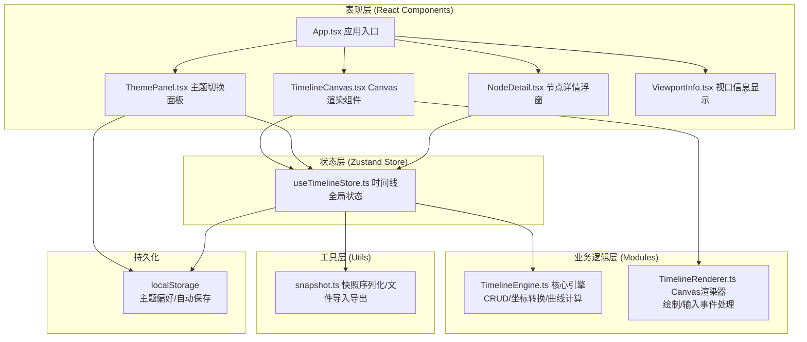

## 1. 架构设计



## 2. 技术描述

- **前端框架**：React 18 + TypeScript 5
- **构建工具**：Vite 5 + @vitejs/plugin-react
- **状态管理**：Zustand 4
- **Canvas渲染**：原生 Canvas 2D API + 自定义渲染器
- **虚拟滚动**：react-window（节点列表>200时启用）
- **唯一ID**：uuid
- **持久化**：localStorage（主题偏好、自动保存）
- **样式方案**：原生 CSS + CSS 变量（主题切换），无额外CSS框架
- **运行脚本**：`npm run dev` 启动开发服务器

## 3. 项目文件结构

```
├── package.json
├── vite.config.js
├── tsconfig.json
├── index.html
└── src/
    ├── main.tsx                    # React入口
    ├── App.tsx                     # 应用根组件
    ├── global.css                  # 全局样式 + CSS变量主题
    ├── modules/
    │   └── timeline/
    │       ├── TimelineEngine.ts   # 核心引擎：CRUD、贝塞尔曲线、坐标转换
    │       └── TimelineRenderer.ts # 渲染器：Canvas绘制、输入处理
    ├── store/
    │   └── useTimelineStore.ts     # Zustand状态管理
    ├── components/
    │   ├── TimelineCanvas.tsx      # Canvas组件
    │   ├── ThemePanel.tsx          # 主题切换面板
    │   ├── NodeDetail.tsx          # 节点详情浮窗（Portal）
    │   └── ViewportInfo.tsx        # 视口信息显示
    └── utils/
        └── snapshot.ts             # 快照导入导出工具
```

## 4. 数据模型

### 4.1 类型定义

```typescript
// 节点形状类型
type NodeShape = 'circle' | 'diamond' | 'star';

// 主题类型
type ThemeMode = 'dark' | 'light';

// 时间线节点
interface TimelineNode {
  id: string;
  timelineId: string;
  title: string;
  description: string;
  date: number;           // Unix时间戳（绝对时间坐标）
  tags: string[];
  shape: NodeShape;
  positionX: number;      // 相对时间线的归一化位置 [0, 1]
}

// 时间线
interface Timeline {
  id: string;
  title: string;
  color: string;          // 预设色板中的颜色
  yPosition: number;      // 画布Y轴位置（像素）
  nodes: TimelineNode[];
  createdAt: number;
}

// 视口状态
interface ViewportState {
  offsetX: number;        // 平移X偏移（像素）
  offsetY: number;        // 平移Y偏移（像素）
  zoom: number;           // 缩放等级 [0.5, 3]
  centerTime: number;     // 视口中心的绝对时间坐标
}

// 快照（导出用）
interface TimelineSnapshot {
  version: string;
  exportedAt: number;
  timelines: Timeline[];
  viewport: ViewportState;
}

// Store状态
interface TimelineStore {
  timelines: Timeline[];
  viewport: ViewportState;
  theme: ThemeMode;
  selectedNodeId: string | null;
  hoveredNodeId: string | null;
  // Actions
  addTimeline: (title?: string) => void;
  removeTimeline: (id: string) => void;
  updateTimeline: (id: string, patch: Partial<Timeline>) => void;
  addNode: (timelineId: string, data?: Partial<TimelineNode>) => void;
  removeNode: (nodeId: string) => void;
  updateNode: (nodeId: string, patch: Partial<TimelineNode>) => void;
  setViewport: (patch: Partial<ViewportState>) => void;
  setSelectedNode: (id: string | null) => void;
  setHoveredNode: (id: string | null) => void;
  setTheme: (mode: ThemeMode) => void;
  exportSnapshot: () => TimelineSnapshot;
  importSnapshot: (snapshot: TimelineSnapshot) => void;
}
```

### 4.2 核心算法说明

1. **贝塞尔曲线连接**：相邻节点 A(x1,y) → B(x2,y) 之间绘制二次贝塞尔曲线
   - 控制点：`cx = (x1 + x2) / 2`，形成平滑 S 形或直线过渡
2. **坐标转换**：
   - 世界坐标 → 屏幕坐标：`screenX = (worldX * zoom) + offsetX`
   - 屏幕坐标 → 世界坐标：`worldX = (screenX - offsetX) / zoom`
3. **缩放限制**：使用 `clamp(zoom, 0.5, 3)` 限制范围
4. **节点命中检测**：根据节点形状选择不同碰撞算法（圆/多边形）
5. **虚拟滚动**：当 `totalNodes > 200` 时，侧边节点列表使用 `react-window` 的 `VariableSizeList`

## 5. 性能优化策略

| 优化点 | 方案 |
|--------|------|
| Canvas重绘 | 使用 `requestAnimationFrame` 节流，仅状态变化时标记脏区重绘 |
| 视口操作 | 对平移/缩放事件使用 `passive` 监听器，避免阻塞主线程 |
| 节点渲染 | 超出视口范围的节点跳过绘制（视口裁剪） |
| 状态订阅 | Zustand 使用 selector 细粒度订阅，避免不必要的重渲染 |
| 虚拟滚动 | 节点列表 > 200 时使用 react-window，仅渲染可见项 |
| 事件委托 | Canvas 统一处理点击/悬停，命中检测定位目标节点 |
| localStorage | 使用节流写入，避免频繁序列化 |
