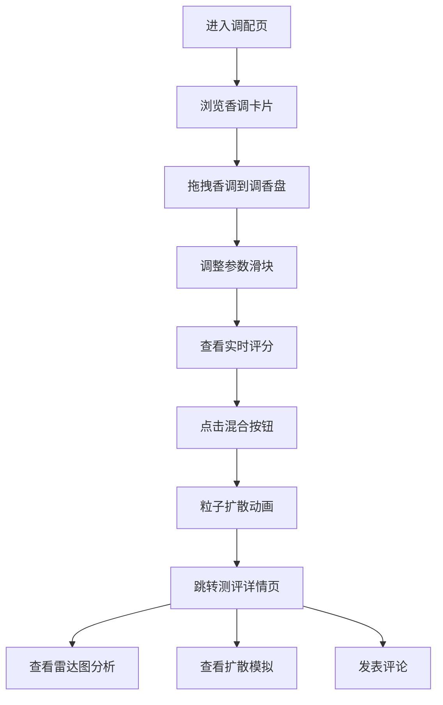

## 1. 产品概述

数字香水调配与感官可视化测评应用，让用户通过组合不同香调（前调、中调、后调）来调配虚拟香水，并生成雷达图、气味扩散模拟和用户评分配置。

- 主要目的：为香水爱好者提供沉浸式的虚拟调香体验，通过视觉化方式呈现香水配方的感官特征
- 目标用户：香水爱好者、调香师、创意人士
- 产品价值：将抽象的嗅觉体验转化为可视化的交互过程，降低香水调配门槛，提升创作乐趣

## 2. 核心功能

### 2.1 用户角色
无需用户登录，所有用户均可使用全部功能。

### 2.2 功能模块
1. **调配主页**：香调选择面板、圆形调香盘、参数滑块、混合按钮、二维码分享
2. **测评详情页**：配方信息展示、雷达图分析、气味扩散模拟、评论区域

### 2.3 页面详情
| 页面名称 | 模块名称 | 功能描述 |
|-----------|-------------|---------------------|
| 调配主页 | 香调面板 | 三栏标签页（前调/中调/后调）展示香调卡片，支持拖拽操作 |
| 调配主页 | 调香盘 | 接收拖拽香调，按序环状排列，支持点击移除，中心混合按钮触发动画 |
| 调配主页 | 参数控制 | 浓度、扩散度、持久度滑块调节，实时显示香味等级评分 |
| 调配主页 | 扩散动画 | Canvas粒子系统模拟香调混合扩散效果 |
| 调配主页 | 二维码分享 | 实时生成当前配方的分享二维码 |
| 测评详情页 | 配方信息 | 展示配方名称、创建时间、香调组合、参数配置 |
| 测评详情页 | 雷达图 | 5维度（清新、温暖、甜美、辛香、木质）可视化分析 |
| 测评详情页 | 扩散画布 | 60秒循环的粒子运动模拟 |
| 测评详情页 | 评论区 | 评论列表展示、新评论提交 |

## 3. 核心流程

用户进入调配页面 → 在左侧面板浏览香调卡片 → 拖拽香调到调香盘 → 调整浓度、扩散度、持久度参数 → 查看实时香味等级评分 → 点击混合按钮 → 观看粒子扩散动画 → 自动跳转到测评详情页 → 查看雷达图分析和扩散模拟 → 发表评论

## 4. 用户界面设计

### 4.1 设计风格
- **主色调**：深紫黑 #1A1A2E 作为背景，紫色 #6C63FF 作为点缀色
- **辅助色**：金色 #FFD700 用于评分星级，半透明 #2D2D44 用于卡片背景
- **按钮风格**：渐变圆角按钮（#8B5CF6 → #6D28D9），悬停时缩放1.05
- **字体**：现代无衬线字体，层次分明
- **布局风格**：桌面端左右两栏布局，移动端上下堆叠
- **视觉效果**：半透明毛玻璃效果（backdrop-filter: blur(8px)）、柔和紫色光晕、流畅过渡动画

### 4.2 页面设计概述
| 页面名称 | 模块名称 | UI元素 |
|-----------|-------------|-------------|
| 调配主页 | 香调面板 | 三栏标签页、140px圆角卡片、拖拽手柄、悬停放大与光晕 |
| 调配主页 | 调香盘 | 460px直径圆形区域、径向渐变背景、环状香调圆点、连线动画 |
| 调配主页 | 参数控制 | 自定义滑块（6px轨道、20px手柄）、数值tooltip、五星评分 |
| 调配主页 | 混合按钮 | 渐变背景、圆角24px、悬停缩放过渡 |
| 测评详情页 | 雷达图 | Recharts雷达图、半透明填充紫色、多边形边框 |
| 测评详情页 | 扩散画布 | Canvas粒子循环动画 |
| 测评详情页 | 评论区 | 滚动列表、圆角输入框、提交按钮 |

### 4.3 响应式
- 桌面端（≥768px）：左右两栏布局，左栏340px固定宽度
- 移动端（<768px）：上下堆叠布局，全宽自适应
- 所有交互元素支持触摸操作

### 4.4 动画与性能
- 所有过渡动画：0.2s cubic-bezier 平滑过渡
- 粒子动画帧率：≥45fps
- 雷达图更新响应：≤200ms
- 核心交互响应时间：≤50ms
- 首次加载时间：≤2s
