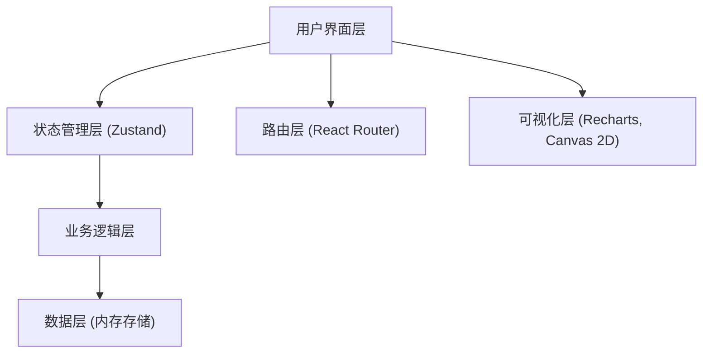
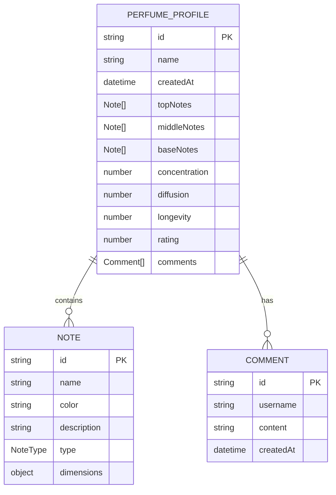

## 1. 架构设计



## 2. 技术描述

- **前端框架**: React 18 + TypeScript
- **构建工具**: Vite
- **状态管理**: Zustand
- **图表库**: Recharts
- **路由**: React Router DOM
- **唯一ID**: uuid

## 3. 路由定义

| 路由 | 用途 |
|-------|---------|
| / | 香水调配主页面 |
| /profile/:id | 测评详情页面 |

## 4. 数据模型

### 4.1 数据模型定义



### 4.2 类型定义

```typescript
type NoteType = 'top' | 'middle' | 'base';

interface NoteDimensions {
  fresh: number;
  warm: number;
  sweet: number;
  spicy: number;
  woody: number;
}

interface Note {
  id: string;
  name: string;
  color: string;
  description: string;
  type: NoteType;
  dimensions: NoteDimensions;
}

interface Comment {
  id: string;
  username: string;
  content: string;
  createdAt: Date;
}

interface PerfumeProfile {
  id: string;
  name: string;
  createdAt: Date;
  topNotes: Note[];
  middleNotes: Note[];
  baseNotes: Note[];
  concentration: number;
  diffusion: number;
  longevity: number;
  rating: number;
  comments: Comment[];
}

interface PerfumeState {
  selectedTopNotes: Note[];
  selectedMiddleNotes: Note[];
  selectedBaseNotes: Note[];
  concentration: number;
  diffusion: number;
  longevity: number;
  profiles: PerfumeProfile[];
  addNote: (note: Note) => void;
  removeNote: (noteId: string) => void;
  setConcentration: (value: number) => void;
  setDiffusion: (value: number) => void;
  setLongevity: (value: number) => void;
  createProfile: () => PerfumeProfile;
  addComment: (profileId: string, comment: Comment) => void;
  getRating: () => number;
}
```

## 5. 项目文件结构

```
d:\Pro\tasks\auto150/
├── package.json
├── vite.config.js
├── tsconfig.json
├── index.html
└── src/
    ├── App.tsx
    ├── main.tsx
    ├── index.css
    ├── pages/
    │   ├── BlenderPage.tsx
    │   └── ProfilePage.tsx
    ├── components/
    │   ├── NotePanel.tsx
    │   ├── Canvas3D.tsx
    │   ├── PerfumeDisk.tsx
    │   ├── ControlSliders.tsx
    │   ├── RadarChart.tsx
    │   ├── CommentSection.tsx
    │   └── StarRating.tsx
    ├── store/
    │   └── usePerfumeStore.ts
    ├── data/
    │   └── notes.ts
    └── types/
        └── index.ts
```

## 6. 性能优化策略

1. **Canvas 粒子优化**: 使用 requestAnimationFrame，粒子对象池复用，避免频繁 GC
2. **状态更新**: Zustand 浅比较选择器，避免不必要的重渲染
3. **组件拆分**: 细粒度组件拆分，配合 React.memo 减少渲染范围
4. **CSS 动画**: 优先使用 transform 和 opacity 实现动画，触发 GPU 加速
5. **资源加载**: 无外部图片资源依赖，确保首次加载快速
