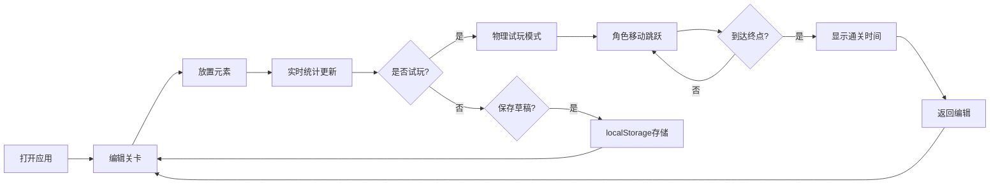

## 1. 产品概述

2D平台关卡原型风洞测试工具，帮助游戏设计师在浏览器中快速搭建和试玩2D平台关卡原型。解决传统关卡设计迭代周期长、难以直观感受跳跃距离和敌人密度对玩家路径选择影响的问题。

- 核心用户：游戏关卡设计师、独立游戏开发者
- 核心价值：所见即所得的关卡编辑 + 即时物理试玩，大幅缩短设计迭代周期

## 2. 核心特性

### 2.1 功能模块

1. **关卡编辑器**：网格化编辑、元素放置/移除、滚轮缩放、中键平移
2. **物理试玩**：玩家角色物理运动、跳跃、碰撞检测、尖刺伤害、终点判定
3. **实时统计**：关卡尺寸、元素计数、预计通关时间估算
4. **草稿管理**：本地存储最多5个关卡草稿、命名、删除、切换、重置

### 2.2 页面详情

| 页面名称 | 模块名称 | 功能描述 |
|---------|---------|---------|
| 主界面 | 编辑器区域 | 左侧75%空间，Canvas绘制网格和元素，支持编辑操作 |
| 主界面 | 统计面板 | 右侧240px固定宽度，实时显示关卡统计数据 |
| 主界面 | 工具栏 | 元素选择、试玩/编辑切换、草稿管理按钮 |

## 3. 核心流程

用户打开应用 → 在编辑器中放置砖块/尖刺/平台/终点 → 实时查看统计数据 → 点击试玩按钮 → 控制角色跳跃移动 → 到达终点查看通关时间 → 返回编辑继续调整 → 保存草稿到本地

## 4. 用户界面设计

### 4.1 设计风格

- **主色调**：深灰星际背景 #1A1A2E，深蓝 #16213E，红色强调 #E94560
- **游戏元素色**：草绿砖块 #7CB342，红色尖刺 #E53935，橙色平台 #FB8C00，金色终点 #FFD700，蓝色玩家 #2196F3
- **按钮样式**：圆角8px，背景 #16213E，边框 #E94560，文字 #EEEEEE，悬停亮度提升20%
- **字体**：现代无衬线字体，清晰易读
- **布局风格**：左侧编辑器主体 + 右侧统计面板，深色科技感
- **动效**：元素放置弹性缩放、粒子消散、草稿切换淡入淡出

### 4.2 页面设计概览

| 页面名称 | 模块名称 | UI元素 |
|---------|---------|--------|
| 主界面 | 编辑器Canvas | 天蓝色渐变背景、半透明白色网格线、像素风元素精灵 |
| 主界面 | 统计面板 | 磨砂玻璃半透明背景(rgba(255,255,255,0.15))、统计数值列表 |
| 主界面 | 工具栏 | 元素选择按钮组、试玩切换按钮、草稿管理区 |

### 4.3 响应式设计

- **桌面端**：左侧编辑器75% + 右侧统计面板240px
- **移动端**（<900px）：统计面板折叠到顶部横向条带

## 5. 性能要求

- 编辑器帧率稳定60fps
- 试玩模式物理更新60fps
- 物理模拟耗时不超过3ms
- 网格缩放时线条保持1px视觉恒定
