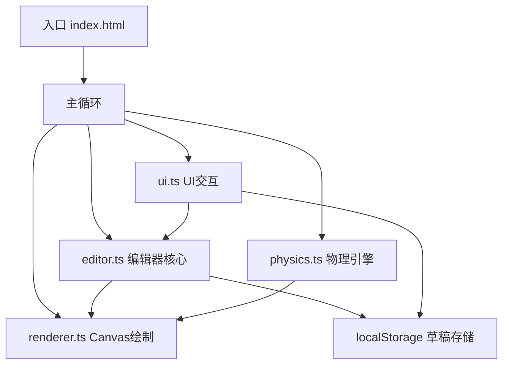

## 1. 架构设计



## 2. 技术选型

- **前端框架**：原生 TypeScript + Canvas 2D API（无框架依赖，性能最优）
- **构建工具**：Vite（极速开发体验，TypeScript原生支持）
- **状态管理**：模块内状态 + 事件回调
- **数据存储**：浏览器 localStorage
- **依赖包**：typescript, vite, uuid

## 3. 核心模块定义

### 3.1 editor.ts - 编辑器核心

| 函数/类 | 说明 |
|--------|------|
| `Editor` 类 | 编辑器主类，管理网格数据、视图变换 |
| `placeElement(x, y, type)` | 在指定网格位置放置元素 |
| `removeElement(x, y)` | 移除指定网格位置的元素 |
| `setZoom(scale, centerX, centerY)` | 设置缩放比例 |
| `pan(dx, dy)` | 平移视图 |
| `exportData()` | 导出关卡数据 |
| `importData(data)` | 导入关卡数据 |
| `getStats()` | 获取关卡统计数据 |
| `estimateClearTime()` | 估算通关时间 |

### 3.2 renderer.ts - Canvas绘制

| 函数/类 | 说明 |
|--------|------|
| `Renderer` 类 | 渲染器主类 |
| `render(editorState, physicsState, uiState)` | 渲染一帧 |
| `drawGrid()` | 绘制网格线 |
| `drawElements()` | 绘制所有元素 |
| `drawPlayer()` | 绘制玩家角色 |
| `drawParticles()` | 绘制粒子效果 |
| `spawnParticles(x, y, color)` | 生成粒子效果 |

### 3.3 physics.ts - 物理引擎

| 函数/类 | 说明 |
|--------|------|
| `PhysicsWorld` 类 | 物理世界 |
| `update(dt)` | 单帧物理更新 |
| `resetPlayer()` | 重置玩家到起点 |
| `checkCollisions()` | 碰撞检测 |
| `Player` 类型 | 玩家状态（位置、速度、是否存活等） |

### 3.4 ui.ts - UI交互

| 函数/类 | 说明 |
|--------|------|
| `UI` 类 | UI管理器 |
| `updateStats(stats)` | 更新统计面板 |
| `bindEvents()` | 绑定DOM事件 |
| `saveDraft(name)` | 保存草稿 |
| `loadDraft(id)` | 加载草稿 |
| `deleteDraft(id)` | 删除草稿 |

## 4. 数据结构

### 4.1 元素类型枚举

```typescript
enum ElementType {
  BRICK = 'brick',
  SPIKE = 'spike',
  PLATFORM = 'platform',
  GOAL = 'goal',
}
```

### 4.2 关卡数据结构

```typescript
interface LevelData {
  id: string;
  name: string;
  width: number;   // 格子数
  height: number;  // 格子数
  elements: Array<{
    type: ElementType;
    x: number;
    y: number;
    platformStartX?: number;
    platformEndX?: number;
    platformSpeed?: number;
  }>;
  createdAt: number;
  updatedAt: number;
}
```

### 4.3 玩家状态

```typescript
interface PlayerState {
  x: number;
  y: number;
  vx: number;
  vy: number;
  isAlive: boolean;
  isFlashing: boolean;
  flashTimer: number;
}
```

### 4.4 统计数据

```typescript
interface LevelStats {
  width: number;
  height: number;
  brickCount: number;
  spikeCount: number;
  platformCount: number;
  goalCount: number;
  estimatedTime: number;
}
```

## 5. 性能优化策略

1. **Canvas离屏渲染**：静态网格元素缓存到离屏Canvas
2. **空间分区**：碰撞检测使用网格空间加速
3. **requestAnimationFrame**：使用浏览器原生动画循环
4. **固定时间步长**：物理更新使用固定dt保证一致性
5. **粒子对象池**：复用粒子对象减少GC
6. **最小化重绘**：UI更新使用CSS而非Canvas重绘
