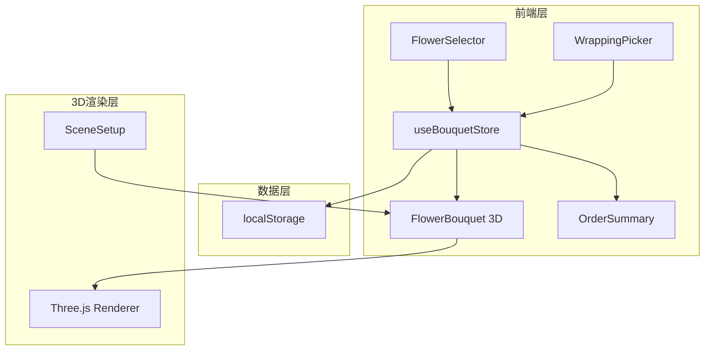
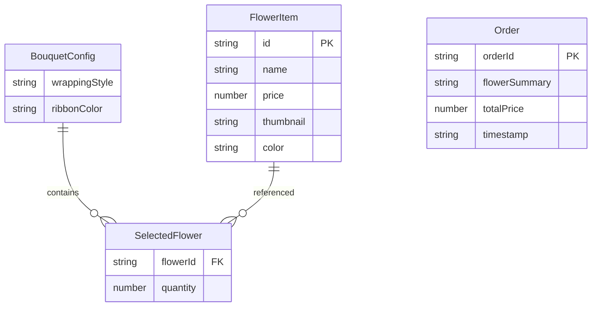

## 1. 架构设计



## 2. 技术说明
- 前端：React@18 + TypeScript + Vite
- 状态管理：Zustand（无后端，纯前端应用）
- 3D渲染：Three.js + @react-three/fiber + @react-three/drei
- 初始化工具：vite-init（react-ts模板）
- 数据持久化：localStorage
- 样式：Tailwind CSS + CSS Modules

## 3. 路由定义
| 路由 | 用途 |
|------|------|
| / | 主定制页面（单页应用） |

## 4. 数据模型

### 4.1 数据模型定义



### 4.2 Zustand Store 数据结构

```typescript
interface BouquetState {
  selectedFlowers: Map<string, { flowerId: string; quantity: number }>;
  wrappingStyle: string;
  ribbonColor: string;
  orders: Order[];
  addFlower: (flowerId: string) => void;
  removeFlower: (flowerId: string) => void;
  updateFlowerQuantity: (flowerId: string, quantity: number) => void;
  setWrappingStyle: (style: string) => void;
  setRibbonColor: (color: string) => void;
  submitOrder: () => Order;
}
```

## 5. 文件结构与调用关系

```
src/
├── main.tsx                          # 入口，渲染App
├── App.tsx                           # 布局容器，组合三大区域
├── modules/
│   ├── customizer/
│   │   ├── FlowerSelector.tsx        # 花材选择 → 写入store
│   │   └── WrappingPicker.tsx        # 包装选择 → 写入store
│   ├── renderer/
│   │   ├── FlowerBouquet.tsx         # 3D花束组件 ← 读取store
│   │   └── SceneSetup.ts            # 场景初始化（灯光/相机/控制器）
│   ├── store/
│   │   └── useBouquetStore.ts        # Zustand store（中心状态）
│   └── order/
│       └── OrderSummary.tsx         # 订单摘要 ← 读取store
├── data/
│   └── flowers.ts                    # 花材静态数据（8+种）
└── types/
    └── index.ts                      # TypeScript类型定义
```

数据流向：FlowerSelector/WrappingPicker → useBouquetStore → FlowerBouquet/OrderSummary
