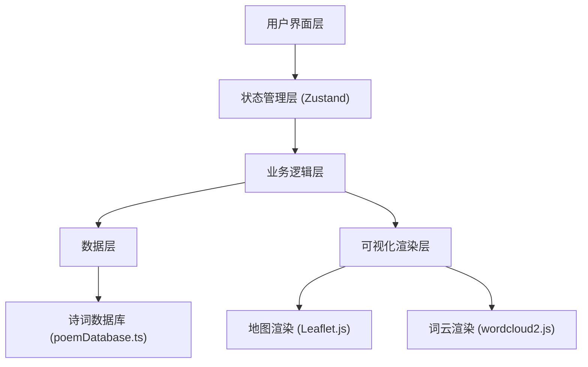
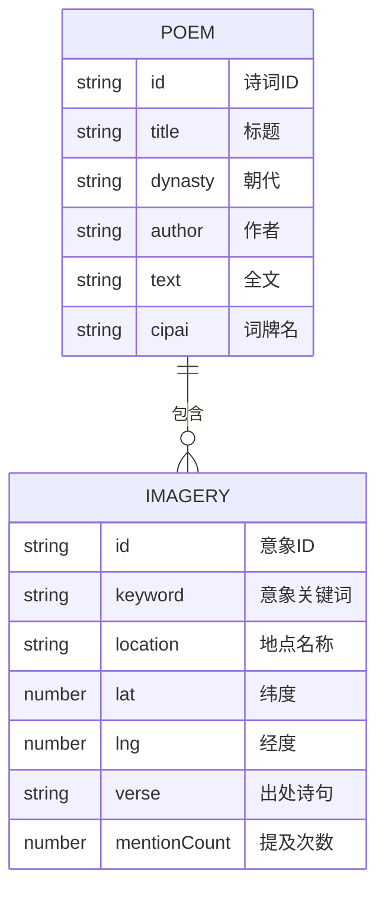

## 1. 架构设计



## 2. 技术描述

- **前端框架**：React 18 + TypeScript
- **构建工具**：Vite 5
- **状态管理**：Zustand
- **地图渲染**：Leaflet.js + react-leaflet + Leaflet.heat
- **词云可视化**：wordcloud2.js
- **唯一标识**：uuid
- **无后端**：纯前端应用，数据预置在 poemDatabase.ts 中

## 3. 项目结构

```
d:\Pro\tasks\auto153\
├── package.json
├── vite.config.js
├── tsconfig.json
├── index.html
└── src/
    ├── main.tsx
    ├── App.tsx
    ├── store/
    │   └── usePoemStore.ts          # Zustand 状态管理
    ├── modules/
    │   ├── search/
    │   │   ├── PoemSearchModule.ts  # 诗词搜索逻辑
    │   │   └── SearchBar.tsx        # 搜索栏组件
    │   ├── map/
    │   │   ├── MapModule.ts         # 地图逻辑
    │   │   ├── MapView.tsx          # 地图组件
    │   │   ├── PulseMarker.tsx      # 脉冲图钉组件
    │   │   ├── HeatmapLayer.tsx     # 热力图层
    │   │   └── FlyLine.tsx          # 飞线动画组件
    │   └── visual/
    │       ├── VisualizationModule.ts  # 可视化逻辑
    │       ├── WordCloud.tsx           # 词云组件
    │       └── ParticleBackground.tsx  # 粒子背景组件
    ├── components/
    │   └── PoemList.tsx             # 诗词列表组件
    ├── data/
    │   └── poemDatabase.ts          # 预置诗词数据库
    ├── types/
    │   └── index.ts                 # TypeScript 类型定义
    └── utils/
        └── animation.ts             # 动画工具函数
```

## 4. 数据模型

### 4.1 数据模型定义



### 4.2 TypeScript 类型定义

```typescript
interface Imagery {
  id: string;
  keyword: string;
  location: string;
  lat: number;
  lng: number;
  verse: string;
  mentionCount: number;
}

interface Poem {
  id: string;
  title: string;
  dynasty: '唐' | '宋';
  author: string;
  text: string;
  cipai?: string;
  imageries: Imagery[];
}

interface SearchFilters {
  dynasty?: '唐' | '宋' | '';
  cipai?: string;
  keyword?: string;
}

interface MapState {
  center: [number, number];
  zoom: number;
  showHeatmap: boolean;
}
```

## 5. 性能优化策略

1. **地图渲染**：使用 react-leaflet 组件化渲染，标记点使用 Canvas 渲染，确保帧率 > 30fps
2. **词云生成**：使用 Web Worker 或异步生成，确保生成时间 < 200ms
3. **搜索性能**：对诗词数据库建立索引，使用正则表达式快速匹配，响应时间 < 300ms
4. **动画优化**：使用 CSS transform 和 opacity 动画，避免 layout thrashing
5. **状态管理**：Zustand 选择性订阅，避免不必要的重渲染
6. **飞线动画**：使用 requestAnimationFrame 驱动，路径计算缓存

## 6. 核心模块说明

### 6.1 诗词搜索模块 (PoemSearchModule)
- 搜索策略：按朝代过滤 → 按词牌名匹配 → 按意象关键词全文搜索
- 高亮逻辑：使用正则表达式匹配关键词，返回带高亮标记的文本片段

### 6.2 地图可视化模块 (MapModule)
- 图钉标记：自定义脉冲动画 SVG 图标，朝代颜色区分
- 热力图：使用 Leaflet.heat 插件，按意象频次计算热力强度
- 飞线动画：贝塞尔曲线插值，光点沿路径移动，淡入淡出效果

### 6.3 意境可视化模块 (VisualizationModule)
- 词云：wordcloud2.js 渲染，字号映射意象频次
- 粒子背景：CSS 动画实现花瓣/落叶飘落效果，随机位置、大小、速度
- 渐变背景：根据诗词朝代动态调整渐变色彩
